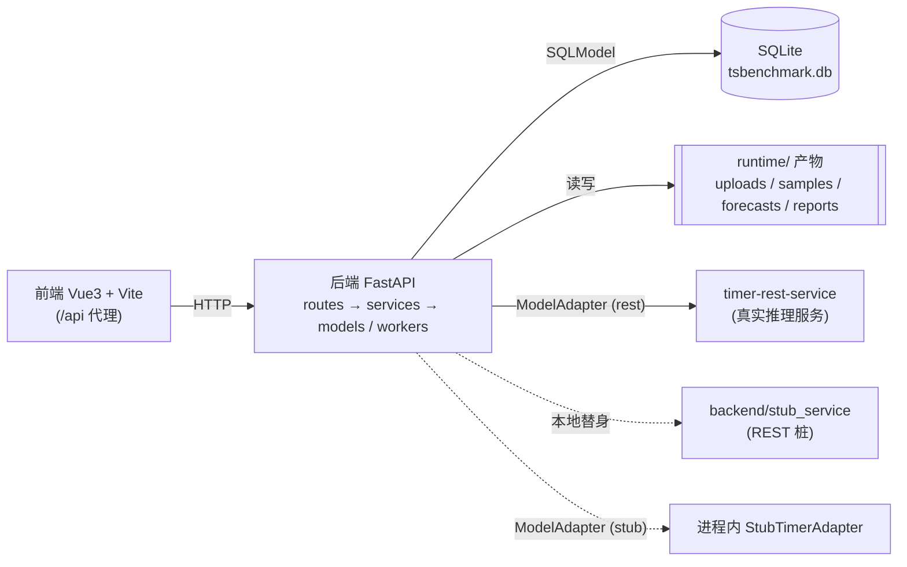

# TSBenchmark 开发者手册

本手册面向参与 TSBenchmark 开发与维护的工程师，讲清**系统怎么搭起来的、数据怎么建模的、关键流程怎么跑的、以及如何安全地扩展**。所有内容以当前代码为唯一事实来源，引用处尽量标注 `路径:行号`，便于核对。

面向使用者的「怎么用」请看 [用户手册](../manual/README.md)。外部推理服务（timer-rest-service）的 REST 契约见 [参考文档](../reference/rest-api.md)。

## 文档导航

| 篇目 | 内容 |
| --- | --- |
| [架构与关键流程](./key-flows.md) | 系统分层架构、错误信封、六大关键流程（数据集接入与样本物化 / 赛道与能力块 / **评测运行执行** / 模型推理接入 / 榜单计算 / 样本预测视图）、本地桩服务行为、API 端点速查表、扩展指引 |
| [数据模型](./data-model.md) | 全部 23 个 SQLModel 实体设计（字段表 + 状态枚举 + ER 图）、3 类落盘产物（sample.v1 / forecast.v1 / report JSON）、传输层 DTO、关键不变量与生命周期 |

## 系统速览



- **后端**：FastAPI + SQLModel + SQLite。分层边界——`api/routes/` 只做校验与委派，`services/` 承载业务行为，`models/` 仅持久化，`workers/` 跑后台执行。
- **前端**：Vue 3 + Vite 7，经 `/api` 代理访问后端。
- **推理**：通过 `ModelAdapter` 协议接出，由配置 `TSBENCHMARK_MODEL_ADAPTER` 选择 `rest`（HTTP 调 timer-rest-service / 本地桩）或 `stub`（进程内确定性桩）。
- **产物**：序列真值与样本存进 SQLite（`SeriesPoint` 逐点行 + `SampleIndex` 指针）；评测产物（预测、报告）落在 `runtime/` 下的 JSONL / JSON 文件；元数据进 SQLite。

## 核心数据层级

```
DatasetManifest → DatasetLoadJob → Shard(real) → SampleIndex      （数据侧）
Track → CapabilityBlock → CapabilityBlockShard → Shard → SampleIndex （组织侧）
BenchmarkingRun → Unit(按模型) → Task(按能力块) → Shard → Sample  （执行侧）
MetricResult：单表多层级（sample / shard / task / unit）
```

## 前端结构

前端在 `frontend/src/`（Vue 3 `<script setup>` + Vite 7），经 `/api` 代理访问后端，**刻意不引入 vue-router / pinia**，保持轻依赖：

- **应用外壳** `App.vue`：左侧栏导航（概览 / 新建评测 / 数据集 / 运行）+ 顶栏（面包屑 + 亮暗主题切换）+ 自写 hash 路由（`#/`、`#/new`、`#/datasets[/:id]`、`#/load-jobs/:id`、`#/shards/:id`、`#/runs[/:id]`、`#/tracks/:id[/ranking]`、`#/reports/:id`、`#/samples/:id?run_id=`），未匹配回落到概览。工作流（向导）是子页面 `#/new`，首页 `#/` 是概览。
- **页面** `pages/`：`HomePage`（概览）、`EvaluationWizardPage`（分步门禁向导）、`DatasetsPage` / `RunsPage`（列表）、各详情页（DatasetManifest / LoadJob / Shard / RunDetail / Track / Ranking / Report / SampleForecast）。
- **组件**：`components/wizard/`（6 个向导步骤）、`components/results/`（`ForecastChart` 交互式折线图、`RankingChart` 条形、`RankingTable` / `ReportSummary` / `SampleMetricTable`）、`components/ui/`（`Icon` 内联 SVG、`StatusBadge`、`StateBlock` 统一 loading/empty/error+重试）。
- **设计系统** `styles.css`：CSS tokens，亮 + 暗双主题经 `[data-theme]` 切换（`composables/useTheme.ts`，默认跟随系统）。
- **状态 / 工具**：`stores/wizard.ts`（向导状态 + 分步控制）、`stores/auth.ts`（JWT token、当前用户与权限码）、`composables/useAuthGuard.ts`（前端镜像 Tier 0/1/2 路由守卫）、`composables/useResourceCounts.ts`（列表总数角标）、`composables/useModels.ts`（缓存模型目录把 `model_id` 解析为名字）、`lib/format.ts`。
- **API 客户端** `api/`：`client.ts` 统一加 `/api` 前缀并解析错误信封，其余按域分模块。
- 测试 `tests/`（Vitest + Testing Library）：`cd frontend && npm test`。

## 本地开发常用命令

```bash
./scripts/start-system.sh                 # 启动前后端
./scripts/stub-service.sh start           # 启动 REST 推理桩（127.0.0.1:10810）
cd backend && uv run pytest               # 后端测试
cd frontend && npm test                   # 前端单测
cd frontend && npm run test:e2e           # 前端 smoke
bash scripts/tests/test_system_scripts.sh # 脚本测试
```

更多环境变量、启停细节与排障见[用户手册](../manual/README.md)。
