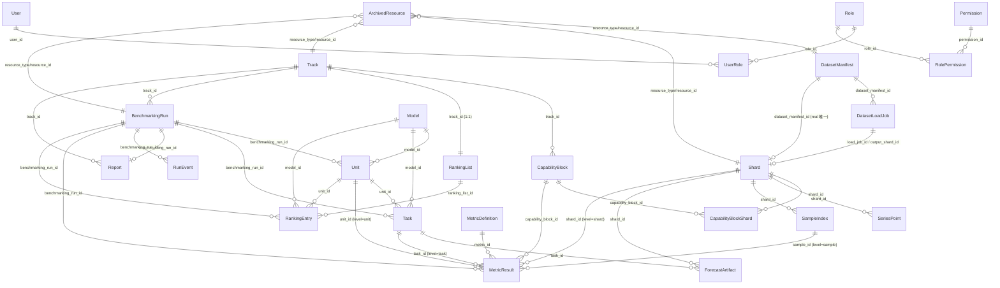

# 开发者手册 · 数据模型篇

> 返回[开发者手册总览](./README.md) ｜ 相关：[架构与关键流程](./key-flows.md)

本篇覆盖 TSBenchmark 后端的**全部实体设计**，以代码为唯一事实来源。所有字段表均按实体定义文件逐字核对，状态/类型枚举值取自 `services/` 中的实际赋值，不做臆测。

> **分层约定**：`routes` 校验并委派、`services` 承载行为、`models` 仅做持久化。本文聚焦 `models`（SQLModel 表实体）、`schemas`（传输层 DTO）与落盘产物（非 DB 的 JSONL / JSON 结构）。

## 0. 通用约定

### 0.1 主键与 ID

所有 SQLModel 表实体的主键都使用 `Field(default_factory=new_id, primary_key=True)`，其中 `new_id` 即 UUID4 字符串（`backend/app/core/ids.py:4`）：

```python
def new_id() -> str:
    return str(uuid4())
```

### 0.2 时间字段

`created_at` / `updated_at` / `*_at` 等时间字段默认工厂为 `utc_now`，返回带 UTC 时区的 `datetime`（`backend/app/core/time.py:4`）：

```python
def utc_now() -> datetime:
    return datetime.now(UTC)
```

### 0.3 JSON 列

凡是 `list[...]` / `dict[...]` 类型且需要持久化的字段，都通过 `sa_column=Column(JSON)` 落到 SQLite 的 JSON 列。本文在字段表中以「JSON 列」标注。

### 0.4 建表与元数据注册

`init_db(engine)` 通过导入所有 model 模块触发 SQLModel 元数据注册，再调用 `SQLModel.metadata.create_all(engine)` 建表（`backend/app/db/init_db.py:13`）。没有显式的外键约束（SQLite + SQLModel 此处仅以 `index=True` 字段表达逻辑外键），关系靠 service 层维护。

---

## 1. 总览

### 1.1 SQLModel 表实体清单（25 个）

| 实体 | 文件 | 职责 |
| --- | --- | --- |
| `DatasetManifest` | `backend/app/models/dataset.py:11` | 描述真实数据源（**CSV 或 TsFile** 文件、列配置） |
| `DatasetLoadJob` | `backend/app/models/dataset.py:28` | 一次数据加载/校验/切分/索引任务 |
| `Shard` | `backend/app/models/dataset.py:47` | 统一数据单元；真实或合成测试用例集，前端展示为“测试用例集” |
| `SeriesPoint` | `backend/app/models/series_point.py:11` | per-shard 原始序列逐点行存储（**SQLite 单一真值源**） |
| `SampleIndex` | `backend/app/models/sample.py:11` | 样本切片位置（行号区间指针，值在 `SeriesPoint`） |
| `CapabilityBlock` | `backend/app/models/benchmark.py:11` | 统一能力块；MVP 用 `block_type=real` |
| `CapabilityBlockShard` | `backend/app/models/benchmark.py:27` | 能力块与可复用 shard 的多对多关联 |
| `Track` | `backend/app/models/benchmark.py:33` | 评测赛道 |
| `Model` | `backend/app/models/model_registry.py:10` | 可评测模型 + adapter 配置 |
| `BenchmarkingRun` | `backend/app/models/benchmark.py:41` | 一次评测执行 |
| `Unit` | `backend/app/models/benchmark.py:63` | 某模型在某次 run 中的完整结果 |
| `Task` | `backend/app/models/benchmark.py:76` | 某模型在某 `CapabilityBlock` 上的结果 |
| `ForecastArtifact` | `backend/app/models/benchmark.py:94` | 预测产物位置与 schema |
| `RunEvent` | `backend/app/models/benchmark.py:108` | run/unit/task 过程事件与日志 |
| `MetricDefinition` | `backend/app/models/metric.py:10` | 指标注册表（MVP: mse / mae） |
| `MetricResult` | `backend/app/models/metric.py:24` | 统一多层级指标结果 |
| `Report` | `backend/app/models/report.py:11` | 基础评测报告 |
| `RankingList` | `backend/app/models/ranking.py:10` | 每条 Track 一个的榜单定义 |
| `RankingEntry` | `backend/app/models/ranking.py:21` | 榜单中的模型成绩行 |
| `User` | `backend/app/models/auth.py:9` | 登录用户；用于 JWT subject 与启停账号 |
| `Role` | `backend/app/models/auth.py:20` | 角色；MVP 内置 `admin` / `viewer` |
| `Permission` | `backend/app/models/auth.py:28` | 权限码字典；启动时由 `core/permissions.py` seed |
| `UserRole` | `backend/app/models/auth.py:34` | 用户-角色关联表 |
| `RolePermission` | `backend/app/models/auth.py:39` | 角色-权限关联表 |
| `ArchivedResource` | `backend/app/models/lifecycle.py:8` | 多态资源归档状态；不改写业务实体状态 |

### 1.2 ER 图



### 1.3 核心层级速览

数据侧（数据集 → 样本）：

```text
DatasetManifest → DatasetLoadJob → Shard(real) → SeriesPoint（逐点真值）
                                         ↓        ↘ SampleIndex（行号区间指针 → 现切自 SeriesPoint）
Synthetic generator → Shard(synthetic) → SeriesPoint（逐点真值）
                                      ↘ SampleIndex（行号区间指针 → 现切自 SeriesPoint）
Track → CapabilityBlock → CapabilityBlockShard → Shard → SampleIndex
```

执行侧（评测 → 结果）：

```text
BenchmarkingRun → Unit → Task → (遍历 CapabilityBlock 下的 Shard) → ForecastArtifact
                                                                   → MetricResult(sample/shard/task/unit)
```

`MetricResult` 是**单表多层级**：通过 `result_level` 字段区分 `sample` / `shard` / `task` / `unit`（MVP 实际写入这四级；定义上还预留 `run` / `ranking`）。

生命周期侧：

```text
ArchivedResource(resource_type, resource_id) → DatasetManifest / Shard / Track / BenchmarkingRun
```

归档状态独立存储，避免把 `BenchmarkingRun.status` 这种执行状态混入资源管理状态。物理删除由 `services/resource_lifecycle.py` 显式按依赖顺序清理。

> **逻辑外键说明**：模型层未声明数据库级 FOREIGN KEY，关系仅以带 `index=True` 的 ID 字段表达，并由 service 层维护引用完整性。ER 图中的关系基数据此还原。

### 1.4 ArchivedResource

资源归档状态表。源文件 `backend/app/models/lifecycle.py:8`。

| 字段 | 类型 | 默认值/约束 | 说明 |
| --- | --- | --- | --- |
| `resource_type` | `str` | **联合主键** | `dataset_manifest` / `shard` / `track` / `benchmarking_run` |
| `resource_id` | `str` | **联合主键** | 对应业务实体 ID |
| `archived_reason` | `str \| None` | `None` | 可选归档原因，当前 UI 未填写 |
| `archived_at` | `datetime` | `utc_now` | 归档时间 |

列表接口通过该表默认过滤归档资源；详情接口仍返回业务实体并附加 `archived_at`。恢复资源时删除对应 `ArchivedResource` 行。归档不删除报告、预测、指标或榜单条目。

---

## 2. 数据加载域实体

### 2.1 DatasetManifest

描述一个真实数据源。源文件 `backend/app/models/dataset.py:11`。

| 字段 | 类型 | 默认值/约束 | 说明 |
| --- | --- | --- | --- |
| `dataset_manifest_id` | `str` | **主键**，`default_factory=new_id` | UUID4 |
| `name` | `str` | 必填 | 数据集展示名 |
| `domain` | `str` | 必填 | 数据领域 |
| `source_type` | `str` | `"managed_file"` | `managed_file` / `synthetic` |
| `source_uri` | `str` | 必填 | 原始数据位置；真实上传为 `runtime/uploads/` 路径，合成数据为 `synthetic://<generation_id>` |
| `file_format` | `str` | `"csv"` | 输入格式；真实数据支持 `csv` / `tsfile`，合成数据写 `synthetic` |
| `time_column` | `str` | 必填 | 时间列列名 |
| `frequency` | `str \| None` | `None` | 时间频率；load 成功后由推断结果回填 |
| `timezone` | `str \| None` | `None` | 仅作元数据，不做时区转换 |
| `schema_version` | `str` | `"dataset_manifest.v1"` | manifest schema 版本 |
| `status` | `str` | `"ready_to_load"` | 见下方枚举 |
| `created_at` | `datetime` | `utc_now` | |
| `updated_at` | `datetime` | `utc_now` | |

**status 取值**（代码实际出现）：
- `"ready_to_load"`：默认初始值（`models/dataset.py:23`）。
- `"loaded"`：加载成功后置位（`services/dataset_load_service.py:149`）。

> 设计稿（spec §4.1）列出 `draft / ready_to_load / loaded / disabled` 四态，但当前代码只实际写入 `ready_to_load` 和 `loaded`，未见 `draft` / `disabled` 的赋值。

### 2.2 DatasetLoadJob

记录一次加载过程。源文件 `backend/app/models/dataset.py:28`。

| 字段 | 类型 | 默认值/约束 | 说明 |
| --- | --- | --- | --- |
| `load_job_id` | `str` | **主键**，`default_factory=new_id` | UUID4 |
| `dataset_manifest_id` | `str` | `index=True`（逻辑外键 → DatasetManifest） | 来源 manifest |
| `status` | `str` | `"created"` | 见下方枚举 |
| `current_step` | `str \| None` | `None` | 当前步骤 |
| `reader_type` | `str` | `"csv_dataset_reader"` | 读取器类型 |
| `reader_version` | `str` | `"1"` | 读取器版本 |
| `validation_summary` | `dict[str, Any]` | `{}`，**JSON 列** | 校验摘要（见下） |
| `split_config` | `dict[str, Any]` | `{}`，**JSON 列** | 切分配置（见下） |
| `seed` | `int` | `0` | 物化/stub 默认 seed |
| `error_code` | `str \| None` | `None` | 失败错误码 |
| `error_message` | `str \| None` | `None` | 失败说明 |
| `output_shard_id` | `str \| None` | `None` | 成功后产生的唯一 Shard |
| `started_at` | `datetime \| None` | `None` | |
| `finished_at` | `datetime \| None` | `None` | |
| `created_at` | `datetime` | `utc_now` | |
| `updated_at` | `datetime` | `utc_now` | |

**status 取值**（来自 `services/dataset_load_service.py`）：
- `"created"`：默认初始值（`models/dataset.py:31`）。
- `"loading"`：进入物化阶段（`dataset_load_service.py:117`）。
- `"succeeded"`：成功（`dataset_load_service.py:152`）。
- `"failed"`：捕获 `ApiError` 后失败（`dataset_load_service.py:92`）。

**current_step 取值**（来自同文件）：
- `"validating"`：创建 job 时（`dataset_load_service.py:82`）。
- `"materializing_samples"`：写序列（SeriesPoint）与样本指针时的 `current_step`（保留历史步名；实际不再物化文件）。
- `"succeeded"`：成功收尾时（`dataset_load_service.py:153`）。

> spec §4.2 的状态机额外提到 `validating`、`materializing_samples`，但它们在代码里落在 `current_step` 字段，而非 `status`。`status` 实际未写入独立的 `validating` / `materializing_samples` 值。

**`split_config` 结构**（service 读取的 key，`dataset_load_service.py`）：
- `context_length`（int，必填）
- `horizon`（int，必填）
- `stride`（int，可选；缺省取 `horizon`）
- `target_columns`（list[str]，**必填且至少 1 个，不能重复**；目标列选择。未选择或重复时报 `load_target_columns_invalid`；目标列不存在时由 reader 返回格式相关错误码）
- `covariate_columns`（list[str]，可选；known-future 协变量列选择。不能重复，不能与 `target_columns` 重叠；选择的列会与目标列共用同一时间轴并按窗口切成 `history_cov` / `future_cov`）
- `max_samples`（int，可选）：窗口数超过它时沿序列均匀采样（含首尾，可复现）。
- `shard_name`（str，可选）：前端上传/切片时提供的人类可读切片名称；成功后写入 `Shard.name`，不参与唯一性或执行逻辑。

**`validation_summary` 结构**（成功时写入，`dataset_load_service.py:155-160`）：
```json
{
  "row_count": 20,
  "sample_count": 4,
  "frequency": "1h",
  "columns": ["time", "target", "extra"],
  "target_columns": ["target"],
  "covariate_columns": ["extra"]
}
```

### 2.3 Shard

统一数据单元。源文件 `backend/app/models/dataset.py:47`。产品界面中将其展示为“测试用例集 / Test case set”，但代码、API、数据库字段仍沿用 `Shard` 命名。

| 字段 | 类型 | 默认值/约束 | 说明 |
| --- | --- | --- | --- |
| `shard_id` | `str` | **主键**，`default_factory=new_id` | UUID4 |
| `name` | `str \| None` | `None` | 测试用例集展示名；来自 `split_config.shard_name`，列表和详情优先展示该值 |
| `shard_type` | `str` | `"real"` | `real` / `synthetic` |
| `capability_type` | `str \| None` | `None`，`index=True` | 合成 shard 的能力维度 ID；真实数据通常为空 |
| `dataset_manifest_id` | `str` | `index=True`（逻辑外键 → DatasetManifest） | 数据来源 |
| `load_job_id` | `str \| None` | `None`，`index=True`（逻辑外键 → DatasetLoadJob） | 产生该 shard 的 job |
| `capability_block_id` | `str \| None` | `None`，`index=True`（逻辑外键 → CapabilityBlock） | 兼容旧数据的单归属字段；新链路通过 `CapabilityBlockShard` 关联，可为 None |
| `source_uri` | `str` | 必填 | 原始数据位置；真实数据为文件路径，合成数据为 `synthetic://<generation_id>` |
| `storage_uri` | `str \| None` | `None` | 规范化产物位置；真实数据通常为空，合成数据写入 `runtime/synthetic/*.json` 生成摘要 |
| `checksum` | `str \| None` | `None` | 校验值 |
| `time_range_start` | `str \| None` | `None` | 时间范围起（ISO 8601 字符串） |
| `time_range_end` | `str \| None` | `None` | 时间范围止（ISO 8601 字符串） |
| `row_count` | `int` | `0` | 行数 |
| `target_columns` | `list[str]` | `[]`，**JSON 列** | 被选中的目标列，可为一个或多个 |
| `target_dim` | `int` | `1` | 目标维度，等于 `target_columns` 数量 |
| `covariate_columns` | `list[str]` | `[]`，**JSON 列** | 被选中的 known-future 协变量列 |
| `covariate_dim` | `int` | `0` | 协变量维度，等于 `covariate_columns` 数量 |
| `frequency` | `str \| None` | `None` | 时间频率 |
| `context_length` | `int` | `0` | 样本历史长度 |
| `horizon` | `int` | `0` | 预测长度 |
| `stride` | `int` | `0` | 滑窗步长 |
| `sample_count` | `int` | `0` | 样本数 |
| `generation_config` | `dict[str, Any]` | `{}`，**JSON 列** | 合成生成配置摘要；真实数据通常为空 |
| `status` | `str` | `"created"` | 见下方枚举 |
| `created_at` | `datetime` | `utc_now` | |
| `updated_at` | `datetime` | `utc_now` | |

**shard_type 取值**：
- `"real"`：真实 CSV / TsFile 经 load job 切分生成。
- `"synthetic"`：`POST /synthetic/shards` 按能力维度和共享参数生成；同一次请求可产生多个 synthetic shard。

> 2026-05-28 起，Shard 是可复用数据切片；同一 shard 可以通过多条 `CapabilityBlockShard` 记录挂到不同 capability block / track。`Shard.capability_block_id` 仅用于旧数据 fallback。

**status 取值**：
- `"created"`：默认初始值（`models/dataset.py:66`）。
- `"ready"`：成功加载后创建 shard 即置为 ready（`dataset_load_service.py:137`）；`init_db.py:38` 的唯一性断言也按 `status=="ready"` 过滤。

> spec §4.3 列出 `created / ready / failed / disabled`，代码实际只出现 `created` 和 `ready`。

### 2.4 SampleIndex

记录样本切片位置（**行号区间指针**，值现切自 `SeriesPoint`，不再物化产物）。源文件 `backend/app/models/sample.py:11`。

| 字段 | 类型 | 默认值/约束 | 说明 |
| --- | --- | --- | --- |
| `sample_id` | `str` | **主键**，`default_factory=new_id` | UUID4 |
| `shard_id` | `str` | `index=True`（逻辑外键 → Shard） | 所属 shard |
| `sample_index` | `int` | 必填 | shard 内序号（从 0 起） |
| `context_start` | `int` | 必填 | history 窗口起（行偏移） |
| `context_end` | `int` | 必填 | history 窗口止（含） |
| `horizon_start` | `int` | 必填 | future 窗口起 |
| `horizon_end` | `int` | 必填 | future 窗口止（含） |
| `target_columns` | `list[str]` | `[]`，**JSON 列** | 目标列 |
| `covariate_columns` | `list[str]` | `[]`，**JSON 列** | known-future 协变量列 |
| `context_length` | `int` | `0` | history 长度 |
| `horizon` | `int` | `0` | future 长度 |
| `storage_ref` | `dict[str, Any]` | `{}`，**JSON 列** | **指针化切片引用**：`{shard_id, sample_id, sample_index, target_columns, covariate_columns, context:[s,e], horizon:[s,e]}`（行号区间，**闭区间**；切片走 `SeriesPoint`） |
| `materialized` | `bool` | `False` | 指针化：值在 `SeriesPoint`，样本不物化为产物 |
| `materialized_sample_uri` | `str \| None` | `None` | 兼容旧 `read_by_ref` 签名的遗留字段，已不使用 |
| `checksum` | `str \| None` | `None` | 样本**内容**（值/时间戳/列名/行范围）的 sha256，**排除随机 ID** → 同数据跨加载相等（#7） |
| `sample_metadata` | `dict[str, Any]` | `{}`，**JSON 列** | 可选样本摘要 |
| `created_at` | `datetime` | `utc_now` | |
| `updated_at` | `datetime` | `utc_now` | |

写入逻辑见 `services/sample_store.py`（**2026-05-25 SQLite pivot**）：样本不物化为产物，`storage_ref` 只记录行号区间指针；`checksum` 对样本内容算（排除随机 `sample_id`/`shard_id`，跨加载可比，#7）。读取时 `SampleStore.read_by_ref(session, storage_ref)` 用**调用方的 session** 调 `SeriesStore.slice(...)` 按 `(shard_id, row_index)` 范围查询 `SeriesPoint`，现拼出 `sample.v1` 视图（值与时间戳均来自 SQLite）。

> 注意字段名为 `sample_metadata`（不是 `metadata`，后者与 SQLAlchemy 保留名冲突）。spec §4.4 写作「metadata」，以代码为准。

### 2.5 SeriesPoint

per-shard 原始序列的**逐点行存储**，是样本值的 SQLite 单一真值源。源文件 `backend/app/models/series_point.py:11`。

| 字段 | 类型 | 默认值/约束 | 说明 |
| --- | --- | --- | --- |
| `series_point_id` | `str` | **主键**，`default_factory=new_id` | UUID4 |
| `shard_id` | `str` | `index=True`（逻辑外键 → Shard） | 所属 shard |
| `row_index` | `int` | 必填 | shard 内行号（从 0 起，等距） |
| `ts` | `str` | 必填 | ISO 8601 时间戳**原文**（保留原始 offset，不经 ms-epoch 往返，#8） |
| `values_json` | `dict[str, Any]` | `{}`，**JSON 列** | 该点各 value 列的 `{列名: 值}`，自描述、不依赖列序 |
| `created_at` | `datetime` | `utc_now` | |

复合索引 `ix_seriespoint_shard_row (shard_id, row_index)` 支撑样本切片的范围查询。写入见 `services/series_store.py` 的 `SeriesStore.write`（批量插）/ `slice` / `slice_timestamps`（**闭区间**范围查询）。

---

## 3. 评测组织域实体

### 3.1 CapabilityBlock

统一能力块。源文件 `backend/app/models/benchmark.py:11`。

| 字段 | 类型 | 默认值/约束 | 说明 |
| --- | --- | --- | --- |
| `capability_block_id` | `str` | **主键**，`default_factory=new_id` | UUID4 |
| `track_id` | `str \| None` | `None`，`index=True`（逻辑外键 → Track） | 所属 Track；挂到 Track 前为 None |
| `block_type` | `str` | `"real"` | `real` / `synthetic` |
| `capability_type` | `str` | `"real_data"` | 能力类型；真实数据为 `real_data`，合成数据为能力维度 ID |
| `name` | `str` | 必填 | 展示名 |
| `task_type` | `str` | `"univariate_forecast"` | 任务类型 |
| `target_dim` | `int` | `1` | 目标维度 |
| `covariate_dim` | `int` | `0` | 协变量维度 |
| `shard_count` | `int` | `0` | shard 数 |
| `sample_count` | `int` | `0` | 汇总样本数 |
| `aggregation_policy` | `str` | `"mean_over_shards"` | shard 聚合策略 |
| `generation_config` | `dict[str, Any]` | `{}`，**JSON 列** | 合成能力块的生成配置摘要 |
| `status` | `str` | `"ready"` | 见下方枚举 |
| `created_at` | `datetime` | `utc_now` | |
| `updated_at` | `datetime` | `utc_now` | |

`block_type`/`capability_type` 由 `services/track_service.py` 创建能力块时写入。真实数据为 `"real"` / `"real_data"`；合成数据由 `/wizard/track-from-shards` 按 `Shard.capability_type` 自动拆成多个 synthetic block。
**status 取值**：仅 `"ready"`（默认值，`models/benchmark.py:22`），代码无其它写入。spec §4.5 预留 `draft / disabled`。

### 3.1.1 CapabilityBlockShard

能力块与 shard 的关联表。源文件 `backend/app/models/benchmark.py:27`。

| 字段 | 类型 | 默认值/约束 | 说明 |
| --- | --- | --- | --- |
| `capability_block_id` | `str` | **联合主键**（逻辑外键 → CapabilityBlock） | 能力块 |
| `shard_id` | `str` | **联合主键**（逻辑外键 → Shard） | 可复用切片 |
| `created_at` | `datetime` | `utc_now` | |

该表允许同一个 shard 被多条 track 复用：复用时为新 track 创建新的 capability block，再插入指向同一 shard 的 `CapabilityBlockShard` 记录。

### 3.2 Track

评测赛道。源文件 `backend/app/models/benchmark.py:27`。

| 字段 | 类型 | 默认值/约束 | 说明 |
| --- | --- | --- | --- |
| `track_id` | `str` | **主键**，`default_factory=new_id` | UUID4 |
| `name` | `str` | 必填 | 赛道名 |
| `track_type` | `str` | `"real_dataset"` | `real_dataset` / `synthetic_dataset` / `mixed_dataset` |
| `description` | `str \| None` | `None` | 描述 |
| `primary_metric_id` | `str` | `"mase"` | 默认榜单指标（**2026-05-25 起切为 mase 主排名**；mse/mae 降为诊断） |
| `default_ranking_policy` | `str` | `"latest_valid_result"` | 默认榜单策略 |
| `benchmark_version` | `str` | `"mvp"` | benchmark 版本 |
| `data_version` | `str` | `"v1"` | 数据版本 |
| `status` | `str` | `"ready"` | 见下方枚举 |
| `created_at` | `datetime` | `utc_now` | |
| `updated_at` | `datetime` | `utc_now` | |

**status 取值**：仅 `"ready"`（默认值）。spec §4.6 预留 `draft / disabled`。

> 归档状态不写入 `Track.status`，而是由 `ArchivedResource(resource_type="track")` 表达。归档赛道仍可查详情和榜单，但 `create_benchmarking_run` 会拒绝在归档赛道上创建新 run。

### 3.3 Model

可评测模型注册项。源文件 `backend/app/models/model_registry.py:10`。

| 字段 | 类型 | 默认值/约束 | 说明 |
| --- | --- | --- | --- |
| `model_id` | `str` | **主键**，`default_factory=new_id` | UUID4 |
| `name` | `str` | 必填 | 展示名 |
| `model_family` | `str` | 必填 | 模型族（Timer / Chronos / toto / TimesFM 等） |
| `model_version` | `str` | 必填 | 版本 |
| `adapter_type` | `str` | `"timer_service"` | adapter 类型 |
| `endpoint_uri` | `str \| None` | `None` | 推理服务地址 |
| `supported_task_types` | `list[str]` | `["univariate_forecast"]`，**JSON 列** | 支持的任务类型 |
| `forecast_limits` | `dict[str, Any]` | `{}`，**JSON 列** | 远端模型能力限制镜像；读取 `max_target_count` 判断多目标支持，`null` 表示不限制目标数，缺失表示不支持多目标；读取 `max_covariate_count` 判断协变量支持，缺失或 `0` 表示不支持协变量 |
| `input_schema_version` | `str` | `"sample.v1"` | 输入协议版本 |
| `stub_seed` | `int` | `0` | stub 可复现 seed |
| `status` | `str` | `"available"` | 见下方枚举 |
| `created_at` | `datetime` | `utc_now` | |
| `updated_at` | `datetime` | `utc_now` | |

**status 取值**：仅 `"available"`（默认值，`models/model_registry.py:20`）。spec §4.7 预留 `registered / disabled`。

**adapter_type**：默认 `"timer_service"`。
- 注意实际选用哪种 adapter 由**全局配置**决定而非该字段：`get_model_adapter(settings)` 在 `settings.model_adapter == "stub"` 时返回 `StubTimerAdapter`，否则返回 `TimerRestAdapter`（`services/model_adapter.py:13-20`）。
- `endpoint_uri == "stub://fail"` 是约定的失败注入：会让对应 unit 直接以 `adapter_error` 失败（`run_executor.py:142-143`）。
- 种子模型由 `seed_mvp_models` 写入（`track_service.py:79-93`），共 5 个：Timer 3.5 / Timer 3.0 / Chronos 2 / toto / TimesFM 2.5，`endpoint_uri` 形如 `stub://timer-service/{slug}`；其中 `toto` 的 `forecast_limits.max_target_count=null`，其余 MVP 种子模型为 `1`；`Chronos 2` 的 `forecast_limits.max_covariate_count=50`，其余为 `0`。
- `remote_model_id(model)` 把本地模型映射为 REST 服务的 model_id，规则为 `{model_family}-{model_version}`（如 `Timer-3.5`），缺失时退回 `name` 或 `model_id`（`model_adapter.py:23-29`）。
- REST 模式下 `/models` 以 timer-rest-service `/models/list` 为权威来源并同步 `forecast_limits`；`state=inactive` 的远端模型视为不可用，不对前端展示，也不能被手动加载或用于创建 run。创建 run 时若 track 的最大 `target_dim > 1`，缺失 `max_target_count` 或小于目标维度的模型会被 `model_target_dim_unsupported` 拒绝；若 track 的最大 `covariate_dim > 0`，缺失 `max_covariate_count` 或小于协变量维度的模型会被 `model_covariate_dim_unsupported` 拒绝。

---

## 4. 评测执行域实体

### 4.1 BenchmarkingRun

一次评测执行。源文件 `backend/app/models/benchmark.py:41`。

| 字段 | 类型 | 默认值/约束 | 说明 |
| --- | --- | --- | --- |
| `benchmarking_run_id` | `str` | **主键**，`default_factory=new_id` | UUID4 |
| `track_id` | `str` | `index=True`（逻辑外键 → Track） | 被评测 Track |
| `model_ids` | `list[str]` | `[]`，**JSON 列** | 参评模型 ID 列表 |
| `benchmark_version` | `str` | `"mvp"` | |
| `data_version` | `str` | `"v1"` | |
| `status` | `str` | `"created"` | 见下方枚举 |
| `execution_mode` | `str` | `"background_thread"` | 执行方式 |
| `cancel_requested` | `bool` | `False` | 是否已请求取消 |
| `cancel_requested_at` | `datetime \| None` | `None` | 取消请求时间 |
| `model_count` | `int` | `0` | 模型数 |
| `task_count` | `int` | `0` | task 数 |
| `sample_count` | `int` | `0` | 样本数 |
| `metric_set` | `list[str]` | `["mase", "mse", "mae"]`，**JSON 列** | 计算的指标集（mase 主排名，mse/mae 诊断） |
| `report_id` | `str \| None` | `None`（逻辑外键 → Report） | 关联报告 |
| `ranking_list_id` | `str \| None` | `None`（逻辑外键 → RankingList） | 关联榜单 |
| `started_at` | `datetime \| None` | `None` | |
| `finished_at` | `datetime \| None` | `None` | |
| `created_at` | `datetime` | `utc_now` | |
| `updated_at` | `datetime` | `utc_now` | |

**status 取值**（来自 `services/run_executor.py`）：
- `"created"`：模型定义的默认值（`models/benchmark.py:47`）。
- `"queued"`：`create_benchmarking_run` 创建时实际写入（`run_executor.py:30`）。
- `"running"`：开始执行（`run_executor.py:101`）。
- `"cancel_requested"`：运行中 run 已收到取消请求，执行器会在模型生命周期、unit/task/shard/sample 调度边界协作式停止。
- `"cancelled"`：排队/未开始 run 被直接取消，或运行中 run 已确认取消并停止调度；取消 run 不生成 report，也不刷新榜单。
- `"succeeded"`：全部 unit 成功（`run_executor.py:117`）。
- `"partial_succeeded"`：部分 unit 成功、部分失败（`run_executor.py:115`）。
- `"failed"`：全部失败，或服务重启时把未完成 run 标记失败（`run_executor.py:83,119`）。

> 归档状态不写入 `BenchmarkingRun.status`，而是由 `ArchivedResource(resource_type="benchmarking_run")` 表达。归档/永久删除 run 前必须已进入终态：`succeeded`、`partial_succeeded`、`failed` 或 `cancelled`。

正常执行的终态判定逻辑：统计 `unit.status`——全部 `succeeded` → `succeeded`；存在 `succeeded` 或 `partial_succeeded` 但未全部成功 → `partial_succeeded`；否则 → `failed`。取消路径绕过该判定，直接落 `cancelled`。

### 4.2 Unit

某模型在某次 run 中的完整结果。源文件 `backend/app/models/benchmark.py:63`。

| 字段 | 类型 | 默认值/约束 | 说明 |
| --- | --- | --- | --- |
| `unit_id` | `str` | **主键**，`default_factory=new_id` | UUID4 |
| `benchmarking_run_id` | `str` | `index=True`（逻辑外键 → BenchmarkingRun） | 所属 run |
| `model_id` | `str` | `index=True`（逻辑外键 → Model） | 模型 |
| `status` | `str` | `"created"` | 见下方枚举 |
| `task_count` | `int` | `0` | task 数 |
| `sample_count` | `int` | `0` | 样本数 |
| `started_at` | `datetime \| None` | `None` | |
| `finished_at` | `datetime \| None` | `None` | |
| `created_at` | `datetime` | `utc_now` | |
| `updated_at` | `datetime` | `utc_now` | |

**status 取值**（来自 `run_executor.py`）：
- `"created"`：默认值（`models/benchmark.py:67`），创建 unit 时未显式改写。
- `"running"`：开始执行 unit（`run_executor.py:138`）。
- `"succeeded"`：所有 task metric 非空（`run_executor.py:156`）。
- `"partial_succeeded"`：部分 task 成功（`run_executor.py:156`）。
- `"failed"`：`_fail_unit` 整体失败（`run_executor.py:170`，如 `endpoint_uri=="stub://fail"`）。
- `"cancelled"`：run 取消确认时，尚未到达终态的 unit 会被置为 cancelled。

> spec §4.9 还列出 `skipped`；当前 run_executor 未写入 `skipped`。

### 4.3 Task

某模型在某 `CapabilityBlock` 上的结果。源文件 `backend/app/models/benchmark.py:76`。

| 字段 | 类型 | 默认值/约束 | 说明 |
| --- | --- | --- | --- |
| `task_id` | `str` | **主键**，`default_factory=new_id` | UUID4 |
| `benchmarking_run_id` | `str` | `index=True`（逻辑外键 → BenchmarkingRun） | 所属 run |
| `unit_id` | `str` | `index=True`（逻辑外键 → Unit） | 所属 unit |
| `model_id` | `str` | `index=True`（逻辑外键 → Model） | 模型 |
| `capability_block_id` | `str` | `index=True`（逻辑外键 → CapabilityBlock） | 能力块 |
| `status` | `str` | `"created"` | 见下方枚举 |
| `shard_count` | `int` | `0` | shard 数 |
| `sample_count` | `int` | `0` | 样本数 |
| `processed_sample_count` | `int` | `0` | 运行中已处理样本数（成功 + 失败），用于 artifact 写入前的进度可见性 |
| `failed_sample_count` | `int` | `0` | 运行中已失败样本数 |
| `aggregation_policy` | `str` | `"mean_over_shards"` | shard 聚合策略 |
| `error_code` | `str \| None` | `None` | 失败错误码 |
| `error_message` | `str \| None` | `None` | 失败说明 |
| `started_at` | `datetime \| None` | `None` | |
| `finished_at` | `datetime \| None` | `None` | |
| `created_at` | `datetime` | `utc_now` | |
| `updated_at` | `datetime` | `utc_now` | |

**status 取值**（来自 `run_executor.py`）：
- `"created"`：默认值（`models/benchmark.py:82`）。
- `"running"`：开始执行 task（`run_executor.py:177`）。
- `"succeeded"`：所有 shard metric 非空（`run_executor.py:192`）。
- `"partial_succeeded"`：部分 shard 成功（`run_executor.py:192`）。
- `"failed"`：随 unit 失败被批量置位，并写入 `error_code`/`error_message`（`run_executor.py:165-167`）。
- `"cancelled"`：run 取消确认时，尚未到达终态的 task 会被置为 cancelled。

> spec §4.10 同样列出 `skipped`；当前 run_executor 未写入 `skipped`。

### 4.4 ForecastArtifact

预测产物位置记录（不含 forecast 数组）。源文件 `backend/app/models/benchmark.py:94`。

| 字段 | 类型 | 默认值/约束 | 说明 |
| --- | --- | --- | --- |
| `forecast_artifact_id` | `str` | **主键**，`default_factory=new_id` | UUID4 |
| `benchmarking_run_id` | `str` | `index=True`（逻辑外键 → BenchmarkingRun） | 所属 run |
| `unit_id` | `str` | `index=True`（逻辑外键 → Unit） | 所属 unit |
| `task_id` | `str` | `index=True`（逻辑外键 → Task） | 所属 task |
| `model_id` | `str` | `index=True`（逻辑外键 → Model） | 模型 |
| `shard_id` | `str` | `index=True`（逻辑外键 → Shard） | 数据 shard |
| `storage_uri` | `str` | 必填 | forecast JSONL 路径 |
| `schema_version` | `str` | `"forecast.v1"` | 产物 schema 版本 |
| `sample_count` | `int` | `0` | 覆盖样本数 |
| `checksum` | `str \| None` | `None` | 整文件 sha256 |
| `created_at` | `datetime` | `utc_now` | |

写入见 `services/forecast_store.py:46-56`：`storage_uri` 为 `forecasts/{run_id}/{task_id}/{model_id}_{shard_id}.jsonl`，`sample_count=len(rows)`，`checksum` 为逐行累积的 sha256。`unit_id` 在写入返回后由 `run_executor.py:233` 补齐。

### 4.5 RunEvent

run/unit/task 过程事件与日志。源文件 `backend/app/models/benchmark.py:108`。

| 字段 | 类型 | 默认值/约束 | 说明 |
| --- | --- | --- | --- |
| `run_event_id` | `str` | **主键**，`default_factory=new_id` | UUID4 |
| `benchmarking_run_id` | `str` | `index=True`（逻辑外键 → BenchmarkingRun） | 所属 run |
| `unit_id` | `str \| None` | `None`，`index=True`（逻辑外键 → Unit） | 可选 |
| `task_id` | `str \| None` | `None`，`index=True`（逻辑外键 → Task） | 可选 |
| `level` | `str` | `"info"` | `info` / `warning` / `error` |
| `event_type` | `str` | `"status_changed"` | 事件类型 |
| `message` | `str` | 必填 | 文本说明 |
| `payload` | `dict[str, Any]` | `{}`，**JSON 列** | 结构化补充 |
| `created_at` | `datetime` | `utc_now` | |

**level 取值**（代码实际使用）：`"info"`（默认/run 排队、开始、完成）、`"warning"`（取消相关，`run_executor.py:71,95`）、`"error"`（重启中断，`run_executor.py:85`）。

**event_type 取值**（代码实际使用）：
- `"status_changed"`：默认值。
- `"cancel_requested"`：请求取消（`run_executor.py:71`）。
- `"cancelled"`：取消完成（`run_executor.py:95`）。
- `"interrupted_by_server_restart"`：服务重启中断（`run_executor.py:85`）。

---

## 5. 指标 / 报告 / 榜单域实体

### 5.1 MetricDefinition

指标注册表。源文件 `backend/app/models/metric.py:10`。

| 字段 | 类型 | 默认值/约束 | 说明 |
| --- | --- | --- | --- |
| `metric_id` | `str` | **主键**，`default_factory=new_id` | UUID4 |
| `name` | `str` | 必填 | 指标名（`mase` / `mse` / `mae`；mase 为主排名） |
| `display_name` | `str` | 必填 | 展示名 |
| `direction` | `str` | `"lower_is_better"` | 优劣方向 |
| `supported_levels` | `list[str]` | `["sample","shard","task","unit","run","ranking"]`，**JSON 列** | 支持层级 |
| `status` | `str` | `"active"` | 默认 active（spec 预留 `disabled`） |
| `created_at` | `datetime` | `utc_now` | |
| `updated_at` | `datetime` | `utc_now` | |

> 注意 `MetricResult.metric_id` / `_metric()` 直接使用字符串 `"mse"` / `"mae"`（指标 name），并非引用 `MetricDefinition.metric_id`（UUID）。即指标在执行链路里以 name 作为业务键使用。

### 5.2 MetricResult

统一多层级指标结果。源文件 `backend/app/models/metric.py:24`。

| 字段 | 类型 | 默认值/约束 | 说明 |
| --- | --- | --- | --- |
| `metric_result_id` | `str` | **主键**，`default_factory=new_id` | UUID4 |
| `metric_id` | `str` | `index=True` | 指标键（实际存 `"mse"`/`"mae"`） |
| `result_level` | `str` | 必填 | `sample` / `shard` / `task` / `unit`（写入这四级） |
| `benchmarking_run_id` | `str` | `index=True`（逻辑外键 → BenchmarkingRun） | 所属 run |
| `unit_id` | `str \| None` | `None`，`index=True` | unit 级及以下携带 |
| `task_id` | `str \| None` | `None`，`index=True` | task 级及以下携带 |
| `sample_id` | `str \| None` | `None`，`index=True` | sample 级必填 |
| `shard_id` | `str \| None` | `None`，`index=True` | shard 级/sample 级携带 |
| `model_id` | `str` | `index=True`（逻辑外键 → Model） | 模型 |
| `capability_block_id` | `str \| None` | `None`，`index=True` | 可选 |
| `value` | `float` | 必填 | 指标值 |
| `aggregation` | `str` | `"raw"` | 见下方命名规则 |
| `metadata_json` | `dict` | `{}`，**JSON 列** | 附加信息 |
| `created_at` | `datetime` | `utc_now` | |

**各层级写入的 ID 组合**（来自 `run_executor._execute_*` 与 `_metric`）：

| result_level | unit_id | task_id | shard_id | sample_id | capability_block_id | aggregation |
| --- | --- | --- | --- | --- | --- | --- |
| `sample` | ✓ | ✓ | ✓ | ✓ | ✓ | `raw` |
| `shard` | ✓ | ✓ | ✓ | — | ✓ | `mean_over_shards` |
| `task` | ✓ | ✓ | — | — | ✓ | `mean_over_tasks` |
| `unit` | ✓ | — | — | — | — | `mean_over_units` |

**aggregation 命名规则**（`run_executor._metric`，`run_executor.py:268`）：

```python
aggregation="raw" if level == "sample" else f"mean_over_{level}s"
```

即 `sample → "raw"`，其余层级为 `mean_over_{level}s`：`shard → "mean_over_shards"`、`task → "mean_over_tasks"`、`unit → "mean_over_units"`。

> 这是一个**值得注意的命名细节**：聚合标签描述的是「在该层级内对下层求平均后落到该层」，但字面用了该层级自身的复数（如 task 级写 `mean_over_tasks`），与直觉上的「mean_over_shards 才得到 task 值」略有出入——以代码为准。

**指标计算与聚合**（`services/metric_service.py`）：
- sample 级：把 `target_future` 与 `forecast` 各自 flatten 后逐元素求误差，`mse = mean(err²)`、`mae = mean(|err|)`；**`mase = mae / scale`**，其中 `scale` 为 `target_history` 的 naive（last-value，m=1）尺度 `mean_t|h[t]-h[t-1]|`。`scale==0`（平稳历史）或历史 <2 行时**不在 metrics dict 产出 mase 键**（聚合时按缺失/失败处理，避免 NaN 污染），但**缺席不再静默**（#14）：`compute_sample_metrics` 返回 `SampleMetrics` 子类，经 `mase_unavailable_reason`（`flat_history` / `no_history_diffs`）暴露原因，report 在该 unit 标注 `metrics.mase=null` + 原因（不能往 dict 放 None——`run_executor` 把每键当非空 float 持久化）。见 `metric_service.py` 与 §10.5。
- 上层聚合：`aggregate_metric` 对下层成功项取算术平均，并返回 `success_count` / `failure_count`；若全部失败返回 `None`（`metric_service.py:20-34`）。

### 5.3 Report

基础评测报告。源文件 `backend/app/models/report.py:11`。

| 字段 | 类型 | 默认值/约束 | 说明 |
| --- | --- | --- | --- |
| `report_id` | `str` | **主键**，`default_factory=new_id` | UUID4 |
| `report_type` | `str` | `"run_summary"` | 报告类型 |
| `benchmarking_run_id` | `str` | `index=True`（逻辑外键 → BenchmarkingRun） | 所属 run |
| `track_id` | `str` | `index=True`（逻辑外键 → Track） | 所属 track |
| `status` | `str` | `"created"` | 见下方枚举 |
| `storage_uri` | `str \| None` | `None` | 报告 JSON 路径 |
| `summary` | `dict[str, Any]` | `{}`，**JSON 列** | 基础摘要 |
| `created_at` | `datetime` | `utc_now` | |
| `updated_at` | `datetime` | `utc_now` | |

**status 取值**：
- `"created"`：默认值（`models/report.py:15`）。
- `"ready"`：报告生成完成（`services/report_service.py:35`）。

**summary 结构**（`report_service.py:37`）：`{"status": <run.status>, "model_count": <unit 数>, "task_count": <task 数>}`。`storage_uri` 为 `reports/{run_id}.json`。

### 5.4 RankingList

每条 Track 一个的榜单定义。源文件 `backend/app/models/ranking.py:10`。

| 字段 | 类型 | 默认值/约束 | 说明 |
| --- | --- | --- | --- |
| `ranking_list_id` | `str` | **主键**，`default_factory=new_id` | UUID4 |
| `track_id` | `str` | `index=True`（逻辑外键 → Track） | 所属 track |
| `default_metric_id` | `str` | 必填 | 默认排序指标（来自 `Track.primary_metric_id`） |
| `default_policy` | `str` | `"latest_valid_result"` | 默认策略 |
| `supported_policies` | `list[str]` | `["latest_valid_result","best_result"]`，**JSON 列** | 支持策略 |
| `public_visible` | `bool` | `True` | 临时公开开关；`False` 时匿名 `/ranking-lists` 和 `/tracks/{track_id}/ranking` 不展示该榜，登录用户仍可见 |
| `status` | `str` | `"active"` | 默认 active（spec 预留 `disabled`） |
| `created_at` | `datetime` | `utc_now` | |
| `updated_at` | `datetime` | `utc_now` | |

### 5.5 RankingEntry

榜单中的模型成绩行。源文件 `backend/app/models/ranking.py:21`。

| 字段 | 类型 | 默认值/约束 | 说明 |
| --- | --- | --- | --- |
| `ranking_entry_id` | `str` | **主键**，`default_factory=new_id` | UUID4 |
| `ranking_list_id` | `str` | `index=True`（逻辑外键 → RankingList） | 榜单 |
| `track_id` | `str` | `index=True`（逻辑外键 → Track） | 赛道 |
| `metric_id` | `str` | `index=True` | 当前视图指标（`mse`/`mae`） |
| `policy` | `str` | `"latest_valid_result"` | 视图策略 |
| `model_id` | `str` | `index=True`（逻辑外键 → Model） | 模型 |
| `benchmarking_run_id` | `str` | `index=True`（逻辑外键 → BenchmarkingRun） | 采用的 run |
| `unit_id` | `str` | `index=True`（逻辑外键 → Unit） | 对应 unit |
| `metric_value` | `float` | 必填 | 排序指标值 |
| `rank` | `int` | 必填 | 排名（从 1 起，按 value 升序） |
| `status` | `str` | `"active"` | 默认 active（spec 预留 `stale`） |
| `created_at` | `datetime` | `utc_now` | |
| `updated_at` | `datetime` | `utc_now` | |

**policy 取值**：`"latest_valid_result"`、`"best_result"`（`refresh_ranking` 对两种 policy 各刷新一套 entry，`ranking_service.py:11`）。

---

## 6. 落盘产物的数据结构（非 DB）

这些结构不进入 SQLite，而是以文件形式存于 `runtime/` 目录，DB 实体只保存其 `storage_uri` / `storage_ref`。

### 6.1 样本视图（sample.v1）

**2026-05-25 SQLite pivot / 2026-06-02 target-only cleanup / 2026-06-03 multi-target + known-future covariates**：样本不物化为文件。每个 shard 的目标向量与协变量序列逐点存在 SQLite `SeriesPoint`（见 §2.5）。`sample.v1` 是 `SampleStore.read_by_ref(session, storage_ref)` 用 `SeriesStore.slice` 按 `SampleIndex.storage_ref` 的行号区间（`(shard_id, row_index)` 范围查询）**现切**出来的内存视图，字段结构如下（`services/sample_store.py` 的 `_assemble`）。协变量只支持 known-future：同一 `covariate_column_names` 在 history 与 horizon 两段都存在，分别返回为 `history_cov` / `future_cov`。

| 字段 | 类型 | 说明 |
| --- | --- | --- |
| `schema_version` | `str` | 固定 `"sample.v1"` |
| `sample_id` | `str` | 对应 `SampleIndex.sample_id` |
| `shard_id` | `str` | 所属 shard |
| `sample_index` | `int` | shard 内序号 |
| `target_column_names` | `list[str]` | 目标列名 |
| `covariate_column_names` | `list[str]` | 协变量列名；无协变量时为空数组 |
| `history_timestamps` | `list[str]` | history 窗口 ISO 8601 时间戳，长度 = context_length |
| `future_timestamps` | `list[str]` | future 窗口 ISO 8601 时间戳，长度 = horizon |
| `target_history` | `list[list[float]]` | shape `[context_length, target_dim]`，二维数组（单变量也是二维） |
| `target_future` | `list[list[float]]` | shape `[horizon, target_dim]`，作为 ground truth |
| `history_cov` | `list[list[float]]` | shape `[context_length, covariate_dim]`；无协变量时为空数组 `[]` |
| `future_cov` | `list[list[float]]` | shape `[horizon, covariate_dim]`；无协变量时为空数组 `[]` |
| `source_row_start` | `int` | 校验后原始数据行起（左闭） |
| `source_row_end` | `int` | 校验后原始数据行止（含） |

序列化使用 canonical JSON（`ensure_ascii=False, sort_keys=True, separators=(",", ":")`），`SampleIndex.checksum` 即该行内容的 sha256（`sample_store.py:11-16,53`）。

示例片段：
```json
{"covariate_column_names":["promo"],"future_cov":[[1.0],[0.0],[1.0]],"future_timestamps":["2020-01-01T06:00:00","2020-01-01T07:00:00","2020-01-01T08:00:00"],"history_cov":[[0.0],[0.0],[1.0],[0.0],[0.0],[1.0]],"history_timestamps":["2020-01-01T00:00:00","2020-01-01T01:00:00","2020-01-01T02:00:00","2020-01-01T03:00:00","2020-01-01T04:00:00","2020-01-01T05:00:00"],"sample_id":"...","sample_index":0,"schema_version":"sample.v1","shard_id":"...","source_row_end":8,"source_row_start":0,"target_column_names":["value"],"target_future":[[6.0],[7.0],[8.0]],"target_history":[[0.0],[1.0],[2.0],[3.0],[4.0],[5.0]]}
```

### 6.2 预测产物（forecast.v1）

每个 (run, task, model, shard) 组合一个 JSONL 文件 `runtime/forecasts/{run_id}/{task_id}/{model_id}_{shard_id}.jsonl`，每行一个 sample 的 forecast。结构来自 `services/forecast_store.py:29-42`。

| 字段 | 类型 | 说明 |
| --- | --- | --- |
| `schema_version` | `str` | 固定 `"forecast.v1"` |
| `benchmarking_run_id` | `str` | run |
| `task_id` | `str` | task |
| `model_id` | `str` | 模型 |
| `shard_id` | `str` | shard |
| `sample_id` | `str` | 对应样本 |
| `status` | `str` | sample forecast 状态，默认 `"succeeded"`（来自 `row.get("status","succeeded")`） |
| `forecast` | `list[list[float]] \| None` | 预测数组，shape `[horizon, target_dim]`；失败行为 `null` |
| `future_timestamps` | `list[str]` | 与对应 sample 的 `future_timestamps` 一致；默认 `[]` |
| `metrics` | `dict` | 该 sample 的 sample-level 指标（如 `{"mse":..,"mae":..}`）；默认 `{}` |
| `error_code` | `str \| None` | 失败错误码（成功行为 `null`） |
| `error_message` | `str \| None` | 失败说明（成功行为 `null`） |

> 说明：当前 `run_executor._execute_shard` 写入的 row 均为成功行（含 `forecast` / `future_timestamps` / `metrics`），未携带 `status`/`error_*`，故落盘时 `status` 取默认 `"succeeded"`、`error_*` 为 `null`。失败/跳过行字段（`status="failed"/"skipped"` + `error_code`/`error_message`）是 schema 预留位，由 `ForecastStore` 的 `row.get(...)` 兜底支持。
> forecast.v1 **不保存 ground truth**——读取 sample.v1 的 `target_future` 才能算 metric。

示例片段（成功行）：
```json
{"benchmarking_run_id":"...","error_code":null,"error_message":null,"forecast":[[6.01],[6.99],[8.02]],"future_timestamps":["2020-01-01T06:00:00","2020-01-01T07:00:00","2020-01-01T08:00:00"],"metrics":{"mae":0.013,"mse":0.0002},"model_id":"...","sample_id":"...","schema_version":"forecast.v1","shard_id":"...","status":"succeeded","task_id":"..."}
```

### 6.3 报告 JSON

每个 run 一个 `runtime/reports/{run_id}.json`，由 `services/report_service.py:22-31` 生成（`json.dumps(payload, indent=2, sort_keys=True)`）。

| 字段 | 类型 | 说明 |
| --- | --- | --- |
| `benchmarking_run_id` | `str` | run |
| `track_id` | `str` | track |
| `status` | `str` | run 终态 |
| `model_metrics` | `list[dict]` | 每个 unit 一项（见下） |
| `task_summaries` | `list[dict]` | 每个 task 一项（见下） |
| `capability_blocks` | `list[dict]` | 本次 run 涉及的能力测试块元数据（见下） |
| `capability_metrics` | `list[dict]` | 每个模型在每个能力测试块上的 task 级指标（见下） |
| `sample_forecast_links` | `list[dict]` | 按 sample 去重后的 sample → forecast artifact 链接，含窗口/时间戳展示元数据 |
| `sample_forecast_links_total` | `int` | 读报告 API 返回，分页前的 sample link 总数 |
| `sample_forecast_links_limit` | `int` | 读报告 API 返回，本次返回的 link limit；未传分页参数时等于总数 |
| `sample_forecast_links_offset` | `int` | 读报告 API 返回，本次返回的 link offset |
| `cancellation_reason` | `str \| None` | 兼容字段；正常执行生成的报告为 `null`。取消 run 不生成报告 |

`model_metrics[*]`（`_unit_metrics`，`report_service.py`）：`unit_id`、`model_id`、`model_name`、`status`、`metrics`（仅 `result_level=="unit"` 且匹配 unit 的指标，形如 `{"mse":..,"mae":..}`）。

`task_summaries[*]`（`_task_summary`，`report_service.py`）：`task_id`、`unit_id`、`model_id`、`capability_block_id`、`status`、`sample_count`、`processed_sample_count`、`failed_sample_count`、`error_code`、`error_message`、`metrics`（仅 `result_level=="task"` 且匹配 task）。

`capability_blocks[*]`（`_capability_block_summary`，`report_service.py`）：`capability_block_id`、`name`、`block_type`、`capability_type`、`capability_label`、`task_type`、`target_dim`、`covariate_dim`、`shard_count`、`sample_count`、`aggregation_policy`、`generation_config`、`shard_ids`。前端报告页用它把 task 指标还原到“能力维度 / 测试组”语义；历史报告没有该字段时能力画像区域不显示。

`capability_metrics[*]`（`_capability_metric`，`report_service.py`）：`task_id`、`unit_id`、`model_id`、`model_name`、`capability_block_id`、`status`、`sample_count`、`processed_sample_count`、`failed_sample_count`、`error_code`、`error_message`、`metrics`。这些值与 `task_summaries` 的 task 指标同源，单独展开是为了让前端不用从 task 摘要反查模型名与 block 上下文。报告页默认只用 synthetic block 聚合出能力雷达；同一 `capability_type` 多个 block 时按 `sample_count` 加权。真实数据 block 保留在“全部测试组”分解表中，不进入默认雷达轴。

`sample_forecast_links[*]`（`_sample_links`，`report_service.py`）：逐个读取 ForecastArtifact 文件并按 `(run_id, sample_id)` 去重，产出 `{"sample_id":..,"run_id":..,"forecast_artifact_id":..,"forecast_artifact_ids":[..],"model_count":..}`；若 `SampleIndex` 可读，还会补 `sample_index`、`context_start/end`、`horizon_start/end`、`history_start/end_at`、`forecast_start/end_at`，供报告页分页展示为可读窗口名称，而不是裸 ID。

`GET /reports/{report_id}` 支持 `sample_link_limit` / `sample_link_offset` 对 `sample_forecast_links` 做响应分页。报告产物文件本身仍保存完整链接列表，分页发生在 `read_report(...)` 返回 API payload 时。

> 报告 DB 实体（`Report`）的 `summary` 字段与此 JSON 不同：`summary` 只存 `{status, model_count, task_count}`（§5.3），完整内容落在 `storage_uri` 指向的 JSON 文件里。

---

### 6.4 序列真值存储：SQLite SeriesPoint（2026-05-25 SQLite pivot）

序列真值**不再落盘**为 per-dataset TsFile，而是逐点行存进 SQLite `SeriesPoint`（DB 表，见 §2.5）。`SeriesStore`（`services/series_store.py`）封装存取：
- `SeriesStore.write(session, shard_id, timestamps, columns, values)`：把目标列 + 协变量列矩阵逐点插入 `SeriesPoint`（`values_json={列:值}`、`ts` 存 ISO 原文，**不经 ms-epoch 往返**，规避 #8 的本地时区漂移）。
- `SeriesStore.slice(session, shard_id, columns, row_start, row_end)` / `slice_timestamps(...)`：按 `(shard_id, row_index)` **闭区间**范围查询，返回行主序 `list[list[float]]` / ISO 时间戳。`sample.v1` 的视图由此现切。

> **TsFile 现在是输入格式之一**（不再是存储）：`tsfile_dataset_reader.py` 的 `TsFileDatasetReader` 把单设备表模型 TsFile 读成 `DatasetReadResult`，与 CSV 走同一存储/校验通路（`get_dataset_reader(file_format)` 工厂选 reader）。`tsfile==2.3.0` 依赖因此保留（`requires-python>=3.14`）；旧的 `services/tsfile_store.py`（`TsFileStore`/`TsFileSlicer`）已不在数据通路中使用。forecast 输出仍为 JSONL（§6.2 不变）。

---

## 7. 传输层 DTO（schemas）

`backend/app/schemas/*.py` 是 API 读/写模型（Pydantic `BaseModel`），与持久化实体分离。当前都很薄：

| DTO | 文件 | 字段 |
| --- | --- | --- |
| `RealDatasetTrackCreateDTO` | `api/routes/wizard.py:13` | `name: str`、`shard_ids: list[str]`、`primary_metric_id: str = "mase"` |
| `DatasetLoadJobCreateDTO` | `schemas/dataset.py:4` | `dataset_manifest_id: str`、`split_config: dict`、`seed: int = 0` |
| `ModelDTO` | `schemas/model_registry.py:4` | `model_id: str`、`name: str`、`adapter_type: str`、`forecast_limits: dict` |
| `RankingRowDTO` | `schemas/ranking.py:4` | `model_id: str`、`metric_value: float`、`rank: int` |
| `ReportDTO` | `schemas/report.py:4` | `report_id: str`、`benchmarking_run_id: str`、`status: str` |
| `SamplePreviewDTO` | `schemas/sample.py:4` | `sample_id: str`、`target_history: list[list[float]]`、`target_future: list[list[float]]`，带协变量样本还包含 `covariate_column_names/history_cov/future_cov` |

> spec §3.2 / §7 还提到 `SampleForecastDTO`、`RunProgressDTO` 等读模型，但当前它们没有独立的 schema 类——而是由 service 直接构造 `dict` 返回（`build_sample_forecast`、`build_run_progress`）。

`RunProgressDTO` 顶层包含持久状态 `status` 与 run 级展示态 `activity_status`。`activity_status` 由最近 run event 和样本进度推导，可显示 `model_loading`、`forecasting`、`model_unloading`、`finalizing` 等，不改变 run 状态机；模型 `model_loaded` 后、第一条样本进度落盘前也显示 `forecasting`，避免界面退回普通 `running`。`RunProgressDTO.units[*]` 也包含按 `unit_id` 推导的 `activity_status`，供运行详情页“单元”列表显示每个模型的加载/预测/卸载阶段；unit 级推导会让 `model_unload_started` 等模型生命周期事件优先于 unit 已落盘的终态展示。`RunProgressDTO.progress` 当前包含 `total_models/completed_models`、`total_tasks/completed_tasks`、`total_samples/completed_samples/failed_samples/processed_samples`。其中 `processed_samples = completed_samples + failed_samples`，用于前端进度条；`completed_samples` 只统计成功产出 forecast 的样本。`RunProgressDTO.tasks[*]` 同理返回 `completed_sample_count`、`failed_sample_count`、`processed_sample_count`。

`GET /benchmarking-runs` 的列表项在 run 表字段之外也返回 `activity_status`，使用同一套展示态推导逻辑，供工作台运行列表和赛道详情运行列表显示“模型加载中/预测中/模型卸载中”等阶段。

---

## 8. 关键不变量与生命周期

### 8.1 DatasetManifest 只能成功 load 一次

`assert_manifest_can_succeed_load`（`backend/app/db/init_db.py:18-30`）：若已存在 `status=="succeeded"` 的 `DatasetLoadJob`，抛 `dataset_manifest_already_loaded`。创建 load job 时调用（`dataset_load_service.py:74`）。

### 8.2 real shard 唯一性

`assert_manifest_can_create_successful_real_shard`（`init_db.py:33-46`）：若该 manifest 已有 `shard_type=="real"` 且 `status=="ready"` 的 Shard，抛 `dataset_manifest_already_has_real_shard`。同样在创建 load job 时调用（`dataset_load_service.py:75`）。二者共同保证：一个 manifest → 至多一个成功 load job → 至多一个 real shard（spec §1.2 / §5）。

### 8.3 加载失败时清理中间产物

`DatasetLoadService.create_load_job` 捕获 `ApiError` 后调用 `_cleanup_job_artifacts` 删除已生成的 `samples/{output_shard_id}.jsonl`，再把 job 置 `failed` 并记录 `error_code`/`error_message`（`dataset_load_service.py:90-100,170-174`）。成功加载会回填 `manifest.status="loaded"`、`manifest.frequency`、`job.output_shard_id`、`shard.storage_uri` 等。

### 8.4 样本切分（滑动窗口）

`build_windows`（`dataset_load_service.py:26-54`）：`stride` 缺省取 `horizon`；要求 `context_length/horizon/stride` 均为正；`context_length + horizon` 超过行数抛 `split_length_exceeds_rows`；窗口为空抛 `sample_count_empty`。窗口左闭右含，`source_row_start..source_row_end` 即原始（校验后）数据行范围。

### 8.5 capability block 与 shard 复用

`create_real_capability_block`（`track_service.py:15-43`）：要求至少一个 shard；shard 不存在抛 `shard_not_found`；输入 shard id 会去重。新建 block 后通过 `CapabilityBlockShard` 写入 block → shard 关联，不再写 `Shard.capability_block_id`，因此同一 shard 可以被多个 block / track 复用。block 的 `shard_count`/`sample_count`/`target_dim`/`covariate_dim` 由所含 shard 汇总。

`shards_for_capability_block` 先读 `CapabilityBlockShard`；若旧数据没有关联表记录，则 fallback 到 `Shard.capability_block_id`。

### 8.6 track 与 ranking 同生

`create_track_with_blocks`（`track_service.py:64-88`）：把指定 capability block 挂到新 track（`block.track_id = track.track_id`），并为该 track 创建唯一 `RankingList`（`default_metric_id = primary_metric_id`）。即 Track ↔ RankingList 一对一（spec §1.1）。一个 capability block 仍只属于一条 track；切片复用通过为另一条 track 新建 block 并关联同一批 shard 实现。

### 8.7 run 执行生命周期

创建（`create_benchmarking_run`，`run_executor.py:19-63`）：要求非空 `model_ids` 且 track 有 capability block；按 `模型数 × block 数` 预生成 Unit 与 Task，`status="queued"`。

执行（`execute_run`）：
1. 若 run 已终态则直接返回；若已 `cancel_requested` → 标记 `cancelled` 并返回。
2. 否则置 `running`，逐 unit → 逐 task → 逐 shard 执行；shard 内按 `TSBENCHMARK_RUN_SAMPLE_PARALLELISM` 做样本级有界并发 forecast，并按 `TSBENCHMARK_RUN_PROGRESS_UPDATE_INTERVAL_SAMPLES` 刷新 `Task.processed_sample_count/failed_sample_count`。每 sample 产 forecast 后算 sample 指标，单个 sample 的 adapter 或指标错误会写成 `forecast.v1` 失败行，不中断后续样本；shard/task/unit 逐层聚合成功样本的指标。
3. 执行器会在模型加载/卸载、unit/task/shard 边界和样本调度间隙检查取消请求；并发样本执行采用有界滚动提交，取消后不再提交新样本。已发出的单次 forecast 请求不被强杀，会等待其返回或超时。
4. 非取消路径完成后做终态判定（§4.1），写 RunEvent，调 `generate_run_report` 生成报告，回填 `run.report_id`。
5. 仅非取消路径会对 `mase`/`mse`/`mae` 各刷新一次榜单。

取消（`cancel_run`）：排队/未开始 run 会立即进入终态 `cancelled`；运行中 run 先置 `cancel_requested=True`、`cancel_requested_at`、`status="cancel_requested"` 并写 warning 事件，随后由执行器协作式收敛到 `cancelled`。取消 run 的 `report_id` 保持 `None`，不会写 report，也不会产生新的 `RankingEntry`。

崩溃恢复（`recover_interrupted_runs`，`run_executor.py:78-87`）：服务启动时把仍处于 `queued`/`running`/`cancel_requested` 的 run 标记 `failed` 并写 `interrupted_by_server_restart` 事件。

### 8.8 榜单刷新规则

`refresh_ranking`（`ranking_service.py:8-37`）：对 `latest_valid_result` 与 `best_result` 两种 policy 各重建一套 entry。
- **有效 unit 过滤**（`_valid_unit_metric_rows`，`ranking_service.py:53-69`）：只取 `result_level=="unit"` 的指标，且 run 属于该 track、`run.status ∈ {succeeded, partial_succeeded}`、`unit.status == "succeeded"`。即 `partial_succeeded`/`failed` 的 unit **不进榜**（spec §8.4-48）。
- `latest_valid_result`：每模型取 `run.created_at` 最新的有效 unit（`_select_latest`）。
- `best_result`：每模型取 metric 值最优的有效 unit（`_select_best`，按 `direction` 取 min/max）。
- 排序按 `MetricDefinition.direction`（`lower_is_better → 升序`、`higher_is_better → 降序`），`rank` 从 1 起（#15：不再硬编码升序）。

### 8.9 指标聚合命名

见 §5.2。核心一句：`aggregation = "raw" if level=="sample" else f"mean_over_{level}s"`（`run_executor.py:268`）。

### 8.10 stub forecast 可复现

`StubTimerAdapter.forecast`（`stub_timer_adapter.py:9-27`）：以 `target_history` 最后一个值做 naive 预测，叠加由 `sha256(f"{model_id}:{sample_id}:{seed}")` 决定的确定性噪声与 `model_bias`。相同 `model_id + sample_id + seed` 必得相同 forecast（spec §1.7）。

### 8.11 资源归档与物理删除

`ArchivedResource` 只记录归档标记，不修改业务实体状态。`visible_rows` / `row_with_archive`（`services/resource_lifecycle.py`）让列表默认隐藏归档资源，并让详情和 `include_archived=true` 列表带上 `archived_at`。

归档/恢复入口：

- dataset manifest / shard：`POST /dataset-manifests/{id}/archive|restore`、`POST /shards/{id}/archive|restore`，需要 `dataset.delete`。
- track：`POST /tracks/{id}/archive|restore`，需要 `track.delete`。
- benchmarking run：`POST /benchmarking-runs/{id}/archive|restore`，需要 `run.delete`，且 run 必须是终态。

永久删除入口都需要 `admin.purge`。`deletion_impact` 先返回受影响实体计数，`DELETE ...?cascade=true` 才允许删除有下游引用的 dataset/shard/track。核心级联边界：

- purge dataset manifest：删除关联 load jobs、shards、SeriesPoint、SampleIndex，以及引用这些 shards 的 tracks/runs/reports/rankings/metrics/forecast artifacts；同时删除位于 `runtime/uploads/` 下的托管上传文件。
- purge shard：删除该 shard 的 SeriesPoint、SampleIndex、sample/shard 指标、legacy storage 和引用它的 tracks/runs；不删除同一 manifest 下其它 shard，也不主动删除 manifest 的上传源文件。
- purge track：有 run 时非级联删除返回 `purge_requires_cascade`；级联删除 runs、reports、ranking list/entries、capability blocks 和相关指标。
- purge run：删除 units、tasks、reports、forecast artifacts、metric results、ranking entries 和 run events；非终态返回 `run_not_terminal`。

---

## 9. 设计稿与代码的差异汇总

逐条精读后发现的「设计稿 ↔ 代码」不一致之处（均**以代码为准**）：

1. **DatasetLoadJob 的 `validating` / `materializing_samples` 不是 `status` 值**，而是 `current_step` 字段的取值；`status` 实际只取 `created/loading/succeeded/failed`（spec §4.2 把它们画进 status 状态机）。
2. **多数实体的 `status` 枚举代码只实现了「快乐路径」子集**：`DatasetManifest`（仅 `ready_to_load/loaded`）、`Shard`（仅 `created/ready`）、`CapabilityBlock`/`Track`（仅 `ready`）、`Model`（仅 `available`）。spec 中列出的 `draft/disabled/registered/failed` 等当前无代码写入。
3. **Unit / Task 的 `skipped` 状态未实现**：run_executor 不会写入 `skipped`；`cancelled` 仅在 run 取消确认时用于尚未终态的 unit/task。
4. **`SampleIndex` 字段名是 `sample_metadata`，不是 spec §4.4 写的 `metadata`**（规避 SQLAlchemy 保留名）。
5. **指标在执行链路里用 name（`"mse"`/`"mae"`）作业务键**，`MetricResult.metric_id`/`RankingEntry.metric_id` 存的是指标 name 而非 `MetricDefinition.metric_id`（UUID）。
6. **聚合标签命名**：task 级写 `mean_over_tasks`、unit 级写 `mean_over_units`（即「本层级复数」），而非直觉上的「下层复数」；spec §4.13 仅举例 `mean_over_samples/mean_over_shards`，未覆盖这两个值。
7. **`BenchmarkingRun.model_ids`、`Shard` 大量物理切分字段（context_length/horizon/stride 等）** 在 spec 字段表中未逐一列出，代码中确有这些列。
8. **`SampleForecastDTO` / `RunProgressDTO` 没有独立 schema 类**：service 直接返回 dict（`build_sample_forecast` / `build_run_progress`）。
9. **adapter 选择由全局配置 `settings.model_adapter` 决定**（`stub` vs REST），`Model.adapter_type` 字段当前不参与运行期分支判断；spec §4.7 偏向把 adapter 绑在 Model 上（清理项 #22，接真实推理时再议按模型路由）。

---

## 10. 已知约束与边界（2026-05-25 SQLite pivot 登记）

数据通路 review（清理 plan 24 项）沉淀的、当前**有意保留**的约束，便于后续接续：

1. **存储已 pivot 为 SQLite**：内部真值源是 `SeriesPoint`（逐点行），TsFile 由「存储格式」降为「输入格式」之一。输入支持 **CSV 或 TsFile**，经 `get_dataset_reader(file_format)` 各自 reader → 统一 `DatasetReadResult` → 写入 `SeriesPoint`。
2. **单序列 / 单设备边界**（#10，本轮明确排除）：一个 CSV = 一条序列（时间轴严格递增不重复）；TsFile 输入要求**恰好一个设备**（多设备 → `tsfile_multiple_devices`），但可选择同设备下的多个目标物理量。多序列/面板需单列一轮设计。
3. **等间隔校验挡掉日历型频率**（#11）：`_infer_frequency` 要求相邻间隔严格相等，月/季/年（天数不齐）会被 `csv_time_not_equidistant` 拒。连带 MASE 季节 `monthly→12` 现实不可达。本轮按「接受现状 + 文档登记」，未放宽为日历等间隔。
4. **MASE 季节项 `m=1`**（#13）：`_mase_scale` 用 last-value naive（`m=1`），未按频率推季节 `m`。与 #11 一致（季节 m 大半不可达），m=1 为务实简化，登记为最终决策。
5. **MASE 缺席可见化**（#14，已实现）：平稳历史（in-sample `scale==0`）下该样本 MASE 无定义。现不再静默缺席——`compute_sample_metrics` 经 `SampleMetrics` 暴露 `mase_unavailable_reason`（`flat_history` / `no_history_diffs`），report 在该 unit 显式标注 `metrics.mase=null` + `mase_unavailable_reason`；榜单仍正确跳过（无 `mase` MetricResult 行即不进 MASE 榜）。
6. **max_samples 抽稀与 stride 的相互作用**（#9）：`subsample_windows` 沿窗序均匀抽稀（含首尾、可复现）。若先用小 stride 多产窗再抽稀，被选窗的有效间距可能 < horizon → 答案段重叠、指标对重叠区重复计权，且样本集随 max_samples 变化而不可比。要「每点考一次 + 封顶」更稳的做法是直接调 `stride` 让答案段铺满，而非小 stride 再抽稀。
