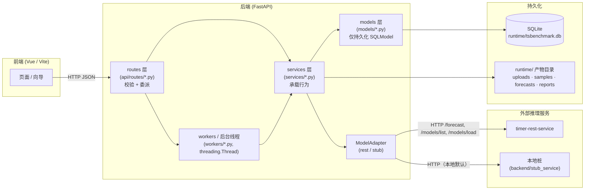
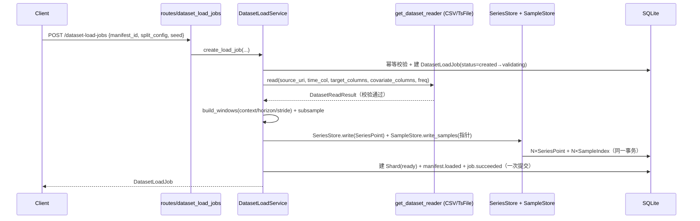
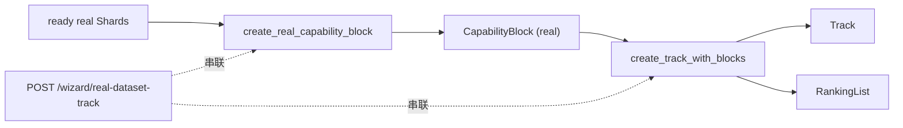
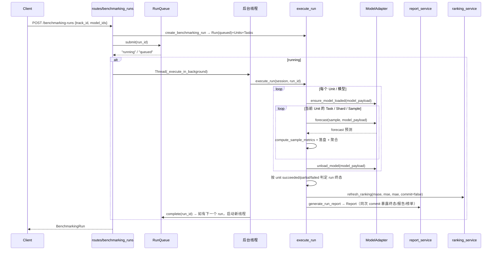
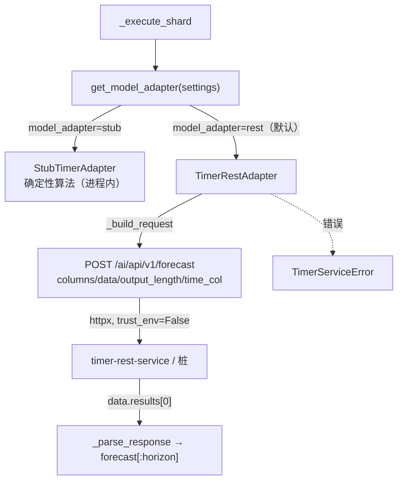
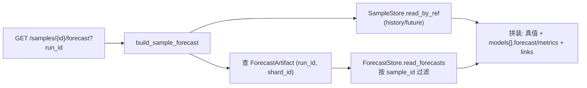
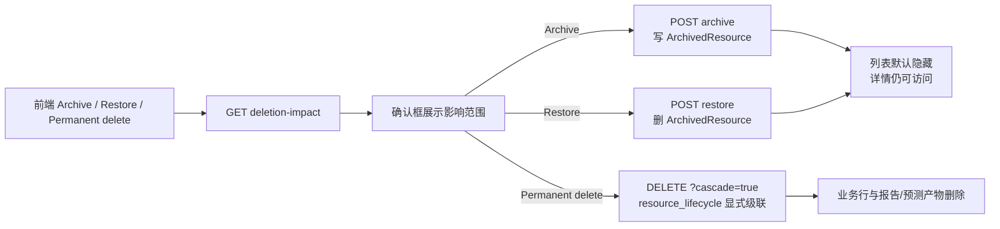

# 开发者手册 · 架构与关键流程篇

> 返回[开发者手册总览](./README.md) ｜ 相关：[数据模型](./data-model.md)

本篇以**代码为唯一事实来源**，讲清 TSBenchmark 后端的分层架构、各关键业务流程的调用链，以及本地桩服务的行为。实体字段细节见 [data-model.md](./data-model.md)，外部推理服务的 REST 契约见 [../reference/rest-api.md](../reference/rest-api.md)。

> 路径约定：本文所有代码引用以仓库根为基准，形如 `backend/app/...:行号`。

---

## 1. 系统架构总览

TSBenchmark MVP 由三个进程协作：Vue/Vite 前端、FastAPI 后端、外部 timer-rest-service（推理/模型/数据集治理服务；本地用 `backend/stub_service` 桩替代）。后端用 SQLite 持久化结构化状态，用 `runtime/` 目录持久化大块产物（样本、预测、报告、上传文件）。



### 各层职责与代码边界

| 层 | 目录 | 职责 | 边界约束 |
| --- | --- | --- | --- |
| routes | `backend/app/api/routes/` | 定义 HTTP 路由、Pydantic 请求体校验、解析依赖（DB session），把工作**委派**给 service | 不写业务逻辑；典型实现是「取依赖 → 调一个 service 函数 → 返回」 |
| services | `backend/app/services/` | 承载所有行为：数据集读取与切窗、运行执行、指标计算、产物落盘、榜单/报告 | 接收 `Session`、纯函数式协作；不直接定义 HTTP |
| models | `backend/app/models/` | 仅 SQLModel 表定义（持久化） | 无业务方法 |
| workers | `backend/app/workers/` + `routes/benchmarking_runs.py` 的 `threading.Thread` | 跑后台任务（运行队列、运行执行、启动恢复） | — |
| core | `backend/app/core/` | 配置、错误信封、ID/时间工具 | — |

### 应用装配

`create_app()`（`backend/app/main.py:15`）一次性完成装配：

1. 注册全局错误处理器 `api_error_handler`（`main.py:16`）。
2. 校验 `TSBENCHMARK_AUTH_SECRET`：缺省时直接拒绝启动，避免静默使用弱 JWT 密钥（`main.py:19-22`）。
3. 创建 `runtime/` 下子目录：`uploads / samples / forecasts / reports`（`main.py:23-27`，目录路径由 `Settings` 的 computed_field 派生）。
4. 建 DB 引擎并存到 `app.state.engine`（`main.py:28`，`db/session.py:8`）。
5. 建进程内运行队列 `RunQueue` 存到 `app.state.run_queue`（`main.py:29`）。
6. `init_db` 通过 `SQLModel.metadata.create_all` 建表（`db/init_db.py:13`）。
7. 启动 seed：权限码、系统角色、首个 admin 用户，以及 5 个内置模型（`main.py:31-35`）。
8. 注册全部路由器（含 auth/users/roles 与业务路由，`main.py:36-49`）。

> 注意：DB session 依赖 `get_db_session` 用 `request.app.state.engine`（`api/deps.py:7`），而 `db/session.py:14` 的 `get_session()` 会临时新建引擎——后者仅供脱离 request 的场景使用。

### 错误信封

所有受控错误走统一信封。`ApiError`（`core/errors.py:7`）带 `error_code / message / details / status_code`（默认 400）；`api_error_handler`（`core/errors.py:16`）把它序列化为：

```json
{ "error_code": "...", "message": "...", "details": { } }
```

service 层抛 `ApiError`，routes 层不需 try/except；FastAPI 通过 `add_exception_handler` 自动捕获。`main.py:51` 的 `/__test__/error-contract` 探针专门用于验证该信封形状。

### 访问控制

所有业务路由使用 `make_router()` 创建，最终由 `TieredRoute` 统一切面处理认证与授权：

- **Tier 0 public**：匿名可访问，例如 `/auth/login`、`/ranking-lists`、`/tracks/{id}/ranking`。
- **Tier 1 authed**：需要任意有效 Bearer token，例如数据集/运行/报告读取接口。
- **Tier 2 perm**：需要 token 加权限码，例如 `dataset.write`、`run.execute`、`user.manage`。

`User` / `Role` / `Permission` / `UserRole` / `RolePermission` 在启动时自动建表并 seed。`admin` 是 superuser，`viewer` 只拿 `*.read` 权限。前端 `useAuthGuard.ts` 镜像同一套 Tier 规则，用于 hash 路由跳转到登录页或 forbidden 页。

资源生命周期相关权限：

- `dataset.delete`：归档/恢复 dataset manifest 与 shard。
- `track.delete`：归档/恢复 track。
- `run.delete`：归档/恢复 benchmarking run。
- `admin.purge`：物理删除所有资源。

---

## 2. 关键流程

### 2.a 数据集接入与样本存储（SQLite 逐点行）

**入口**：`POST /dataset-manifests/upload` → `POST /dataset-manifests` → `POST /dataset-load-jobs`
**服务**：`get_dataset_reader`（CSV / TsFile）→ `DatasetLoadService` → `build_windows` → `SeriesStore` + `SampleStore`
**产物实体**：`DatasetManifest` → `DatasetLoadJob` → `Shard` + N×`SeriesPoint`（逐点真值）+ N×`SampleIndex`（行号区间指针）

> **2026-05-25 SQLite pivot**：序列真值从「per-dataset TsFile」改为 SQLite `SeriesPoint`（逐点行）。TsFile 由存储格式降为**输入格式之一**——输入支持 **CSV 或 TsFile**，由 `get_dataset_reader(manifest.file_format)` 选 reader，二者产出统一的 `DatasetReadResult`。
>
> **2026-06-02 前端术语**：底层实体仍叫 `Shard`，API 和 DB 字段不迁移；前端面向用户统一展示为“测试用例集 / Test case set”，表示由数据集生成、可被赛道复用的预测评测样本集合。

上传（`routes/dataset_manifests.py:29`）只做嗅探，把文件落到 `uploads/`，不入库（#3 已改为按扩展名分支）：CSV 用 `CsvDatasetReader` 给出分隔符/编码/列名/预览，`has_header`（`_looks_like_data_row` 真判）与 per-列 `inferred_type`（numeric/string 真推断）；`.tsfile` 则用 `tsfile.TsFileDataFrame` 给出设备名与物理量列。创建 manifest（`dataset_manifests.py:59`）把元数据（含 `file_format`）写入 `DatasetManifest`。

真正的存储在创建 load job 时同步发生（`routes/dataset_load_jobs.py:20` → `DatasetLoadService.create_load_job`）：

- 前置幂等校验：`assert_manifest_can_succeed_load` 与 `assert_manifest_can_create_successful_real_shard`（`db/init_db.py:18,33`）——一个 manifest 只能有一个成功 load job / 一个 ready 的 real shard。
- `_execute_job` 先从 `split_config.target_columns` 取**一个或多个不重复**的目标列，再从 `split_config.covariate_columns` 取可选 known-future 协变量列；协变量列不能重复，不能与目标列重叠。随后用 `get_dataset_reader(manifest.file_format).read(...)` 读取并**严格校验**这些 value 列：每个目标/协变量值都必须是有限 float，所有列共享同一条时间轴，时间轴经共享的 `validate_time_axis`（递增/不重复/等间隔 + 时区一致性 + 频率按**时长**比较）。TsFile 输入只支持表模型；对 TimeBench 这类多 `timeseries_id` 分片，前端可直接选择完整 series path（`table.device.value`），reader 据此要求所有目标和协变量来自同一个设备。未选择或选择重复目标列时报 `load_target_columns_invalid`；协变量重复或与目标重叠时报 `load_covariate_columns_invalid`。
- `build_windows`（`dataset_load_service.py`）按 `context_length / horizon / stride`（stride 默认等于 horizon）滑窗。每窗给出 context 区间 `[context_start, context_end]` 与 horizon 区间 `[horizon_start, horizon_end]`。校验：参数为正、`context_length + horizon ≤ row_count`、至少产出一个窗口。
- `build_windows` 后按 `split_config.max_samples` 可选**均匀采样**（`subsample_windows`，含首尾、可复现；与 stride 的相互作用见 data-model §10.6）。前端可同时传 `split_config.shard_name` 作为切片展示名；后端只保存到 `Shard.name`，不参与窗口构造。
- 创建 `Shard`（status=`ready`，可带 `name`），用 `SeriesStore.write` 把**目标列 + 协变量列矩阵**逐点写入 `SeriesPoint`（一行一时间点，`values_json={列:值}`，`ts` 存 ISO 原文）；再由 `SampleStore.write_samples` 为每窗建一条 `SampleIndex`——**指针化**，`storage_ref` 记录行号区间、目标列与协变量列，`checksum` 对样本**内容**算（排除随机 ID，跨加载可比，#7）。读取时按 `(shard_id, row_index)` 范围查询 `SeriesPoint` 现切（单一真值源），把协变量自动切成 `history_cov` / `future_cov`。
- **原子加载**：`Shard` + 全部 `SeriesPoint` + 全部 `SampleIndex` 同处一个事务。成功时回填 `manifest.status="loaded"`、`job.status="succeeded"` 及 `validation_summary`；任一 `ApiError` 触发 `session.rollback()` 丢弃半成品，再把 job 落为 `failed` + `error_code/error_message`（替代旧的删 `.tsfile` 文件清理）。



### 2.b 赛道与能力块

**入口**：`POST /capability-blocks` + `POST /tracks`，或一步式 `POST /wizard/real-dataset-track`
**服务**：`create_real_capability_block` → `create_track_with_blocks`（均在 `services/track_service.py`）
**产物实体**：`CapabilityBlock`（real）→ `Track` + `RankingList`

`create_real_capability_block`（`track_service.py:19`）把一组 real `Shard` 聚合成一个 `CapabilityBlock`（block_type=`real`, capability_type=`real_data`），累加 `sample_count`、取最大 `target_dim` 与最大 `covariate_dim`，并通过 `CapabilityBlockShard` 写入 block → shard 关联；不再写 `Shard.capability_block_id`，因此同一 shard 可被多条赛道复用。校验：至少一个 shard（`capability_block_requires_shard`）、shard 都存在（`shard_not_found`）。

`create_track_with_blocks`（`track_service.py:50`）建 `Track`，把 block 的 `track_id` 指过去，并**同时创建一个 `RankingList`**（`default_metric_id` = `primary_metric_id`）。前端向导会显式传入赛道名称和主指标（`mase` / `mse` / `mae`），因此榜单默认视图跟随用户创建赛道时的选择。返回 `(track, ranking)`。校验至少一个 block（`track_requires_block`）、block 都存在（`capability_block_not_found`）。

向导端点 `POST /wizard/real-dataset-track`（`routes/wizard.py:17`）把两步串起来，一次返回 `track_id / capability_block_id / ranking_list_id`。



### 2.c 评测运行执行（核心）

**入口**：`POST /benchmarking-runs`（`routes/benchmarking_runs.py:22`）
**服务**：`create_benchmarking_run` → `RunQueue` → 后台 `threading.Thread` → `execute_run` →（逐层）`_execute_unit` → `_execute_task` → `_execute_shard` → `adapter.forecast` + `compute_sample_metrics` + `ForecastStore` → `aggregate_metric` → `generate_run_report` → `refresh_ranking`
**产物实体**：`BenchmarkingRun` / `Unit` / `Task` / `MetricResult`（4 个 level）/ `ForecastArtifact` / `RunEvent` / `Report` / `RankingEntry`

#### 创建与建模

`create_benchmarking_run`（`services/run_executor.py:19`）校验至少一个 model（`run_requires_model`）、track 有 block（`track_has_no_blocks`），并先取 track 下所有 block 的最大 `target_dim` 与 `covariate_dim` 校验模型能力：当 `target_dim > 1` 时，只有 `Model.forecast_limits.max_target_count` 为 `null`（不限）或大于等于该维度的模型可运行；缺失该字段或值为 `1` 的模型会触发 `model_target_dim_unsupported`。当 `covariate_dim > 0` 时，只有 `Model.forecast_limits.max_covariate_count` 大于等于该维度的模型可运行；缺失或 `0` 会触发 `model_covariate_dim_unsupported`。任一能力不满足都不会建出半成品 run。然后建出层级：

- 一个 `BenchmarkingRun`（status=`queued`），预填 `model_count / task_count（= 模型数 × block 数）/ sample_count`。
- 每个 model 一个 `Unit`。
- 每个 `(model, block)` 一个 `Task`。
- 一条 `RunEvent("run queued")`。

若 track 已在 `ArchivedResource` 中标记归档，创建 run 会直接抛 `resource_archived`（409），不会建出半成品 run。

#### 调度与后台执行

路由层（`benchmarking_runs.py:23`）把 run 提交给进程内 `RunQueue`（`workers/run_queue.py`）：队列**单并发**——`submit` 若当前无运行则置为 `running` 并返回 `"running"`，否则入队返回 `"queued"`。仅当拿到 `running` 才起一个 `daemon` 后台线程 `_execute_in_background`（`benchmarking_runs.py:40`），用独立 `Session` 调 `execute_run`。后台线程在 `finally` 中调用 `queue.complete(run_id)`；若返回下一个 queued run_id，会立即启动新的后台线程继续 drain 队列。因此 adapter 异常也不会把队列卡死，排队中的 run 会在前一个 run 收尾后自动执行。

#### 逐层执行与指标聚合

`execute_run`（`run_executor.py:90`）：

1. 入口先看终态和 `cancel_requested`：已终态直接返回；已请求取消则落 `cancelled` + finished_at + `RunEvent`，返回。
2. 否则置 `running`、发 `run started` 事件，通过 `get_model_adapter(get_settings())` 选定适配器（见 2.d）。
3. 若 `model_lifecycle_mode != "keep_loaded"`（默认 `sequential_unload`），先调用适配器 `unload_all_models`，尽量清空 timer-rest-service 当前已加载模型，降低 run 起始显存水位；失败只写 warning `RunEvent`，不阻断后续加载。
4. 遍历每个 `Unit` 调 `_execute_unit`；执行器会在模型生命周期、unit/task/shard 边界和样本调度间隙轮询取消请求。

各层逻辑：

- `_execute_unit`（`run_executor.py`）：置 unit `running`；**失败注入**——若该 model 的 `endpoint_uri == "stub://fail"`，调 `_fail_unit` 把它名下所有 Task 与该 Unit 全标 `failed`（`error_code="adapter_error"`）并返回。否则先通过 `ensure_model_loaded` 兜底加载当前模型，再逐 Task 调 `_execute_task`，并对 `METRIC_NAMES=["mase","mse","mae"]` 聚合 unit 级指标写 `MetricResult(result_level="unit")`。默认生命周期下，整个 unit 被包在 `finally` 中调用 `unload_model`：即加载一个模型、跑完该模型所有任务、卸载，再进入下一个模型；卸载失败只写 warning 事件，不反向修改已落盘评测结果。
- `_execute_task`（`run_executor.py:176`）：取 block 下所有 `Shard`，逐 shard 调 `_execute_shard`，并对 `METRIC_NAMES=["mase","mse","mae"]` 聚合 task 级指标（`result_level="task"`，带 `capability_block_id`）。
- `_execute_shard`（`run_executor.py`）：取 shard 全部 `SampleIndex`（按 `sample_index` 排序），逐 sample：`SampleStore.read_by_ref(session, storage_ref)` 经 `SeriesStore.slice` 按 `(shard_id, row_index)` 范围**现切**出样本 → **`build_model_input(sample)`** 构造**不含 `target_future`、带 `horizon`** 的输入视图（输入/答案分离，`services/model_input.py`）→ `adapter.forecast(model_input, model_payload, timeout)` → `compute_sample_metrics(target_future, forecast, target_history)` 算 **mse/mae/mase**（`services/metric_service.py`，`target_future` 仅服务端用于算分）→ 每个 sample 指标写 `MetricResult(result_level="sample", aggregation="raw")`。样本级并发采用有界滚动提交，取消后不再提交新 sample；已发出的 forecast 调用会等待返回或超时。所有 sample 的预测行经 `ForecastStore.write_forecasts` 落到 `runtime/forecasts/{run_id}/{task_id}/{model_id}_{shard_id}.jsonl`（`forecast.v1` schema，带 sha256 checksum）并建 `ForecastArtifact`。最后对 `METRIC_NAMES=["mase","mse","mae"]` 逐指标聚合 shard 级（`result_level="shard"`）。

指标聚合 `aggregate_metric`（`metric_service.py`）对一组 `{mase, mse, mae}` 逐指标取均值，并统计 `success_count / failure_count`；某层只要有一个 None 子项即算部分失败。某指标缺失（如平稳历史无 mase）只影响该指标，不影响 mse/mae 的成功判定。`MetricResult` 由 `_metric`（`run_executor.py:245`）统一构造，`aggregation` 字段在 sample 级为 `raw`，其余为 `mean_over_{level}s`。

#### 状态机与判定



- **run 终态判定**（`run_executor.py:112-119`）：统计 unit 状态——全部 succeeded → `succeeded`；只要存在 succeeded 或 partial_succeeded 但未全部成功 → `partial_succeeded`；否则 `failed`。
- **unit 终态**（`run_executor.py:156`）：所有 task_metric 非 None → `succeeded`，否则 `partial_succeeded`（`stub://fail` 路径直接 `failed`）。
- **task 终态**（`run_executor.py:192`）：所有 shard_metric 非 None → `succeeded`，否则 `partial_succeeded`。
- **收尾**：非取消终态才生成报告并回填 `report_id`；`mase / mse / mae` 三张榜单与 run 终态、report_id 在同一次提交中对外可见，避免轮询看到 run 已完成但榜单尚未写入的竞态窗口。`cancelled` run 不生成报告、不刷新榜单。

**取消（cancel_requested）**：`POST /benchmarking-runs/{id}/cancel`（`benchmarking_runs.py` → `cancel_run`）会先从 `RunQueue` 移除非当前运行的 run。排队/未开始 run 直接进入终态 `cancelled`；当前运行中的 run 先置 `cancel_requested=True`、status 置 `cancel_requested` 并发 warning 事件，后台执行器在后续检查点收敛到 `cancelled`。取消 run 不生成 report、不进入榜单；前端继续轮询直到看到 `cancelled`。

**服务重启恢复（recover_interrupted_runs）**：`run_executor.py:78` 把所有处于 `queued / running / cancel_requested` 的 run 统一标记为 `failed` 并发 `interrupted_by_server_restart` 事件——因为执行态只存在于内存线程，重启即丢失，故保守地判失败。入口封装在 `workers/lifecycle.py:6` 的 `recover_runs_on_startup`。

**进度查询**：`GET /benchmarking-runs/{id}/progress`（`build_run_progress`，`run_executor.py`）汇总 run/unit/task 计数、各 unit/task 状态、最近 20 条 `RunEvent`、`report_id`，并返回展示态 `activity_status`。顶层 `activity_status` 从最近 run event 和样本进度推导；`units[*].activity_status` 按 `unit_id` 推导每个模型的加载、预测、卸载阶段。运行详情页顶部使用持久 `status` 表达 run 粗状态，单元列表使用 unit 级 `activity_status` 表达模型细状态。

### 2.d 模型推理接入

**协议**：`ModelAdapter`（`services/model_adapter.py`）定义模型生命周期与推理方法：`unload_all_models(timeout_seconds)`、`ensure_model_loaded(model, timeout_seconds)`、`forecast(sample, model, timeout_seconds) -> list[list[float]]`、`unload_model(model, timeout_seconds)`。执行器默认用 `unload_all → load one → forecast all samples for that model → unload one` 的顺序控制显存峰值。

**工厂**：`get_model_adapter(settings)`（`model_adapter.py:13`）按 `settings.model_adapter` 选择：

- `"stub"` → 进程内 `StubTimerAdapter`（无网络，单测/离线）。
- 其它（默认 `"rest"`）→ `TimerRestAdapter(base_url, api_prefix)`。

**remote_model_id 映射**：`remote_model_id(model)`（`model_adapter.py:23`）把本地 `Model` 映射为远端 ID：REST 同步的模型使用 `endpoint_uri="timer://<remote_id>"`，优先取该远端 ID；否则按历史规则用 `model_family + model_version` 拼出 `"{family}-{version}"`（如 `Timer-3.5`），再退化为 `name` 或 `model_id`。运行时 `_execute_unit` / `_execute_shard` 把它放进 `model_payload`，由适配器使用。

**配置与契约关系**：`Settings`（`core/config.py`）的 `timer_service_base_url`（默认 `http://127.0.0.1:10810`）+ `timer_service_api_prefix`（默认 `/ai/api/v1`）拼成 `timer_service_url`，对应 [rest-api.md](../reference/rest-api.md) 约定的 `http://<host>:<port>` 前缀 + `/ai/api/v1` 路径前缀。`model_lifecycle_mode` 默认 `sequential_unload`；设为 `keep_loaded` 时，运行开始不清空已加载模型，unit 完成后也不主动卸载。

#### TimerRestAdapter（`services/timer_rest_adapter.py`）

- **请求构造** `_build_request`（`timer_rest_adapter.py:50`）：把内部 sample 转成 `/forecast` 契约——以固定列名 `time` 为时间列，`columns = [time, *target_column_names]`，`data` 为 `[[history_ts, *row], ...]`，`output_length = [horizon]`（**2026-05-25 起取 `model_input["horizon"]`，不再读 `target_future` 的长度**，与桩适配器同步改造），`time_col = ["time"]`，`model_id` 取 `model["remote_model_id"]`。若样本含 `covariate_column_names`，则额外发送 `history_covs` 与 `future_covs`：两边都用 `columns=[time,*covariate_column_names]`，前者配 `history_timestamps/history_cov`，后者配 `future_timestamps/future_cov`，用同列名表达同一个协变量在历史段与未来已知段的两部分。
- **请求发送** `_post`（`timer_rest_adapter.py:65`）：默认用 `httpx.Client(timeout=..., trust_env=False)`——**`trust_env=False`** 是关键：推理服务是内网服务，绕开系统 HTTP/SOCKS 代理。HTTP 非 200 或业务信封 `code != 200` 均抛 `TimerServiceError`（真实服务会把「模型未加载」这类业务错误包装成 HTTP 200 + `code=400`）。
- **响应解析** `_parse_response`（`timer_rest_adapter.py:91`）：从 `data.results[0]` 取 `columns/data`，剔除 `time` 列只留数值列，截断到 `horizon`。形状不符抛 `TimerServiceError`。
- **错误归一**：所有 `httpx.HTTPError`、非 200、契约不符都收敛为 `TimerServiceError`（`timer_rest_adapter.py:12`）。
- 另有 `list_models`（GET `/models/list`，取 `data.models`）、`load_model`（POST `/models/load`）、`unload_model`（POST `/models/unload`，已卸载 409 视为 no-op）与 `unload_all_models`（先列目录，只卸载 `loaded=true` 的模型）。REST 模式下 `/models` 路由直接以 `/models/list` 为权威来源，并通过 `model_catalog.py` 把远端模型同步成本地 `Model(model_id=<remote_id>, endpoint_uri="timer://<remote_id>", forecast_limits=...)` 镜像，供 run/unit/metric 继续用本地外键串联。多目标兼容性按 `forecast_limits.max_target_count` 判断：`1` 表示单目标，`null` 表示原生多目标不限目标数，缺失字段按不支持多目标处理。协变量兼容性按 `forecast_limits.max_covariate_count` 判断：大于等于测试用例集 `covariate_dim` 才可运行，缺失或 `0` 表示不支持协变量。`POST /models/{model_id}/load` 仍可供手动预热，但新建评测/赛道运行前端不再批量调用它。
- `_execute_unit` 在进入 task 前调用 `adapter.ensure_model_loaded(...)` 兜底确认。未加载模型会先 POST `/models/load` 并轮询 `/models/list` 直到 `loaded=true`；加载失败会把该 unit 和其 tasks 标记为 `failed` / `model_load_error`，写入 `RunEvent`，然后在 `finally` 中尽量 `unload_model`，让 run 正常进入终态。

#### StubTimerAdapter（`services/stub_timer_adapter.py`）

进程内**确定性**算法（`stub_timer_adapter.py:9`）：以 `sha256(model_id:sample_id:seed)` 播种 `random.Random`，再用 `sha256(model_id)` 派生一个固定 `model_bias`（约 ±0.10），每个 horizon 步在「历史最后一个值 + bias + 小噪声(±0.05)」上生成预测。相同输入永远得到相同输出，便于可复现测试。



### 2.e 榜单计算

**入口**：刷新由 `execute_run` 收尾调用 `refresh_ranking`；查询走 `GET /tracks/{track_id}/ranking`（`routes/ranking_lists.py:10` → `query_ranking`）。
**服务**：`services/ranking_service.py`。

`refresh_ranking`（`ranking_service.py:8`）对单个 `metric_id` 重算两套榜：

1. 收集**有效的 unit 级指标行** `_valid_unit_metric_rows`（`ranking_service.py:53`）：只纳入 `result_level="unit"`、所属 run 属于该 track 且 run 状态 ∈ `{succeeded, partial_succeeded}`、且 `unit.status == "succeeded"` 的指标。
2. 对两种 policy 各重建 `RankingEntry`（先删旧条目）：
   - `latest_valid_result`（`_select_latest`，`ranking_service.py:72`）：每个 model 取 run `created_at` 最新的有效结果。
   - `best_result`（`_select_best`，`ranking_service.py:81`）：每个 model 取 `value` 最小的有效结果。
3. **排序策略**：按 `metric_value` 升序（`sorted(..., key=lambda item: item["value"])`），即 **lower is better**（mse / mae 越小排名越靠前），`rank` 从 1 起。

`execute_run` 默认对 `METRIC_NAMES=["mase", "mse", "mae"]` 都刷新（`run_executor.py`）。`query_ranking`（`ranking_service.py`）按 `(metric_id, policy)` 取条目并按 `rank` 返回；**路由默认 `metric` 跟随 `Track.primary_metric_id`（即 `mase`）、`policy` 跟随 `default_ranking_policy`**（`routes/ranking_lists.py`，2026-05-25 起）。

### 2.f 样本预测视图

**入口**：`GET /samples/{sample_id}/forecast?run_id=...`（`routes/samples.py:19`）；另有 `GET /samples/{sample_id}/preview` 仅回原始样本。
**服务**：`build_sample_forecast`（`services/sample_forecast_service.py:11`）。

把「样本原始数据」与「该 run 在该 sample 上各模型的预测」拼装返回：

1. 用 `SampleStore.read_by_ref` 读出样本的 history/future（时间戳、目标值、列名）。
2. 取该 sample 所属 shard 在该 run 下的所有 `ForecastArtifact`，逐个用 `ForecastStore.read_forecasts` 读出 JSONL，过滤出 `sample_id` 匹配的那一行。
3. 每个命中的模型组一条 `models[]` 记录：`model_name`、`forecast`、`metrics`、`status / error_code / error_message`，并补 `unit_status / task_status`。
4. 顶层返回 `sample_index`、行号窗口、history/forecast 时间戳范围、`history_timestamps / future_timestamps / target_history / target_future / target_column_names`，以及可选的 `covariate_column_names / history_cov / future_cov` + `models[]` + `links`。前端把真值与各模型预测画在同一张图上；如果有协变量，再在下方单独画协变量图，并从样本页跳回报告。



### 2.g 资源生命周期：归档、恢复、影响预览、物理删除

**入口**：`GET /{resource}/{id}/deletion-impact`、`POST /{resource}/{id}/archive`、`POST /{resource}/{id}/restore`、`DELETE /{resource}/{id}?cascade=true`
**服务**：`services/resource_lifecycle.py`
**状态实体**：`ArchivedResource(resource_type, resource_id, archived_at)`

归档是默认删除动作：service 只写 `ArchivedResource`，不改 `DatasetManifest.status`、`Shard.status`、`Track.status` 或 `BenchmarkingRun.status`。列表接口调用 `visible_rows` 默认过滤归档资源；详情接口调用 `row_with_archive` 或等价逻辑返回 `archived_at`。恢复则删除归档标记。run 的归档/删除额外要求状态在 `succeeded / partial_succeeded / failed / cancelled` 中，否则抛 `run_not_terminal`。

`deletion_impact` 会先计算物理删除影响范围，返回固定 key：dataset manifests、load jobs、shards、series points、sample indices、capability blocks、tracks、benchmarking runs、units、tasks、reports、ranking lists/entries、forecast artifacts、metric results、run events。前端确认框只展示计数大于 0 的项。

物理删除不依赖数据库外键级联，而是在 service 层按顺序显式删除：

- dataset manifest：先 purge 引用其 shards 的 tracks，再 purge shards，最后删 load jobs、manifest、archive mark，并删除 `runtime/uploads/` 下的托管上传文件。
- shard：先 purge 引用它的 tracks，再删 sample/series/metric/forecast/block links；若是 legacy shard storage 还会 unlink `storage_uri`。
- track：有 run 时非级联拒绝；级联时先 purge runs，再删 ranking entries/list、capability block links、blocks、track。
- benchmarking run：先确认终态，再删 forecast/report 文件和 unit/task/report/metric/ranking/event/run 行。



---

## 3. 本地桩服务（`backend/stub_service`）

`backend/stub_service/main.py` 用 FastAPI 复刻 timer-rest-service 的应用层契约（见文件头 `main.py:1-26` 与 [rest-api.md](../reference/rest-api.md)），让本地无真实推理服务时后端仍能通过 REST 全程跑通。**所有推理与治理结果是确定性的**；模型注册/加载状态**保存在内存**（每个 app 实例独立，便于测试隔离，`main.py:282-288`）。

### 覆盖的端点

| 类别 | 端点 | 说明 |
| --- | --- | --- |
| 基础 / 健康 | `GET /`（302→/docs）、`GET /health/{startup,liveness,readiness}` | 健康探针返回固定 `started/alive/ready` |
| 运维 | `POST /reboot`、`GET /metrics` | reboot 是**安全桩**：返回契约形状但不真正发 SIGTERM（`main.py:307`）；metrics 输出 Prometheus 文本 |
| 推理 | `POST /ai/api/v1/forecast` | 见下「确定性算法」 |
| 模型管理 | `GET /models/list`、`GET /models/list_loaded`、`POST /models/{register,load,unload,delete}` | 内置模型含 `Timer-3.5/3.0`、`Chronos-2`、`toto2.0`、`AutoARIMA`、`Holt-Winters`，视为已加载；`forecast_limits.max_target_count` 中只有 `toto2.0` 为 `null`（支持原生多目标），其余为 `1`；本地桩中 `Chronos-2` 的 `max_covariate_count=50`，其余为 `0`；register/load/unload/delete 改内存表，删内置模型返回 403 |
| 数据集评估 | `POST /dataset/evaluate/execute`、`GET /dataset/evaluate/list_dimensions` | 维度：`integrity / forecastability / pearson`（`main.py:51-58`） |
| 数据集治理 | `POST /dataset/govern/execute`、`GET /dataset/govern/list_dimensions` | 维度：`timestamp_repair / causal_mean_imputation / flat_series_removal / zscore_normalization / extreme_value_clipping`（`main.py:60-69`） |

所有 `/ai/api/v1` 响应用统一信封 `_envelope`（`main.py:76`）：`{code, message, service_info{timestamp, version}, data}`，与真实服务一致。

### 确定性算法

- **推理** `_forecast_task`（`main.py:106`）：与后端 `StubTimerAdapter` 同构——用 `sha256(model_id)` 派生固定 bias，用 `sha256(model_id:len(data):seed)` 播种 RNG，在「历史末值 + bias + 噪声」上外推；未来时间戳由 `_future_timestamps`（`main.py:89`）按输入末两点的节奏推断（数值差或 ISO 时间差），无法解析时退化为整数序号。种子来自 `TSBENCHMARK_STUB_SEED`（`main.py:72`）。
- **评估** `_evaluate`（`main.py:159`）：integrity 算完整性（非空占比）、forecastability 用确定性「谱熵」桩 `_stub_entropy`、pearson 算真实相关系数 `_pearson`。
- **治理** `_govern`（`main.py:211`）：因果均值填充、z-score 标准化、极值裁剪、平稳序列剔除均为真实实现；`timestamp_repair` 按 no-op（changes_count=0）。

### 与真实服务的关键差异

- **forecast 对未注册 model_id 宽容**（`main.py:333-335`）：仅当 model_id「已注册但被显式 unload」才返回 503；**未注册的 model_id 视为可用**——因此后端 seed 的 `toto / TimesFM` 等也能跑通。真实服务则严格要求模型已加载。
- **reboot 安全桩**：不真正重启（`main.py:307`）。
- **数据集端点只支持 inline**：传 `tsfile` 时 evaluate 返回固定占位结果，govern 直接报错（`main.py:428-431, 449`）；桩不读写 TsFile。
- 模型状态仅在内存，进程重启即回到内置集合。

### 如何启动 / 让后端指向它

启动（任选其一）：

```bash
cd backend && uv run uvicorn stub_service.main:app --host 127.0.0.1 --port 10810
# 或
./scripts/stub-service.sh start    # 默认 127.0.0.1:10810（stub-service.sh:10-11）
```

让后端指向它：后端 `model_adapter` 默认 `"rest"`，`timer_service_base_url` 默认 `http://127.0.0.1:10810`——与桩默认监听一致，**无需额外配置**即可直连本地桩。如需改地址用环境变量（`env_prefix="TSBENCHMARK_"`，`core/config.py:9`）：

```bash
export TSBENCHMARK_TIMER_SERVICE_BASE_URL=http://127.0.0.1:10810
export TSBENCHMARK_MODEL_ADAPTER=rest    # 或 stub（完全进程内，连桩都不需要）
```

---

## 4. API 端点速查表

后端对外路由（从 `backend/app/api/routes/*.py` 真实提取）：

| 方法 | 路径 | 用途 |
| --- | --- | --- |
| POST | `/dataset-manifests/upload` | 上传 CSV 或 TsFile，返回嗅探（CSV：列/预览/分隔符/编码/has_header/类型；TsFile：设备/物理量列） |
| POST | `/dataset-manifests` | 创建数据集 manifest |
| GET | `/dataset-manifests` | 分页列 manifest；`include_archived=true` 时包含归档资源 |
| GET | `/dataset-manifests/{dataset_manifest_id}` | 取 manifest |
| GET | `/dataset-manifests/{dataset_manifest_id}/deletion-impact` | 预览删除 manifest 的影响范围 |
| POST | `/dataset-manifests/{dataset_manifest_id}/archive` | 归档 manifest |
| POST | `/dataset-manifests/{dataset_manifest_id}/restore` | 恢复 manifest |
| DELETE | `/dataset-manifests/{dataset_manifest_id}` | 管理员物理删除 manifest（有引用需 `cascade=true`） |
| POST | `/dataset-load-jobs` | 创建并同步执行 load job（读取 → 切窗 → 写 SeriesPoint + 样本指针） |
| GET | `/dataset-load-jobs/{load_job_id}` | 取 load job |
| GET | `/shards` | 分页列 shard；`include_archived=true` 时包含归档资源 |
| GET | `/shards/{shard_id}` | 取 shard |
| GET | `/shards/{shard_id}/deletion-impact` | 预览删除 shard 的影响范围 |
| POST | `/shards/{shard_id}/archive` | 归档 shard |
| POST | `/shards/{shard_id}/restore` | 恢复 shard |
| DELETE | `/shards/{shard_id}` | 管理员物理删除 shard（有引用需 `cascade=true`） |
| GET | `/shards/{shard_id}/samples` | 分页列 shard 的样本索引 |
| GET | `/samples/{sample_id}/preview` | 取样本原始 history/future |
| GET | `/samples/{sample_id}/forecast` | 取样本 + 某 run 各模型预测（需 `run_id`） |
| POST | `/capability-blocks` | 由 real shard 创建能力块 |
| POST | `/tracks` | 创建赛道（同时建榜单） |
| GET | `/tracks` | 列赛道；`include_archived=true` 时包含归档资源 |
| GET | `/tracks/{track_id}` | 取赛道摘要（含归档状态） |
| GET | `/tracks/{track_id}/deletion-impact` | 预览删除 track 的影响范围 |
| POST | `/tracks/{track_id}/archive` | 归档 track |
| POST | `/tracks/{track_id}/restore` | 恢复 track |
| DELETE | `/tracks/{track_id}` | 管理员物理删除 track（有 run 需 `cascade=true`） |
| GET | `/tracks/{track_id}/ranking` | 查榜（`metric` / `policy` 可选） |
| POST | `/models` | 创建模型 |
| GET | `/models` | REST 模式列 timer-rest-service 模型目录并同步本地镜像；stub 模式列本地模型 |
| POST | `/models/{model_id}/load` | REST 模式调用 timer-rest-service `/models/load` 并等待 loaded |
| POST | `/wizard/real-dataset-track` | 一步建能力块 + 赛道 + 榜单 |
| POST | `/benchmarking-runs` | 创建并调度评测运行 |
| GET | `/benchmarking-runs` | 分页列 run；可用 `track_id` 过滤，`include_archived=true` 时包含归档资源；列表项含展示态 `activity_status` |
| GET | `/benchmarking-runs/{benchmarking_run_id}/progress` | 查运行进度，含展示态 `activity_status` |
| GET | `/benchmarking-runs/{benchmarking_run_id}/deletion-impact` | 预览删除 run 的影响范围 |
| POST | `/benchmarking-runs/{benchmarking_run_id}/archive` | 归档终态 run |
| POST | `/benchmarking-runs/{benchmarking_run_id}/restore` | 恢复 run |
| DELETE | `/benchmarking-runs/{benchmarking_run_id}` | 管理员物理删除终态 run |
| POST | `/benchmarking-runs/{benchmarking_run_id}/cancel` | 请求取消运行 |
| GET | `/reports/{report_id}` | 取运行报告 |
| GET | `/__test__/error-contract` | 错误信封探针（测试用） |

> `GET /tracks/{track_id}/ranking` 与 `POST /tracks` 共用 `/tracks` 前缀，分别由 `ranking_lists.py` 与 `tracks.py` 注册。

---

## 5. 扩展指引

### 新增一个模型适配器

1. 实现 `ModelAdapter` 协议（`forecast(sample, model, timeout_seconds) -> list[list[float]]`），新建 `services/your_adapter.py`。
2. 在 `get_model_adapter`（`services/model_adapter.py:13`）增加分支，按 `settings.model_adapter` 的新取值返回它。
3. 如需新配置项（如新的 base_url/key），加到 `Settings`（`core/config.py:8`，环境变量前缀 `TSBENCHMARK_`）。
4. 如远端 ID 规则不同，调整 `remote_model_id`（`model_adapter.py:23`）。

### 新增一个数据集评估 / 治理维度（在桩里）

1. 评估：在 `EVALUATE_DIMENSIONS` 增声明（`stub_service/main.py:51`），并在 `_evaluate`（`main.py:159`）加该维度的计算分支。
2. 治理：在 `GOVERN_DIMENSIONS` 增声明（`main.py:60`），并在 `_govern`（`main.py:211`）加 `elif dimension == "..."` 分支。
3. `list_dimensions` 端点会自动反映新声明，无需改动。

### 新增一个指标

1. 在 `compute_sample_metrics`（`services/metric_service.py:8`）返回的 dict 里加新键（sample 级计算）。
2. 在 `run_executor.py` 各聚合处（`_execute_unit` / `_execute_task` / `_execute_shard`，分别在 `:150, :186, :235`）对新指标调 `aggregate_metric` 并 `session.add(_metric(...))` 写 `MetricResult`。
3. 若要进榜，在 `execute_run` 的刷新列表 `["mse", "mae"]`（`run_executor.py:130`）加入新指标 ID。
4. 如需指标定义入库，参考 `MetricDefinition`（`models/metric.py`）。
