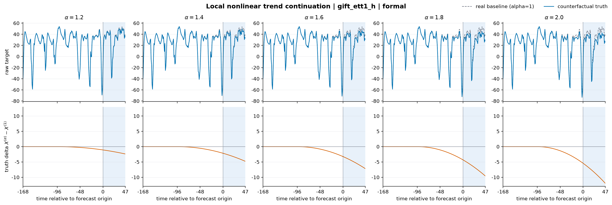
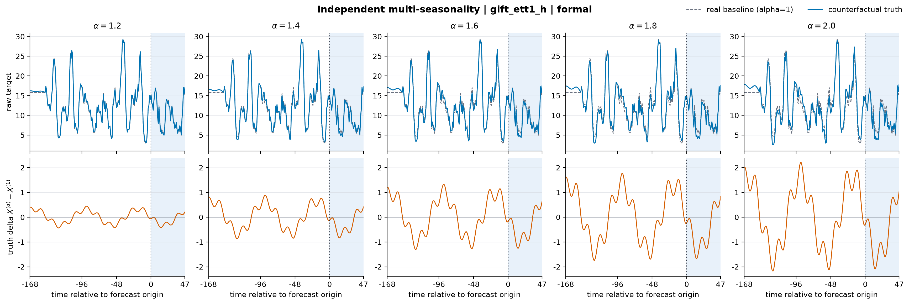
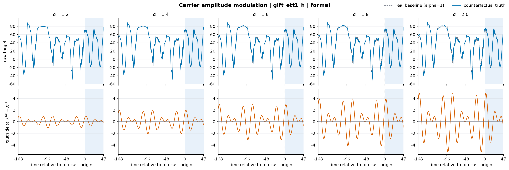
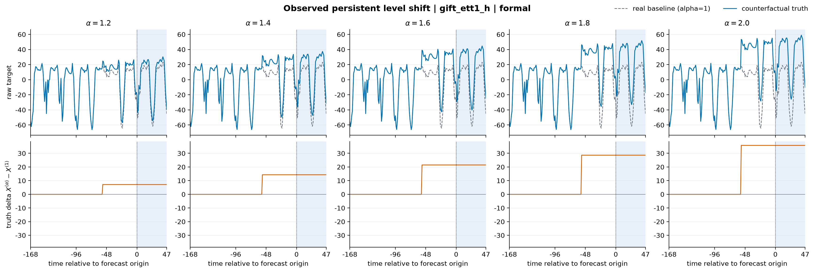
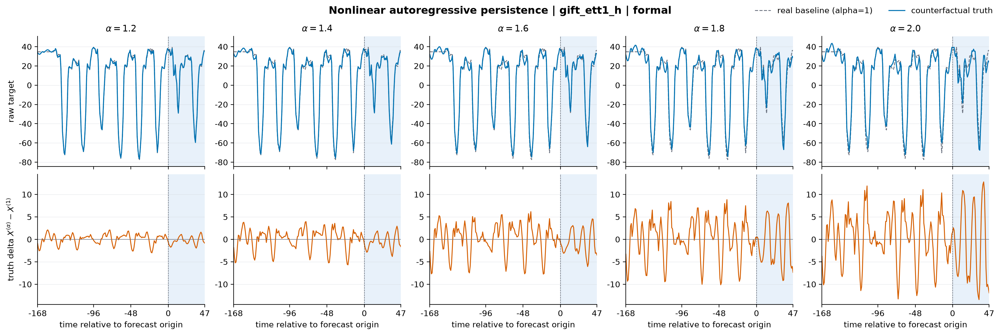
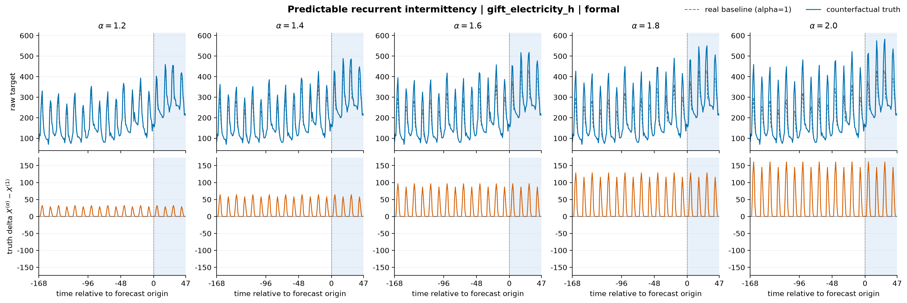
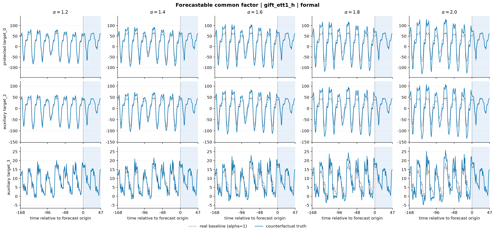
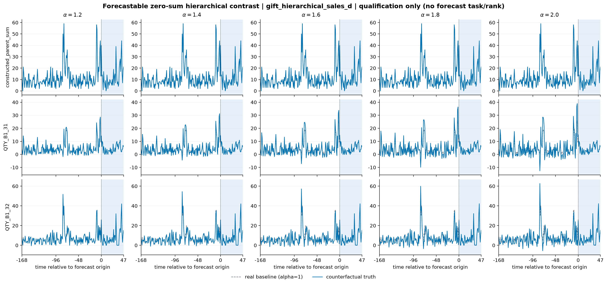
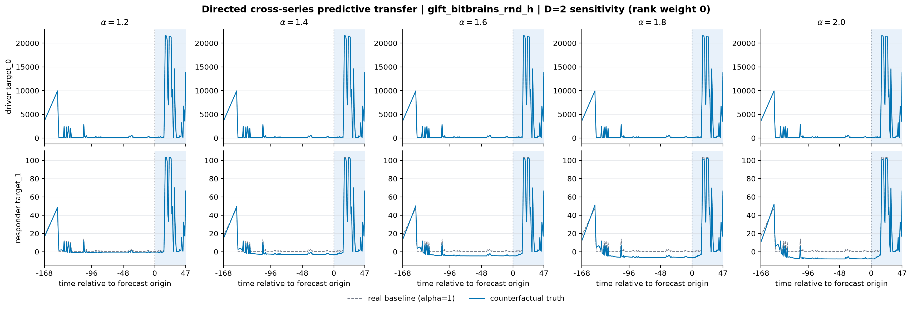
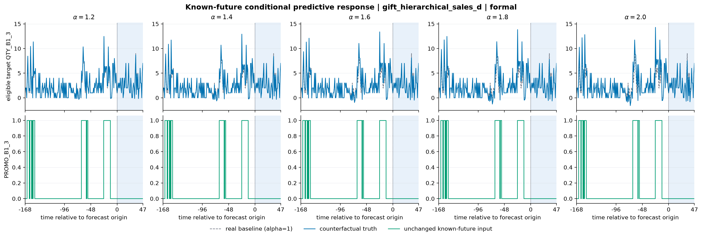

# CaFE 十能力真实路径锚定公式与 v3 实现规范

> 状态：v3 已实现；本文是十能力真实锚定公式与边界的规范说明
> 初稿：2026-08-12；实现冻结：2026-08-14
> 适用目标：把 CaFE 从“用真实特征校准合成机制”扩展为“在真实路径上执行可审计的能力反事实干预”

## 1. 结论摘要

十种能力不能机械地套用同一个合成模板。v3 按以下三类实现：

| 类型 | 能力 | 反事实形式 |
|---|---|---|
| 单变量可加分量 | local nonlinear trend、independent multi-seasonality、carrier amplitude modulation、observed persistent level shift、predictable recurrent intermittency | `real path + scaled fitted component` |
| 结构可加分量 | forecastable common factor、zero-sum hierarchical contrast、directed cross-series predictive transfer、known-future conditional predictive response | `real structured path + scaled fitted structural component` |
| 递归参数干预 | nonlinear autoregressive persistence | 改变递归算子、共享 history innovation，再把两条 history-only rollout 的差加到真实 future |

在原四个分解能力之外，v3 的六项扩展状态如下：

| 能力 | v3 状态 | 实现边界 |
|---|---|---|
| nonlinear persistence | 已实现正式递归 contract | 改变递归算子、共享 observed history innovation；H48 正式定义使用 zero future innovation，residual replay 另生成不排名的辅助 sensitivity task |
| predictable intermittency | 已实现 | 使用 history-only event clock 与 empirical pulse template；clock predictability、可见重复次数和 H48 event 均为硬门 |
| common factor | 已实现结构轨 | 仅接受原生同步且正式维数 $D\ge3$ 的 panel；使用 history-fitted factor continuation，并强制生成 matched-donor auxiliary-input ablation |
| hierarchical coherence | 已实现 qualification-only | zero-sum contrast 严格保持 hierarchy；raw-count 非负 support 政策未冻结，因此禁止 generation 和 formal rank |
| cross-series dependence | 已实现结构轨 | estimand 固定为 directed predictive transfer，不作 causal SCM 主张；正式维数 $D\ge3$ 并强制输入消融 |
| covariate response | 已实现结构轨 | 只接受 adapter 声明的 known-future covariate；控制 response coefficient，不缩放 covariate 本身 |

原四个分解能力也已在 v3 同步完成协议收紧：

1. 每个真实 background 只冻结一次共享 full decomposition 和 component ownership；
2. carrier harmonic、symmetric AM sideband 与 independent secondary 互斥归属；
3. trend 等所有受控分量都增加 fixed-L168 可见强度门；
4. regime 同时通过 step-vs-ramp 与 joinpoint 稳定性门；
5. time-varying seasonality 固定为 carrier-phase-locked constrained AM basis，不再使用四自由度 sideband basis。

## 2. 统一研究语义

real-anchored 轨测量的是：

> 在保留真实数值路径、真实 residual 和真实 held-out nuisance realization 的前提下，只改变一个由历史可识别、并可由历史或合法 known-future input 外推的预测机制后，模型能否恢复声明的 forecast effect。

它不自动证明真实世界因果效应。尤其是：

- 单变量 nonlinear 只说明 autoregressive forecasting recurrence；
- cross-series 只说明 lagged predictive transfer；
- promotion/weather response 只说明 conditional predictive response；
- common factor 的原始 effect recovery 不足以证明模型使用了辅助通道，必须配套输入消融。

## 3. 统一记号和硬约束

令预测起点为 $o$：

\[
H_{fit}=X_{o-504:o},\qquad
H_{model}=X_{o-336:o},\qquad
Y^{real}=X_{o:o+48}.
\]

其中 $X_t$ 可以是单变量、同步 panel 或 hierarchy。所有 normalization 与 MASE reference 都从未修改的 $H_{model}$ 冻结。当前剂量网格沿用：

\[
\alpha\in\{1,1.2,1.4,1.6,1.8,2.0\}.
\]

### 3.1 可加分量的统一公式

若能力 $c$ 有一个从 L504 history 拟合并可合法外推的分量
$\widehat M_t^{(c)}$，则：

\[
\boxed{
X_t^{(c,\alpha)}
=X_t+(\alpha-1)\widehat M_t^{(c)}
}
\]

所以：

\[
X_t^{(c,1)}=X_t,
\qquad
\Delta Y_h^{(c,\alpha)}
=(\alpha-1)\widehat M_{o+h}^{(c)}.
\]

原真实 H48 没有被模型重建，而是作为 pair-shared nuisance 保留：

\[
Y_{o+h}^{(c,\alpha)}
=Y_{o+h}^{real}+\Delta Y_h^{(c,\alpha)}.
\]

### 3.2 所有能力的共同不变量

1. component、period、lag、joinpoint、loading、coefficient、event clock 和 availability 只由 L504 target history 冻结；covariate response 还可使用同区间 covariate history，但不能使用 target H48。
2. 只有 adapter 明确声明的 known-future covariate 可以参与 H48 component；target future 不能参与。
3. 对 generation-eligible 能力，任意改写 $Y^{real}$ 都不得改变 contract、availability 或 truth delta。hierarchy 是明确的 qualification-only 例外：真实 H48 只可改变逐 alpha raw-negativity audit，不得改变 fitted component、qualification decision 或任何 generation artifact。
4. $\alpha=1$ 必须逐点返回真实 baseline。
5. 同一 background 的所有 member 共用 baseline L336 normalization 和 MASE，禁止逐 member z-score。
6. 单变量的统计单位是不同真实 background；panel 是不同 panel-origin；hierarchy 至少按 structural group-origin 聚类。
7. 至少四个 eligible 真实统计单位才允许一个 `dataset × capability` 进入该轨；不得用 seed 重复包装同一 background。
8. 分解与 dynamic/event contract 同时冻结 history、fixed-L168 可见区和 H48 的非退化强度；structural contract 在 L504 上拟合，并对 trailing-L336 history 与 H48 component 执行非退化 gate，再在 fixed-L168 正式视图评估。所有数值阈值由协议预声明，再由独立 reference bank 验证并冻结绑定；evaluation origins 只能复用 policy id 与 threshold hash。
9. 任何需要真实 H48 target 才能选择分量、剂量、方向或 clip 的方案均不合格。

## 4. 共享分解与 component ownership

v3 对每个单变量 background 一次性冻结共享结构分解：

\[
x_t=
L_t+T_t^{nl}+C_t+S_t^{sec}+M_t^{amp}
+R_t^{level}+\varepsilon_t.
\]

各项含义为：

- $L_t$：level 与 local linear tangent；
- $T_t^{nl}$：最后 W96 的 nonlinear trend；
- $C_t$：固定 carrier；
- $S_t^{sec}$：独立 secondary seasonalities；
- $M_t^{amp}$：carrier amplitude modulation；
- $R_t^{level}$：已观察到的 persistent level shift；
- $\varepsilon_t$：其余真实 residual。

predictable intermittency 使用独立 event contract，在冻结 smooth nuisance $\widehat D_t$ 后进一步写为：

\[
x_t=\widehat D_t+E_t^{pred}+\eta_t,
\]

其中 $E_t^{pred}$ 是 history clock 可预测的 recurrent event，$\eta_t$ 保留未被 clock 解释的真实 burst 与 residual。它不进入四个 decomposition contract 的共享 hash。

这不是要求每条真实路径都必须拥有所有分量。每一项都要单独通过 history-only eligibility；没有证据就不创建该 component。

每个 background 同时冻结一个互斥的 ownership map：

```text
frequency / basis column
  -> carrier harmonic
  -> symmetric AM sideband pair
  -> independent secondary
  -> rejected / unresolved

time-local structure
  -> local nonlinear trend
  -> abrupt persistent step
  -> recurrent sparse event
  -> residual
```

该 map 必须互斥。其他已识别 component 在某项能力中只是固定 nuisance，不能因为当前被评能力不同而从 joint fit 中消失。

当前实现先检测可见 carrier，再以 fixed-point ownership 判别 symmetric AM 与 independent secondary；AM envelope 提取会移除 trend 和已归属的 independent secondary。随后检测 persistent step，并把已识别 modulation、secondary 与 regime 一起写入共享 joint design。因此同一 background 上四个分解能力拥有相同 decomposition hash，差别只在被缩放的 intervention slice。

### 4.1 实际曲线示例的统一绘图协议

下文十幅图展示 benchmark 构造出的真实路径反事实 truth，而不是模型预测。除明确标记为 sensitivity 或 qualification-only 的例外外，绘图只从通过资格门的 evaluation-bank contract 中选择真实 background，并调用与 generation 相同的 production apply 逻辑；不得重新拟合一个只供画图使用的 component。

所有图遵守同一约定：

1. 五列从左到右固定为五个非基线剂量
   $\alpha=1.2,1.4,1.6,1.8,2.0$。$\alpha=1$ 不算一个强度档，而是在每列重复绘制的灰色真实 baseline；彩色曲线是同一 baseline、同一 contract 和同一 nuisance / residual realization 上的 treatment。
2. contract 使用完整 L504 history 拟合；为保证可读性，主图只展示预测起点前最后 L168 与其后的 H48，并以竖线标记预测起点 $o$。图中可以在 contract 冻结后展示真实 H48 baseline，但 target H48 不参与 component 拟合、资格判定、anchor 选择、方向选择或阈值设置；H48 treatment 是真实 H48 加 history-only continuation，covariate response 仅额外使用 adapter 合法声明的 known-future input。
3. 完整路径使用 adapter 交付的 raw units。一个通道在五列中共享相同横轴和纵轴范围，不做逐列 z-score、逐列 autoscale 或为视觉效果进行 clipping；结构能力可以按通道分行，但每一行的五列仍共享坐标。差值辅图如使用 $s_{336}$ 归一化，必须与 raw-unit 完整路径明确分开标注。
4. 示例 anchor 通过冻结的 `figure_seed`、`capability_id` 和 `background_id` 做稳定哈希排序后确定；具体 seed、dataset / native item / origin、bank role、background / contract / policy hash、输入 artifact hash 和绘图程序版本写入同目录 `manifest.json`。选择不得查看模型预测、正式分数或 target H48。把同一 contract 重放为五个剂量只服务于可视化，不改变正式无放回分配，也不能把五列当作五个独立统计单位。
5. 每幅图明确标记其协议地位：formal、主分数权重为 0 的 sensitivity，或不创建 forecast task 的 qualification-only。common factor 与 cross-series 的 matched-donor input ablation 是必备归因审计，但不与 full-input 曲线混画；nonlinear 主图只展示 zero-future-innovation 定义，history-residual-replay 只进入单独 sensitivity 输出。
6. 数值资格阈值是协议预先声明的常数，不由最终 evaluation origins 调整，也不是从 reference rows 重新学习分位数。source-time-disjoint reference bank 的作用是验证各 contract 使用同一阈值 payload、记录覆盖情况，并把 policy、bank split 与阈值哈希冻结；evaluation contract 只能逐字复用已经冻结的 policy id 和 threshold hash。

图由 `tools/plotting/real_anchored_examples.py` 读取完成的 calibration bundle 生成。该程序先验证 bundle 自哈希与输入 file records，再调用 production iterator / apply API，确定性输出 PNG、SVG 和包含 plotter source hash 的 manifest；临时 runtime 路径不会写入文档资产。

## 5. 十能力公式

### 5.1 Local nonlinear trend continuation

兼容 capability id：`trend`。

令：

\[
u_t=\left[\frac{t-(o-96)}{96}\right]_+,
\qquad
\widehat T_t^{nl}=\sum_{k=2}^{K}\beta_k u_t^k.
\]

v3 固定 $K=2$。cubic 不属于 v3 estimand；任何改变 $K$ 的新协议都必须预先冻结选择策略并使用 chronological holdout，不能按 H48 表现选择。

反事实为：

\[
\boxed{
x_t^{(\alpha)}
=x_t+(\alpha-1)\widehat T_t^{nl}
}
\]

因为 $u=0$ 时二阶及以上基的值和一阶导都为 0，干预不改变 $o-96$ 处的 level 与 linear tangent。它测的是 trailing-W96 local curvature continuation，不是“整条 L504 趋势强度”。

v3 已实现约束：

- 同时检查 L504、trailing-L168 与 H48 controlled-component RMS；只用包含大量前缀零值的 L504 RMS 不足以说明模型可见；
- shared joint fit 固定 carrier、secondary、AM 和已检测 step nuisance；
- regime 的 step-vs-ramp 判别和共享 ownership 防止 curvature 静默吸收已识别结构突变；
- 保持 raw baseline、shared normalization 和 exact alpha proportionality。

成熟度：v3 已实现并进入正式 real-anchored availability。



*图 5.1 — `trend` 的真实路径锚定示例。来源为 GIFT ETT1 evaluation background `item_0 / channel 0 / origin 14703`，由 production seed-0 稳定分配选中。五列在同一路径上分别加入 $(\alpha-1)\widehat T^{nl}$；灰线为未修改的真实路径，彩线为增强 trailing-W96 quadratic continuation 后的 truth。线性 tangent、共享 decomposition 中的 seasonal / regime nuisance、真实 residual 和 normalization 均保持不变。该图是 formal-contract 可视化，不是模型预测；完整 ID 与哈希见同目录 `manifest.json`。*

### 5.2 Independent multi-seasonality

兼容 capability id：`multi_seasonal`。

保留主 carrier $C_t$，只缩放彼此可辨识、且不属于 carrier harmonic 或 AM sideband 的 secondary：

\[
\widehat S_t^{sec}
=\sum_{j=1}^{J}\sum_{h=1}^{H_j}
\left[
a_{jh}\sin(2\pi ht/P_j)
+b_{jh}\cos(2\pi ht/P_j)
\right].
\]

\[
\boxed{
x_t^{(\alpha)}
=x_t+(\alpha-1)\widehat S_t^{sec}
}
\]

这比 $T+\alpha S+R$ 更准确：后者放大的是总季节性，不能保证 multi-seasonality 增强。这里主 carrier 始终固定。

v3 已实现约束：

- carrier 本身必须通过 visibility gate，而不只是 period 在 L504 中够三周期；
- $P_j$ 至少在 L504 中出现三周期；
- 排除 carrier 的整数 harmonic；
- 先联合判别 symmetric AM sideband，再决定 independent secondary，避免 beat/AM 冒充第二季节；
- 保存每个 secondary 的独立 component 与总和，检查主 carrier 能量在 pair 间不变；
- fixed-L168 至少要暴露可辨识的 secondary history，不能只有 L504 前缀有信号。

成熟度：v3 已实现共享 spectral ownership 和正式 availability gate。



*图 5.2 — `multi_seasonal` 的真实路径锚定示例。来源为 GIFT ETT1 evaluation background `item_0 / channel 1 / origin 11858`，由 production seed-0 稳定分配选中。五列只放大由 L504 共享 spectral ownership 归属为 independent secondary 的 $\widehat S^{sec}$；主 carrier、constrained-AM sideband、trend、level shift 和真实 residual 原样保留。该图是 formal-contract truth，不把总季节性整体缩放，也不是模型预测。*

### 5.3 Carrier amplitude modulation

兼容 capability id：`time_varying_seasonality`。

v3 将该能力严格定义为振幅调制，不同时测试 phase modulation。令固定 carrier 为：

\[
C_t=A_0\cos(\omega_ct+\phi_0),
\]

慢包络为：

\[
m_t=u\cos(\omega_mt)+v\sin(\omega_mt),
\qquad \omega_m<\omega_c,
\]

受控 AM component 为：

\[
\widehat M_t^{amp}
=m_t\cos(\omega_ct+\phi_0).
\]

反事实：

\[
\boxed{
x_t^{(\alpha)}
=x_t+(\alpha-1)\widehat M_t^{amp}
}
\]

等价于固定 carrier，只把 envelope deviation 从 $m_t$ 放大到 $\alpha m_t$。

v3 已实现约束：

- 上下 sideband 必须共享 carrier phase 并满足对称 AM 约束；
- 每个 harmonic 只保留两个 slow-envelope 自由度，不允许四个自由 sideband 系数；
- envelope 识别先移除 trend 与 independent secondary；检测到的 persistent step 在最终 shared joint fit 中固定为 nuisance；
- carrier、modulation 在 L504 中分别通过强度与最少周期门；
- 旧 v2 自由 sideband contract 仅保留读取兼容，不能用于新 v3 资格拟合。

成熟度：v3 constrained-AM 公式已实现并进入正式 real-anchored availability。



*图 5.3 — `time_varying_seasonality` 的真实路径锚定示例。来源为 GIFT ETT1 evaluation background `item_0 / channel 0 / origin 9597`，由 production seed-0 稳定分配选中。五列只放大与 carrier phase 锁定的 constrained-AM envelope component；固定 carrier 的 phase 和 amplitude、independent secondary、其他 nuisance 与真实 residual 均共享。它展示 amplitude modulation truth，不包含自由 phase modulation，也不是模型预测。*

### 5.4 Observed persistent level shift

兼容 capability id：`regime_switching`。

先在去除共同 nuisance 后，从 fixed-L168 可见区检测已发生的 joinpoint：

\[
\widehat\tau\in[o-144,o-24].
\]

受控 component：

\[
\widehat R_t^{level}
=\widehat\beta\,\mathbf 1[t\ge\widehat\tau].
\]

反事实：

\[
\boxed{
x_t^{(\alpha)}
=x_t+(\alpha-1)\widehat\beta
\mathbf 1[t\ge\widehat\tau]
}
\]

它只增强已观察到的 level jump，并把新水平常数延伸到 H48；不假定 future 会新发生一次 regime，也不控制 variance、slope 或 Markov switching rate。

v3 已实现约束：

- abrupt step 必须优于 continuous broken-linear ramp，并通过 local null SSE reduction；
- 接近最优 score 的 joinpoint 区间宽度不得超过冻结阈值，以排除宽泛、不稳定的 join；
- pre/post 局部段各自满足冻结的最小长度；
- 已识别 carrier、secondary 和 AM 固定为 nuisance；
- 如论文仍使用 `regime switching` 标签，正文必须说明实际 estimand 是 persistent level-shift continuation。

成熟度：v3 已实现 step-vs-ramp、join 稳定性和 fixed-L168 gates。



*图 5.4 — `regime_switching` 的真实路径锚定示例。来源为 GIFT ETT1 evaluation background `item_0 / channel 2 / origin 7883`，由 production seed-0 稳定分配选中。五列增强的是 L168 内已经观察到、并由 L504 history-only step-vs-ramp contract 接受的 persistent level shift；joinpoint、pre/post nuisance、真实 residual 和 future nuisance 不变。H48 只是把已观察新水平继续外推，不表示未来凭空发生一次新 regime switch。*

### 5.5 Nonlinear autoregressive persistence

兼容 capability id：`nonlinear_persistence`。

这是唯一不应套用固定 $(\alpha-1)M$ 曲线的能力。先去掉冻结的 deterministic nuisance，并用 baseline L336 scale 标准化：

\[
u_t=\frac{x_t-\widehat D_t}{s_{336}}.
\]

候选 nonlinear lag 使用预先声明集合，而不是对任意 lag 搜索：

\[
\mathcal L(P)=
\left\{
\operatorname{clip}(\operatorname{round}(Pq),2,32):
q\in\left\{\tfrac16,\tfrac15,\tfrac14,
\tfrac13,\tfrac12\right\}
\right\}.
\]

为避免多项式递归爆炸，使用 bounded nonlinear basis。示例：

\[
q(u)=\operatorname{clip}
\left(
\frac{u-\operatorname{median}(u_H)}
{\operatorname{IQR}(u_H)},-3,3
\right),
\]

\[
b_2(u)=\frac{q(u)^2}{1+q(u)^2},
\qquad
b_3(u)=\frac{q(u)^3}{1+|q(u)|^3}.
\]

把 $b_2,b_3$ 对 $(1,q)$ 残差化得到 $\phi_2,\phi_3$，以免受控项重新编码 level 或 linear persistence：

\[
g(u)=\theta_2\phi_2(u)+\theta_3\phi_3(u).
\]

递归算子为：

\[
F_\alpha(\mathbf u_t)
=a+\sum_p\varphi_pu_{t-p}
+\alpha g(u_{t-\ell}).
\]

#### History member

在真实 L504 history 上冻结 baseline one-step innovation：

\[
\widehat\varepsilon_t
=u_t-F_1(\mathbf u_t).
\]

从 model-history 起点 $t_s=o-336$ 递归：

\[
u_t^{(\alpha)}=u_t,\quad t<t_s,
\]

\[
u_t^{(\alpha)}
=F_\alpha(\mathbf u_t^{(\alpha)})
+\widehat\varepsilon_t,
\quad t_s\le t<o.
\]

对应的 model-visible history 为：

\[
x_t^{(\alpha)}
=\widehat D_t+s_{336}u_t^{(\alpha)}
=x_t+s_{336}\left(u_t^{(\alpha)}-u_t\right).
\]

由归纳可知 $\alpha=1$ 精确重构真实 history；其他剂量共享同一条真实 history innovation path。

#### Future truth

主定义不从真实 H48 反推 innovation。分别从 baseline 与 treatment 的终态做 zero-future-innovation rollout：

\[
v_{o+h}^{(a)}=F_a(\mathbf v_{o+h}^{(a)}),
\qquad a\in\{1,\alpha\}.
\]

其中 $v^{(1)}$ 从原始 baseline history 终态初始化，$v^{(\alpha)}$ 从对应 treatment history 终态初始化。

history-only structural effect：

\[
\Delta_h^{(\alpha)}
=s_{336}\left(v_{o+h}^{(\alpha)}-v_{o+h}^{(1)}\right).
\]

最终 target：

\[
\boxed{
y_{o+h}^{(\alpha)}
=y_{o+h}^{real}+\Delta_h^{(\alpha)}
}
\]

最后一段 history residual replay 作为独立 sensitivity task 生成、推理和汇总，但不进入任何正式分数或排名，也不替代 zero-innovation 主定义。

必要 gate：

- lag 与 nonlinear basis 由 blocked chronological validation 冻结；
- full model 相对 linear null 有稳定 out-of-fold incremental gain；
- linear state 与 nonlinear rollout 都稳定、有限、不依赖 clipping 才不发散；
- alpha 最大剂量没有明显离开历史支持；
- model-visible history 与 H48 effect 均非退化；
- validator 检查 contract replay、共享 innovation 与 exact identity，不检查 exact alpha proportionality。

成熟度：v3 已实现独立 dynamic contract、history innovation replay、zero-future-innovation rollout 与专用 validator；通过 dataset-specific availability 后进入正式 real-anchored 结果。



*图 5.5 — `nonlinear_persistence` 的真实路径锚定示例。来源为 GIFT ETT1 evaluation background `item_0 / channel 2 / origin 11857`，由 production seed-0 稳定分配选中。每列用同一 L504 拟合的 bounded recurrence 改变 nonlinear gain；model-visible history 共享冻结的 observed one-step innovations，H48 truth delta 来自 baseline / treatment 终态的 paired zero-future-innovation rollouts，再加回同一真实 H48。该剂量效应不假设线性比例；图中不展示、也不以 history-residual-replay sensitivity 替代正式主定义。*

### 5.6 Predictable recurrent intermittency

兼容 capability id：`predictable_intermittency`。

在 L504 history 上用 robust regression 拟合 smooth nuisance：

\[
r_t=x_t-\widehat D_t.
\]

从同方向的稀疏 residual peaks 拟合最多三相位的重复 interval motif：

\[
c_{k+1}=c_k+d_{k\bmod m},
\qquad m\in\{1,2,3\}.
\]

对历史事件片段对齐后，用 robust median 得到 phase-specific empirical template、width 与 amplitude：

\[
K_j(s)\ge0,
\qquad
K_j(s)=0\ \text{for}\ |s|>1,
\qquad
\max_sK_j(s)=1.
\]

可预测事件 component：

\[
\widehat E_t
=\sum_kA_{k\bmod m}
K_{k\bmod m}
\left(\frac{t-c_k}{w_{k\bmod m}}\right).
\]

反事实：

\[
\boxed{
x_t^{(\alpha)}
=x_t+(\alpha-1)\widehat E_t
}
\]

只缩放 history-clock 可预测的 pulse amplitude；event timing、rate、width、shape，以及未被 clock 解释的随机 burst 都保持不变。

必要 gate：

- L504 至少有足够的 motif repetition 和事件数；
- fixed-L168 中也必须看见多次 event，而不是只有较早 L504 前缀有证据；
- 用较早 history 拟合，在较晚 history block 验证 clock timing 与 waveform；
- timing F1、timing error、holdout clock \(R^2\)、polarity stability、event-to-background ratio 和 duty cycle 全部通过；
- H48 解析延伸中至少出现一个 predicted event window；否则当前 origin unavailable；
- 先去除 smooth carrier，防止把每天固定的宽峰重复计为 seasonality 与 intermittency。

当前 `event_positive_residual_energy_share` 只测 pulse prominence，不测 predictability；它只能做 intensity provenance，不能单独作为真实 contract 准入门。

成熟度：v3 已实现 history-only sparse clock、empirical pulse template 与完整 qualification gates。当前正式定义只支持 positive pulse；negative trough 或 bipolar event 不属于 v3 estimand。



*图 5.6 — `predictable_intermittency` 的真实路径锚定示例。来源为 GIFT Electricity evaluation background `MT_073 / origin 31816`，由 production seed-0 稳定分配选中。五列共享由 L504 history 冻结的 event clock、phase-specific empirical template、event center、width 和 shape，只改变可预测 positive-pulse amplitude；未被 clock 解释的真实 burst 和 residual 不变。H48 event 来自 history clock 的解析延伸，而非查看 target future。*

### 5.7 Forecastable common factor

兼容 capability id：`common_factor`。

必须使用原生同步 $D\ge3$ panel。设 baseline L336 的逐通道 location 与 scale 为 $\mu,S=\operatorname{diag}(s_1,\ldots,s_D)$：

\[
Z_t=S^{-1}(X_t-\mu).
\]

在 L504 history 上拟合 rank-one factor：

\[
Z_t=\lambda f_t+e_t,
\qquad
f_t=\frac{\lambda^\top Z_t}{\lambda^\top\lambda}.
\]

再只用 factor history 拟合截断到稳定区间的 AR(1) extension，得到 $\widehat f_t$。raw-unit component：

\[
\widehat M_t^{CF}
=S\lambda
\begin{cases}
f_t,&t<o,\\
\widehat f_t,&t\ge o.
\end{cases}
\]

反事实：

\[
\boxed{
X_t^{(\alpha)}
=X_t+(\alpha-1)\widehat M_t^{CF}
}
\]

PCA loading 的整体符号不唯一不影响公式，因为 $\lambda f_t$ 的乘积不变。

必要 gate：

- 原生同步 panel，不能把独立 item 临时拼接；
- $D\ge3$，至少三个非退化 loading；
- top-factor share 显著高于 isotropic floor；
- loading direction 在 chronological folds 中稳定；
- factor AR(1) 的 chronological one-step holdout $R^2$ 不低于 frozen threshold；
- trailing-L336 history 与 H48 factor component 非退化；fixed-L168 作为正式推理视图另行评估。

归因限制：单纯放大共同分量不能证明模型利用了横截面信息，因为受评通道自身也看见了该 factor。必须配套：

1. full synchronized panel；
2. 保持受评 target 不变，对其他通道执行 distinct-background matched-donor replacement；
3. 单独报告 full-panel effect NRMSE 与 ablation degradation，不任意加权成一个总分。

成熟度：v3 已实现 structural background、history-fitted factor continuation 和 mandatory input ablation；只有正式 panel $D\ge3$ 且全部 gates 通过时才生成主结果。



*图 5.7 — `common_factor` 的真实路径锚定示例。来源为 GIFT ETT1 evaluation panel `item_0 / origin 15266`（原生同步 $D=7$），由 production seed-0 稳定分配选中；图中按 contract 固定展示 protected target 与两个最大 loading 辅助通道。五列放大 L504 history-fitted rank-one factor 及其稳定 AR(1) continuation，并保留逐通道真实 idiosyncratic residual。图中是 full-panel formal truth；必需的 distinct-background matched-donor input ablation 没有混画，因而仅凭本图不能证明模型实际使用了辅助通道。*

### 5.8 Forecastable zero-sum hierarchical contrast

兼容 capability id：`hierarchical_coherence`。

只允许 adapter 声明的 additive hierarchy。设 parent 与 children 满足：

\[
p_t=\mathbf1^\top c_t.
\]

从 L504 history 估计长期 allocation weight：

\[
\mathbf1^\top w=1,
\qquad
q_t=c_t-wp_t,
\qquad
\mathbf1^\top q_t=0.
\]

在固定 zero-sum basis $B$ 上拟合 contrast state：

\[
q_t=Bg_t,
\qquad
\mathbf1^\top B=0,
\]

并由 history 外推 $\widehat q_t=B\widehat g_t$。反事实：

\[
\boxed{
p_t^{(\alpha)}=p_t,
\qquad
c_t^{(\alpha)}
=c_t+(\alpha-1)\widehat q_t
}
\]

因此对所有剂量：

\[
\mathbf1^\top c_t^{(\alpha)}=p_t.
\]

该能力控制的是可预测 child-allocation contrast，不是 coherence residual；coherence 自始至终都应为 0。

必要 gate：

- hierarchy、node ordering 和 aggregation matrix 必须由 adapter 声明；
- parent 必须等于 children sum，或明确记录为由真实 children 构造的 parent；
- contrast continuation 在 chronological holdout 有预测性；
- normalization 采用 coherent centering 与整棵局部 hierarchy 的共享 scale，禁止逐 child z-score；
- qualification contract 的 zero-sum component 通过 machine-precision aggregation identity，并对每个声明 alpha 记录 raw-negativity audit；
- 分析按 structural group 聚类，多个 sibling pair 或 origin 不能冒充独立 hierarchy。

协议 blocker：计数数据的 additive contrast 在高 alpha 下可能产生负 child。两种选择不能静默混用：

1. 接受标准化实值域干预，并单独报告 raw-domain support violation；
2. 强制 raw-count 非负，改用 compositional / log-ratio 变换。

第二种通常需要真实 future share 才能逐点保持原路径并确保非负，从而违反严格 future-blind delta。v3 因此冻结为 qualification-only：保存 zero-sum identity、holdout 与逐 alpha raw-negativity audit，但 generation count 和 formal rank 均为 0。

成熟度：v3 qualification contract 已实现；raw-support 政策仍未决，因此不进入 real-anchored 主 rank。



*图 5.8 — `hierarchical_coherence` 的 qualification-only 可视化。来源为 GIFT Hierarchical Sales evaluation background `B1-31-32 / origin 1369`，按与 production 相同的稳定排序取首个通过资格的 contract。五列保持真实 parent 完全不变，只在 children 间放大由 L504 history 外推的 zero-sum allocation contrast，因此逐点 child sum 仍等于 parent；同时按剂量审计 raw-domain negative child。它不创建 generation / inference forecast task、不进入 formal rank，不能解读为模型预测或正式能力得分。*

### 5.9 Directed cross-series predictive transfer

兼容 capability id：`cross_series_dependence`。

正式名称不使用 causal SCM。对同步 panel 选择一个 driver $z_t$ 和至少两个 responder $y_{j,t}$。v3 在 L504 history 上枚举 frozen lag bank 中的单一滞后，并以每个 responder 的 own-lag null 为基线。令 $\widetilde z_t=z_t-\bar z$，拟合：

\[
\widetilde z_t=a_z+\psi\widetilde z_{t-1}+u_t,
\]

\[
y_{j,t}
=a_j+\phi_jy_{j,t-1}
+\beta_j\widetilde z_{t-\ell}
+r_{j,t}.
\]

隔离由 driver 产生并经 responder state 传播的 transfer component：

\[
m_{j,t}
=\phi_jm_{j,t-1}
+\beta_j\widetilde z_{t-\ell}.
\]

history 使用真实已观察 driver；future driver 使用同一 L504 history 拟合的截断稳定 AR(1) extension $\widehat z_t$，不能读取真实 H48 driver。定义：

\[
\widehat M_t^{XS}=(0,m_{1,t},\ldots,m_{J,t}).
\]

反事实：

\[
\boxed{
z_t^{(\alpha)}=z_t,
\qquad
y_{j,t}^{(\alpha)}
=y_{j,t}+(\alpha-1)\widehat m_{j,t}
}
\]

在线性系统中，这等价于只改变：

\[
\beta_j\longrightarrow\alpha\beta_j.
\]

必要 gate：

- 原生同步 $D\ge3$ panel，一个 driver 对至少两个 responders；
- candidate lag bank 由 qualification policy 冻结；v3 默认 $\ell\in\{1,\ldots,24\}$；
- chronological L336 folds 的 driver identity 达到一致率门，lag deviation 不超过冻结阈值；
- 每个 responder 的 forward incremental $R^2$ 都先相对 own-lag null 计算，再减去 time-reverse gain；以 responder 中的最小 corrected gain 过门，不能靠平均值掩盖失败通道；
- driver AR(1) persistence 截断到声明的稳定区间，且 trailing-L336 history 与 H48 transfer component 非退化；
- 评分排除 truth effect 恒为 0 的 driver 通道；
- 配套 full-panel vs distinct-background matched-donor driver replacement ablation。

v3 没有把 common factor 或 calendar 显式残差化，也没有 permutation-null gate；time-reverse correction 只能减弱、不能消除这些混杂。观察性 panel 仍不能排除未观测共同因素、反馈、measurement delay 或共同日历响应，因此结果只能解释为 predictive transfer。若论文坚持 causal edge，该能力的真实轨应 unavailable，causal estimand 只保留在 deterministic synthetic。

成熟度：v3 已实现稳定 linear predictive transfer、formal $D\ge3$ gate、exact alpha proportionality 与 mandatory input ablation。nonlinear feedback 不属于 v3 estimand。



*图 5.9 — `cross_series_dependence` 的 $D=2$ sensitivity 示例。来源为 GIFT Bitbrains RND evaluation panel `rnd_68 / origin 553`，由 sensitivity seed-0 稳定分配选中；contract 冻结 driver 0、responder 1 与 lag 6。五列保持 driver 路径及其 truth effect 严格为 0，只放大 L504 history 拟合的 lagged predictive-transfer component 对 responder 的传播；这说明 predictive association，不作 causal edge 主张。$D=2$ 主分数权重为 0，不代表本节要求 $D\ge3$ 的 formal 结果；必需的 matched-donor driver ablation 未在图中混画。*

### 5.10 Known-future conditional predictive response

兼容 capability id：`covariate_response`。

只接受 adapter 明确标记为 `known_future` 的 covariate $z_t$。v3 使用固定 linear ridge design：own-lag state、local linear time、由 `feature_period` 声明的单一正余弦 carrier，以及 covariate 的 0、1、2 阶滞后：

\[
y_t=a+\phi y_{t-1}+\gamma_\tau\tau_t
+\gamma_s\sin(2\pi t/P)+\gamma_c\cos(2\pi t/P)
+\sum_{k=1}^{K}\sum_{\ell=0}^{2}
\beta_{k\ell}\widetilde z_{k,t-\ell}+r_t.
\]

其中：

- $\tau_t$ 是 L504 design 内冻结的标准化局部时间；
- continuous covariate 的 center/scale 只从未修改的 trailing-L336 history 冻结；
- history 中严格为 0/1 的 binary covariate 原值透传；constant continuous 列中心化后不携带可识别响应；
- v3 不包含 spline、nonlinear response basis、secondary、AM 或 step nuisance；这些都不能写成当前实现已经控制的混杂。

定义 covariate-driven response state：

\[
m_t
=\phi m_{t-1}
+\sum_{k=1}^{K}\sum_{\ell=0}^{2}
\beta_{k\ell}\widetilde z_{k,t-\ell}.
\]

由于 $z_{o:o+48}$ 是合法已知输入，可直接生成 H48 response，而不读取 target future：

\[
\boxed{
y_t^{(\alpha)}
=y_t+(\alpha-1)\widehat m_t,
\qquad
z_t^{(\alpha)}=z_t
}
\]

等价于只改变：

\[
\beta_{k\ell}\longrightarrow\alpha\beta_{k\ell}.
\]

这比直接把 binary promotion 从 1 乘到 1.2–2.0 更合理：dose 控制 target 对 covariate 的响应强度，而不是制造无语义的 covariate 值。

必要 gate：

- covariate provenance 明确、非 target 派生、完整覆盖 L504+H48 并与 target 对齐；
- chronological holdout 的 incremental $R^2$ 先相对 own-lag、local-time 与 carrier null 计算，再超过固定 53-step circular-shift covariate null；
- 前后半段 response coefficient vector 的 cosine stability 通过冻结阈值，且全样本 coefficient norm 非零；
- 至少一个 target 通过上述 response gate；未通过的 target component 固定为 0；
- inference 必须把同一 covariate path 传给 baseline 与 treatment；
- trailing-L336 history 与 H48 response component 非退化。

promotion 可能内生，天气 forecast 也可能带误差，因此只能称 conditional predictive response，不能称 causal lift。

成熟度：v3 已实现；仅在 structural background 携带完整、adapter 声明的 known-future covariate 时可用。



*图 5.10 — `covariate_response` 的真实路径锚定示例。来源为 GIFT Hierarchical Sales evaluation background `B1-3-4 / origin 661`，由 production seed-0 稳定分配选中；图中展示通过资格的 target `QTY_B1_3` 与其 contract 中系数范数最大的已知未来输入 `PROMO_B1_3`。五列使用完全相同、由 adapter 声明并覆盖 L504+H48 的 known-future covariate path，只把 history-fitted response coefficient 及其经 target state 传播的 response component 放大到 $\alpha$ 倍；covariate value 本身从不缩放。该图展示 conditional predictive response truth，不声称 causal lift，也不是模型预测。*

## 6. 真实数据与当前接入边界

`RealSeriesRecord` 能表达：

- 原生多通道 target；
- known-future covariates；
- hierarchy values / kind；
- structural group id。

v3 明确分开两条 background 链路：

- univariate builder 继续按真实 channel 生成单变量 L504 contract，供四个共享分解能力和两个 dynamic/event 能力使用；
- structural builder 以原生 record-origin 为统计单位，保留同步 panel、known-future covariate、declared hierarchy 和 structural group，不把独立 channel 或 item 临时拼接成 panel。

结构 background 已冻结：

- 原始 L552 target window hash、私有 L504 fit history，以及公开 L336+H48 target；
- channel id、ordering、时间对齐、同步 missingness 与 observed fraction；
- known-future `covariates[L552,K]` 的 name、kind、normalization 与 source hash；
- hierarchy parent/child index、node ordering、aggregation identity 与 raw source hash；
- structural group id；
- target 的逐通道 L336 normalization，或 hierarchy coherent shared normalization；
- H48 component source：`history_fitted_state_extension` 或 `declared_known_future_covariate_response`；
- panel role：$D\ge3$ 为 formal candidate，$D=2$ 仅 sensitivity，独立 item 拼接被显式禁止。

### 6.1 当前本地 GIFT 资产的实际候选

只读检查当前 `data/gift-eval`：

| 数据 | 原生结构 | 可候选能力 |
|---|---|---|
| ETT1 / ETT2 | 各 7 个同步 target channels | common factor、directed cross-series transfer |
| Jena Weather | 21 个同步 target channels | common factor、directed cross-series transfer |
| BizITObs L2C | 7 个同步 target channels | common factor、directed cross-series transfer |
| BizITObs Application / Service | 每 record 2 个 target channels | 不满足 v3 的 $D\ge3$ common/cross 正式定义；仅进入 sensitivity |
| Hierarchical Sales | 58 个不重叠 sibling-pair records、4 个 brand structural groups | hierarchy；全部 58 条还具有对齐的 known-future promotion，可候选 covariate response |

注意：

- Hierarchical Sales 的有效 hierarchy replication 至少应按 4 个 brand group 聚类，不能把 58 个 sibling pairs 当作 58 个完全独立体系；
- generic GIFT 的 `past_feat_dynamic_real` 是 past-only，当前 loader 也没有把它暴露成 known-future；不能用它伪造 covariate response；
- Electricity、Solar 等独立 item 不允许按相关性临时拼成“真实 panel”；
- FEV / M5 adapter 中已声明的 panel、hierarchy 和 known-future 语义适用同一 structural builder；对应资产仍须排除官方 test tail 并通过相同 history-only gate。

## 7. Availability 与验证

### 7.1 共同验证

每个 contract 至少验证：

- source hashes 与 L504 history hash；
- 修改 target H48 后，generation-eligible contract/delta bitwise 不变；hierarchy 的 fitted component 与 qualification decision 不变，仅 post-fit raw-negativity audit 可变；
- alpha=1 exact identity；
- shared normalization / MASE；
- generation-eligible contract 的 baseline 与 treatment 只在声明字段不同；
- background 无放回分配和 effective background count；
- decomposition/dynamic/event contract 的 history、fixed-L168 与 H48 RMS；structural contract 的 trailing-L336 history 与 H48 RMS，以及 fixed-L168 正式推理视图；
- 每行写入 JSON-safe `qualification_thresholds` 与 `qualification_policy_id`，并验证 evaluation 复用 reference bank 冻结的同一 policy；
- 所有输出有限、无 silent clipping、无 shape/order 变化。

### 7.2 Additive 与 recursive validator 分开

除 nonlinear persistence 外，可加能力应验证：

\[
\frac{X^{(\alpha)}-X}{\alpha-1}
=\widehat M
\]

在数值精度内对所有 alpha 成立。

nonlinear persistence 不满足 exact dose proportionality。它应验证：

- 同一 $F_1,F_\alpha$、basis、lag 和 innovation replay contract；
- alpha=1 对 history 的逐点重构；
- future rollout 完全 target-future-blind；
- dose curve 有限，并保存每个 alpha 的 realized effect，而不是假设线性比例。

### 7.3 结构恒等式

- common factor：loading × factor 乘积与 sign convention 无关；
- hierarchy：qualification contract 的 zero-sum component 满足 aggregation matrix；每个 alpha 只做 raw-support audit，不生成 forecast task；
- cross-series：driver truth effect 严格为 0；
- covariate response：baseline/treatment covariate path 完全相同；
- common/cross：full-panel 与 ablation task 使用同一 target truth pair。

### 7.4 门限的三层语义

实现中有三类容易混淆、但作用完全不同的门限。

第一类是旧 synthetic 轨的 **real-feature support diagnostic**。当某特征至少有 12 个有限真实 anchor 值时，记真实范围为 $[m,M]$、跨度为 $w=M-m$，诊断区间为

\[
[m-0.1w,\ M+0.1w].
\]

synthetic 样本落在区间外只会写诊断；family target 的容忍度同样是 $0.1w$。两者都不会令 validation `accepted=false`，不能把它们解释成 real-anchored availability gate。

第二类是 **real-anchored qualification hard gate**。数值由协议预声明，reference bank 不估计分位数、不优化阈值；它验证 reference contracts 使用相同 payload，记录通过覆盖率，并把 threshold、source-time-disjoint split、reference/evaluation IDs 与 policy hash 冻结。evaluation contracts 只能逐字复用。当前主要数值如下：

| 能力 | background-level hard gate 摘要 |
|---|---|
| 四能力共享分解 | L504 至少 3 个 carrier cycles；carrier RMS / detrended RMS $\ge0.10$，power share $\ge0.01$；受控 component 在 L504、fixed-L168、history-only H48 均大于 $0.01s_{336}$。trend 当前也依赖 carrier 可辨识。 |
| multi-seasonal | 至少一个 independent secondary；每个 tapered spectral power share $\ge0.01$，最多 2 个；排除 carrier 前 8 阶 harmonic，频率容差 $1.5/504$。 |
| time-varying seasonality | carrier strength $\ge0.10$、cycle-amplitude CV $\ge0.05$、envelope peak share $\ge0.10$；modulation 慢于 carrier 且 L504 内至少 3 cycles。 |
| regime switching | 两侧 segment 至少 24、局部窗口 72；standardized jump $\ge0.35$、local SSE reduction $\ge0.05$、step 相对 ramp 的 normalized SSE advantage $\ge0.01$；near-optimal join width $\le12$。 |
| nonlinear persistence | 3 个 blocked folds 的 median gain $\ge0.01$，positive-fold fraction $\ge2/3$，linear spectral radius $<0.98$；history / L168 / zero-innovation H48 effect 均大于 $0.01s_{336}$，五档 effect RMS 严格递增且 rollout 有限、不越过冻结 support。 |
| predictable intermittency | peak $z\ge1$，clock holdout $R^2\ge0.10$，timing F1 $\ge0.60$，median timing error 不超过 1 个 pulse width，positive-pulse fraction $\ge0.80$，pulse/off-event robust-scale ratio $\ge2$，duty $\le0.25$，training events $\ge6$，H48 至少 1 个 event，并通过三段 $0.01s_{336}$ gate。 |
| common factor | top PCA share $\ge1/D+0.02$，split-loading cosine $\ge0.75$，至少 $\min(3,D)$ 个通道的 relative loading $\ge0.25$，factor holdout $R^2\ge0$，trailing-L336/H48 component RMS $\ge0.01$。 |
| cross-series | time-reverse-corrected minimum responder gain $\ge0.0025$，两半 driver agreement $\ge0.50$，median lag deviation $\le2$，lag bank 为 1–24，并通过 structural component gate。 |
| covariate response | actual gain 减固定 53-step shift-null gain $\ge0.0025$，两半 beta cosine $\ge0.50$，$\lVert\beta\rVert>10^{-8}$，至少一个 target 通过，并通过 structural component gate。 |
| hierarchy | zero-sum component max-abs $\le10^{-10}$，mean contrast holdout $R^2\ge0$，并通过 structural component gate；raw negativity 只审计，不改变 qualification，且永不生成或排名。 |

dataset-level 再施加统计单位门：正式 real-anchored 生成/排名要求至少 4 个不同 authentic backgrounds；common/cross 正式 panel 要求 $D\ge3$。$D=2$ 只在至少 2 个不同 donor backgrounds 时进入 sensitivity；hierarchy 是 qualification-only 例外。

第三类是 synthetic-only **near-distance anti-copy gate**。它取每个真实 anchor 的最后 L168，用全体 `anchor × time` 的 pooled mean / standard deviation 做同一 z-normalization，并定义

\[
d(a,b)=\sqrt{\frac1{168}\sum_t(z_{a,t}-z_{b,t})^2}.
\]

对每个真实 anchor 做 leave-one-out，取最近和次近距离 $d_{1,i},d_{2,i}$ 以及 $r_i=d_{1,i}/\max(d_{2,i},10^{-12})$，冻结 dataset-specific 门限

\[
\tau_d=Q_{0.01}(\{d_{1,i}\}),\qquad
\tau_r=Q_{0.01}(\{r_i\}).
\]

生成通道只有同时满足 $d_1\le\tau_d$ 与 $d_1/d_2\le\tau_r$ 才记为 copy risk。单变量有一个风险通道即拒绝；多变量至少 $\lceil D/2\rceil$ 个风险通道才拒绝，generator 最多尝试 5 个确定性 candidate。若真实 anchor masters 少于 12 或 pooled scale 退化，则明确记录 `not_enforced`。real-anchored 路径本来就刻意包含真实 baseline，因此该门对其固定为 `not_applicable:intentional_real_anchor_counterfactual`，不能拿 anti-copy 距离去拒绝真实锚定样本。

## 8. 评分与统计单位

对每个 pair：

\[
\Delta Y=Y^{treat}-Y^{base},
\qquad
\Delta\widehat Y
=\widehat Y^{treat}-\widehat Y^{base}.
\]

主机制量仍可使用：

\[
\operatorname{effect\ NRMSE}
=\frac{\lVert\Delta\widehat Y-\Delta Y\rVert_2}
{\max(\lVert\Delta Y\rVert_2,\epsilon)}.
\]

同时报告 effect correlation、amplitude ratio 和 shared-MASE-scaled effect MAE。

多通道规则：

- 先在一个 background 内对有非零 truth effect 的通道宏平均；
- driver、固定 parent 等零效应通道不进入 effect NRMSE 分母；
- 再对不同 background 等权；
- 同一 source item / structural group 的多个 origin 使用 group-aware bootstrap 或 cluster aggregation；
- common/cross 的 input-ablation degradation 独立报告，不与原始 effect NRMSE 任意加权；
- hierarchy 的 contrast recovery、coherence violation 与 raw-support violation分别报告。

## 9. v3 实现与执行顺序

v3 流水线按以下已实现的依赖顺序执行：

1. **冻结协议与 qualification policy**：所有数值门来自预声明 policy；独立 reference bank 负责验证、冻结与哈希绑定，evaluation origins 不能反推阈值。
2. **拆分 reference/evaluation background banks**：同一 native item 上时间重叠的窗口不得跨 bank；reference rows 不生成 forecast task。
3. **构建真实 background**：单变量链保留真实 channel；结构链保留同步 panel、known-future covariate、hierarchy 与 group semantics。
4. **拟合 capability contract**：四能力共享 decomposition v3；nonlinear/event 使用专用 dynamic contract；common/cross/covariate 使用 structural contract；hierarchy 只生成 qualification contract。
5. **冻结 availability**：每个 dataset × capability 依据 frozen gates 和真实统计单位计数决定 formal、sensitivity、qualification-only 或 unavailable。
6. **生成与推理**：generation 只消费 evaluation bank 和 generation-eligible contract；hierarchy 生成数严格为 0；common/cross 同步产生 mandatory ablation task；$D=2$ panel 与 nonlinear residual replay 产生显式的辅助 sensitivity task。
7. **分轨分析**：real-anchored mechanism score、input-ablation attribution、auxiliary sensitivity、hierarchy qualification 和 deterministic synthetic rank 分开输出，不合成任意总分。

## 10. 已冻结的 v3 决策

| 决策 | v3 结论 | 实现后果 |
|---|---|---|
| TVS 自由 sideband 还是纯 AM | constrained AM | carrier phase 固定，每个 harmonic 仅有两个 envelope 自由度；AM sideband 与 independent secondary 互斥归属 |
| nonlinear future innovation | zero innovation 为正式主结果 | history residual replay 生成独立 sensitivity task 与 summary，但不生成第二套正式排名 |
| hierarchy 非负性冲突 | qualification only | 保存 zero-sum、holdout 与逐 alpha raw negativity audit；generation 和 formal rank 均为 0 |
| common/cross panel 最小维数 | 正式轨固定 $D\ge3$ | $D=2$ 至少有两个不同 donor background 时生成独立 sensitivity task 与 matched input ablation，主 score 权重为 0；该限制不适用于单 target 的 known-future covariate response |
| common/cross input ablation | 声明结构能力的必备组成 | 与 main rows 同 artifact、同 truth pair；单独报告 degradation，主 score 权重严格为 0 |
| qualification 阈值 | 协议预声明，独立 reference bank 验证并冻结绑定 | 同一 native item 上时间重叠窗口不得跨 reference/evaluation bank；最终 origins 只能复用 policy id 与 threshold hash |

### 10.1 v3 接入状态

- `trend`、`multi_seasonal`、`time_varying_seasonality`、`regime_switching`：共享 decomposition v3 与 component ownership；
- `nonlinear_persistence`：递归 dynamic contract，zero-future-innovation 主定义；
- `predictable_intermittency`：history-only sparse clock 与 empirical pulse template；
- `common_factor`、`cross_series_dependence`：原生同步 structural background，正式 panel 要求 $D\ge3$，并强制输入消融；
- `covariate_response`：structural background 必须携带完整且由 adapter 声明的 known-future covariate；不要求 target panel $D\ge3$；
- `hierarchical_coherence`：仅 qualification，不进入 generation/rank；
- 所有正式能力仍需通过 dataset-specific availability；“已支持”不代表每个数据集强制可用。

### 10.2 流水线与输出边界

v3 calibration bundle 冻结 reference/evaluation backgrounds、contracts、bank split audit 和 qualification policy。generation 只读取 evaluation backgrounds；reference rows 不会成为 inference task。`real_anchored_sensitivity_effects.jsonl` 与 `real_anchored_sensitivity_summary.json` 保存 $D=2$ panel 和 nonlinear replay 的辅助结果。real-anchored 主分数、common/cross attribution audit、auxiliary sensitivity、hierarchy qualification 与 deterministic synthetic rank 始终分开，禁止合成任意总分。
