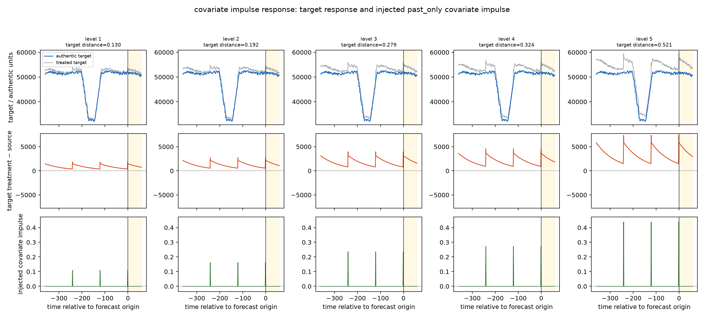

# CaFE v13：基于真实基准路径的十项能力公式设计

本文从原始数据开始，完整说明 CaFE v13 如何在 GIFT-Eval 官方测试实例的完整未来标签子集上构造十项能力评测。读者只按本文顺序阅读，就能知道每个量是什么、来自哪里、如何计算，哪些值来自数据采集，哪些值由程序推导，哪些值是人工配置，以及最终怎样得到 treatment 的历史与未来。

本文描述当前代码的实际行为。数据适配实现在 **src/cafe/benchmark_extension/gift_eval.py**，能力公式实现在 **src/cafe/benchmark_extension/mechanisms.py**，紧凑重放契约由 **src/cafe/benchmark_extension/generation.py** 写出。

## 1. 从 GIFT-Eval 原始记录得到官方实例

### 1.1 原始采集字段

CaFE 不自行采集新的时间序列。真实数值全部来自本地保存的 GIFT-Eval 官方 Arrow 文件。每条记录读取三个必需字段，并在存在时读取两个原生协变量字段：

| 字段 | 来源 | 含义 |
|---|---|---|
| **item_id** | Arrow 原始字段 | 原始记录标识 |
| **target** | Arrow 原始字段 | 被预测的真实序列，原始形状为 \([T]\) 或 \([D,T]\) |
| **freq** | Arrow 原始字段 | 采样频率，例如小时、天、周或月 |
| **past_feat_dynamic_real** | Arrow 可选原始字段 | 只在历史可见的动态实数协变量 |
| **feat_dynamic_real** | Arrow 可选原始字段 | 在预测期也合法可见的动态实数协变量 |

\(T\) 是原始记录的时间点总数，\(D\) 是原生目标通道数。单变量记录取 \(D=1\)。多变量记录保持为一个 \(D\) 维实例，generation 不会将其拆成多个单变量样本。程序只把 target 统一转成时间在前的矩阵 \([T,D]\)。

### 1.2 预测长度与官方预测起点

预测档位 **term** 是运行时人工配置，可取 short、medium 或 long，对应乘数

\[
m_{\mathrm{term}}\in\{1,10,15\}.
\]

非 M4 数据集的基础预测长度 \(P\) 由采集到的 freq 按官方规则映射：年 1、季度 4、月 12、周 8、日 30、小时 48、分钟 48、秒 60。最终预测长度为

\[
H=m_{\mathrm{term}}P.
\]

M4 使用其官方长度：年 6、季度 8、月 18、周 13、日 14、小时 48，并固定只取一个测试窗口。

对非 M4 数据集，先从同一配置的全部 Arrow 记录采集最短长度 \(T_{\min}\)，再计算官方窗口数

\[
W=\operatorname{clip}\!\left(
\left\lceil\frac{0.1T_{\min}}{H}\right\rceil,1,20
\right),
\]

其中 \(\operatorname{clip}(v,a,b)=\min(\max(v,a),b)\)。对一条总长度为 \(T\) 的记录，第 \(i\) 个预测起点为

\[
o_i=T-HW+iH,\qquad i=0,\ldots,W-1.
\]

这些起点固定复现 GIFT-Eval 的官方 test split，不是按 treatment 随机选取。每个起点形成一个实例：

\[
X=(x_{t,d})\in\mathbb R^{L\times D},\qquad
x_{t,d}=\mathrm{target}_{t,d},\quad t=0,\ldots,L-1,
\]

\[
Y=(y_{h,d})\in\mathbb R^{H\times D},\qquad
y_{h,d}=\mathrm{target}_{L+h,d},\quad h=0,\ldots,H-1,
\]

其中历史长度 \(L=o_i\)。所以 \(X\) 是预测起点前的完整官方历史，\(Y\) 是起点后的官方真实未来。

### 1.3 缺失值处理

Arrow 历史中的有限值是采集值。每个通道单独处理缺失：

1. 至少有两个有限值时，只用该通道历史中的有限值做线性插值；历史两端使用最近的边界观测值保持不变；
2. 只有一个有限值时，用该值填满历史；
3. 整个通道都缺失时，用 0 填满并记录该通道。

后文所有估计都使用这个只依赖历史的完整矩阵 \(X\)，不会用 \(Y\) 补历史。

CaFE v13 对预测标签采用完整窗口准入：候选实例的整个
\(H\times D\) 未来矩阵必须全部有限。只要任一未来时刻、任一目标通道
缺失，该官方窗口就会记录为 partially-missing 或 fully-missing 后排除，
不会进入 generation、inference 或 analysis。历史缺失仍按上述只依赖历史
的规则处理，因为它属于模型输入而非评分标签。该规则比 GIFT-Eval 官方
逐点 mask 聚合更严格，正式结果因此对应官方固定起点中的完整未来标签子集。

## 2. 公共符号、数据来源与 treatment 形式

### 2.1 统一符号

| 符号 | 定义与单位 | 来源 |
|---|---|---|
| \(X=(x_{t,d})\) | 完整官方历史，形状 \(L\times D\)，单位与原序列相同 | 从 Arrow target 截取并做历史内缺失处理 |
| \(Y=(y_{h,d})\) | 官方未来，形状 \(H\times D\) | 从 Arrow target 截取 |
| \(L\) | 当前实例的历史点数 | 官方预测起点 \(o_i\) |
| \(H\) | 预测点数 | freq 与人工配置的 term |
| \(D\) | 原生目标通道数 | Arrow target 的形状 |
| \(t\) | 历史索引，\(0\le t<L\) | 实例内部索引 |
| \(h\) | 未来索引，\(0\le h<H\)，对应整段路径索引 \(L+h\) | 实例内部索引 |
| \(d\) | 通道索引，\(0\le d<D\) | Arrow 原生通道顺序 |
| \(k\) | 能力等级，\(k\in\{1,2,3,4,5\}\) | 协议人工规定 |
| \(\Delta X^{(k)},\Delta Y^{(k)}\) | 第 \(k\) 级增加的历史和未来能力分量 | 对应能力公式 |
| \(X^{(k)},Y^{(k)}\) | 第 \(k\) 级 treatment | 原路径与能力分量相加 |
| \(A\) | 距离校验和能力评分所用的受影响通道集合 | 对应能力规则 |

所有可生成能力最终都采用

\[
X^{(k)}=X+\Delta X^{(k)},\qquad
Y^{(k)}=Y+\Delta Y^{(k)}.
\]

这不是另造一条合成序列，而是在真实官方历史和未来上叠加受控分量。generation 处理完整的 \(L\) 点历史；模型的最大上下文截断只在 inference 时进行。

### 2.2 通道冻结尺度

仅从官方历史 \(X\) 计算通道尺度 \(s_d\)。Std 在实现中是总体标准差：

\[
s_d=
\begin{cases}
\operatorname{Std}(x_{0,d},\ldots,x_{L-1,d}),
&\text{若该值有限且大于 }10^{-8},\\
\operatorname{Std}(x_{1,d}-x_{0,d},\ldots,x_{L-1,d}-x_{L-2,d}),
&\text{若上一项不可用且本项有限并大于 }10^{-8},\\
1,&\text{其他情况。}
\end{cases}
\]

\(s_d\) 与原通道单位相同。它由历史采集值推导，不是人工填写，也不会随能力等级变化。

### 2.3 treatment 到真实原序列的距离

能力档位只用完整官方历史定义。另根据当前七个参评模型的实际最大输入长度，检查每个模型真正收到的输入是否既可见又不过强。模型最大输入长度是协议人工配置，并与推理服务公布的限制一致：

| 模型 | 最大输入长度 |
|---|---:|
| TiRex2 | 2,048 |
| Timer-4.0、Chronos-2 | 8,192 |
| Timer-3.5 | 11,520 |
| TimesFM 2.5 | 15,360 |
| Moirai2、Toto 2.0 | 16,384 |

令上述模型上限为 \(M_m\)。对历史长度为 \(L\) 的实例，模型 \(m\) 实际收到的上下文长度是

\[
c_m=\min(L,M_m).
\]

去重后的实际模型上下文集合为

\[
\mathcal C_{\mathrm{model}}
=\operatorname{unique}\{c_m:m\in\mathcal M\}.
\]

因此，若 \(L\le2048\)，所有模型都看完整历史，距离只需计算一次；只有长历史才产生多个实际上下文。旧协议中的 96、168、336、512、1024 固定短后缀不对应当前任何参评模型，已不再使用。

对任一 \(c\in\mathcal C_{\mathrm{model}}\)，取历史最后 \(c\) 点，先计算每个受影响通道的尺度归一化 RMS，再对通道求算术平均：

\[
d_{c,d}(\Delta X)=
\sqrt{\frac{1}{c}\sum_{t=L-c}^{L-1}
\left(\frac{\Delta x_{t,d}}{s_d}\right)^2}.
\]

\[
d_c^{\mathrm{macro}}(\Delta X)
=\frac{1}{|A|}\sum_{d\in A}d_{c,d}(\Delta X).
\]

人工固定的资格门为

\[
\min_{c\in\mathcal C_{\mathrm{model}}}
d_c^{\mathrm{macro}}(\Delta X^{(k)})\ge0.10,
\]

\[
\max_{c\in\mathcal C_{\mathrm{model}}}
d_c^{\mathrm{macro}}(\Delta X^{(k)})\le2,
\]

\[
\max_{c\in\mathcal C_{\mathrm{model}}}
\max_{d\in A}d_{c,d}(\Delta X^{(k)})\le3.
\]

该门比较每一级 treatment 与同一个真实历史 \(X\)，不是比较相邻等级。下限保证所有参评模型都能看到足够明显的 treatment；macro 上限 2 表示受影响通道的平均改变量不得达到两个以上原序列标准差的 RMS，单通道上限 3 防止 macro 平均掩盖个别通道的三标准差级异常。二者相对最高完整历史目标 0.55 仍保留局部上下文放大空间，但一旦越界就应检查机制形状，而不是继续放宽门限。资格门只负责接受或拒绝，不参与增益反推，也不使用未来差异。五级中任一级失败，整个“官方实例 × 能力”组合不可用。

### 2.4 五级强度与确定性抽样

趋势、时变季节性、共同因子、跨序列依赖和协变量冲击响应使用相同的目标距离区间：

| 等级 \(k\) | 人工配置区间 \(I_k\) |
|---|---|
| 1 | \([0.10,0.14]\) |
| 2 | \([0.16,0.20]\) |
| 3 | \([0.22,0.28]\) |
| 4 | \([0.30,0.38]\) |
| 5 | \([0.42,0.55]\) |

能力先从历史估计未缩放的单位分量 \(B^X,B^Y\)，并只在完整官方历史上计算

\[
u=d_L^{\mathrm{macro}}(B^X).
\]

然后从 \(I_k\) 均匀抽取无量纲目标距离 \(\rho_k\)，换算成实例实际使用的物理增益

\[
\alpha_k=\frac{\rho_k}{u},\qquad
\Delta X^{(k)}=\alpha_kB^X,\qquad
\Delta Y^{(k)}=\alpha_kB^Y.
\]

所以 \(\rho_k\) 是 treatment 在完整官方历史上的目标距离，\(\alpha_k\) 才是依赖真实实例的乘数。模型上下文距离不会用于放大分量；若某个实际输入上下文不满足 2.3 节的上下限，直接拒绝该能力组，从而避免“为救活最弱后缀而让其他上下文爆炸”。

状态依赖持续性不使用这套 RMS 反推。它的五级直接控制“在历史识别方向上使用多少稳定性余量”，区间依次为 \([0.20,0.26]\)、\([0.30,0.38]\)、\([0.42,0.50]\)、\([0.56,0.66]\)、\([0.72,0.84]\)。历史 RMS 只作为 2.3 节的可见性和安全资格门，不定义该能力的等级。

多季节性的五级也不使用递增 RMS。它让 Level 1 至 Level 5 分别包含 2 至 6 个受控周期，并为同一实例的五级共同抽取一个完整历史 macro RMS，区间固定为 \([0.22,0.28]\)。因此等级只增加需要同时识别的周期数量，不把“结构更复杂”和“改变量更大”混为一件事。

运行参数 **augmentation_seed** 由用户手动配置。程序将官方实例 ID、能力 ID、等级等键值拼接后做 SHA-256，取摘要前 8 字节，与 augmentation_seed 相加并映射到 32 位种子，再初始化 NumPy 随机生成器。因此同一组键总会得到同一个结果。方向、脉冲宽度等五级共享量的键不包含等级。

制度切换和可预测间歇性以位置或事件间隔定义等级，并为五级共同求一个幅度；多季节性以周期数量定义等级，并让五级共享一个总 RMS。详见对应章节。

### 2.5 先用自然语言理解十项能力

后面的公式不是十种任意的数据扰动，而是十种不同的预测结构。先建立下面这张概念地图，再看公式会更容易：

| 能力 | 一句话概念 | 主要考察模型是否能识别 | 可能对应的现实情况 |
|---|---|---|---|
| 趋势 | 序列沿一个长期方向持续抬升或下降 | 长期斜率并把它延续到未来 | 需求长期增长、设备性能缓慢衰减 |
| 多季节性 | 同一序列同时叠加多个彼此独立的周期，等级越高周期越多 | 同时分解并外推越来越多的重复节奏 | 用电量同时有日、周及更短或更长的周期 |
| 时变季节性 | 周期还在，但周期振幅随更慢节奏改变 | “周期的强弱也在变化” | 夏季空调使每日用电振幅变大 |
| 制度切换 | 某个时刻后整体水平永久跳到新制度 | 最近发生的结构突变 | 调价、传感器重新标定、政策切换 |
| 状态依赖持续性 | 偏离正常水平越极端，下一步保留或回归的比例会改变 | 极端程度如何改变记忆强弱及未来衰减路径 | 极端负荷可能比普通波动持续更久或回归更快 |
| 可预测间歇性 | 事件按可推断间隔稀疏出现 | 稀疏事件的间隔和下次出现时间 | 定期补货、批处理作业、周期性维护 |
| 共同因子 | 多个通道同时受同一个潜在状态驱动 | 面板中的同步共变结构 | 多地区负荷受共同天气影响 |
| 层级一致性 | 上层序列等于下层序列之和 | 预测是否满足聚合约束 | SKU—门店—地区—全国销量 |
| 跨序列依赖 | 一个通道的过去领先另一个通道 | 有方向、有滞后的跨通道预测信息 | 上游流量领先下游流量 |
| 协变量冲击响应 | 原生外生量发生脉冲后，目标按固定滞后核响应 | 学习外生冲击与目标后续变化的因果时序映射 | 价格、天气或控制量变化后的延迟响应 |

每项能力以下都按同一逻辑展开：

1. 先说明它在概念上假设什么，以及不假设什么；
2. 再说明它考察的模型能力和现实对应；
3. 然后给出 treatment 公式，并紧接着解释公式中的局部变量；
4. 最后说明这些参数如何从真实历史中提取、哪些阈值是人工配置。

## 3. 能力一：趋势（trend）

### 3.1 整体概念、考察能力与现实含义

趋势表示：在短期波动之外，序列存在一个覆盖较长时间范围的持续上升或下降方向。这里考察的不是模型能否跟随最后两三个点，而是它能否从完整历史中辨认一个方向稳定的长期斜率，并把该方向继续延伸到预测区间。

现实中可能对应需求规模长期增长、人口或装机容量增长、设备效率缓慢衰减、库存长期消耗等。当前实现只构造**线性**趋势，不代表指数增长、饱和增长或任意曲线趋势。

### 3.2 treatment 怎样表示这个概念

对方向稳定的通道 \(d\)，先定义一条从历史开头为 0、之后匀速变化的单位斜坡：

\[
B^X_{t,d}=s_dv_d\frac{t}{L-1},\qquad
B^Y_{h,d}=s_dv_d\frac{L+h}{L-1}.
\]

第 \(k\) 级 treatment 为

\[
x^{(k)}_{t,d}=x_{t,d}+\alpha_kB^X_{t,d},\qquad
y^{(k)}_{h,d}=y_{h,d}+\alpha_kB^Y_{h,d}.
\]

局部变量含义如下：

| 变量 | 含义 |
|---|---|
| \(v_d\) | 第 \(d\) 个通道从真实历史估计出的稳定方向，取 \(+1\) 或 \(-1\) |
| \(s_d\) | 第 \(d\) 个通道的历史尺度，使斜坡适配原序列单位 |
| \(t/(L-1)\) | 历史内从 0 增长到 1 的相对位置 |
| \((L+h)/(L-1)\) | 同一斜坡延伸到未来第 \(h\) 点的位置 |
| \(\alpha_k\) | 第 \(k\) 级的实例级物理增益，由公共距离规则求得 |

不在受影响集合 \(A\) 的通道分量取 0。未来公式只是延伸已确定的直线，不读取 \(Y\)。

### 3.3 参数怎样从真实曲线提取

要求 \(L\ge16\)。对通道 \(d\)，先从真实历史计算

\[
z_{t,d}=\frac{x_{t,d}-\bar x_d}{s_d},\qquad
\bar x_d=\frac1L\sum_{t=0}^{L-1}x_{t,d},\qquad
r_t=\frac{t}{L-1}.
\]

分别用普通最小二乘拟合全历史斜率 \(b_d\)、前半段斜率 \(b_d^{(1)}\) 和后半段斜率 \(b_d^{(2)}\)。三次回归都以 \(z_{t,d}\) 为响应、\(r_t\) 为自变量并含截距。通道只有满足

\[
|b_d|\ge0.05,\qquad
\operatorname{sign}(b_d^{(1)})=
\operatorname{sign}(b_d^{(2)})=
\operatorname{sign}(b_d)
\]

才进入 \(A\)，并令 \(v_d=\operatorname{sign}(b_d)\)。这意味着整体、前半段和后半段方向必须一致，避免把一次局部波动误当成长期趋势。

\(X,\bar x_d,s_d,b_d,b_d^{(1)},b_d^{(2)}\) 都从真实历史提取；最短长度 16、斜率阈值 0.05 和五级强度区间是人工配置。没有合格通道时，该能力不可用。

## 4. 能力二：多季节性（multi-seasonal）

### 4.1 整体概念、考察能力与现实含义

多季节性表示同一条曲线上同时存在多个彼此独立的重复节奏，而不是只有一个周期，也不是把一个周期的二倍频、三倍频重复计算成新的季节。例如用电量可能同时含有日周期、周周期和更短的设备运行周期。

这个能力的等级控制“模型要同时处理多少个周期”。Level 1 含 2 个受控周期，Level 5 含 6 个。五级的总改变量保持在同一范围，所以高等级不是因为曲线振幅更大，而是因为模型必须从相同总能量里分解更多节奏并把它们一起延伸到未来。

主体链路可以先用六句话理解：

1. 真实 \(X,Y\) 始终作为底座，不替换、不重新合成；
2. 每个目标通道先从历史功率最高的三个频率中寻找一个稳定、可外推的真实 anchor；
3. 三个都不合格时，由协议生成一个人工 anchor，保证该实例仍可参评；
4. 再由协议生成五个与 anchor 及彼此都非邻近、非整数倍谐波的附加周期；
5. 每个周期先归一化为相同历史能量，Level \(k\) 取 anchor 加前 \(k\) 个附加周期；
6. 五级分别归一化到同一个总 RMS，然后把完全相同的解析周期从历史连续延伸到 future。

因此这里的“人造”只指受控周期分量；官方真实曲线仍完整保留。该能力评估的是“真实背景上的受控多周期外推”，不声称协议生成的周期原本就存在于采集数据中。

### 4.2 先确定哪些周期可以被模型看到

令七个参评模型实际收到的最短上下文为

\[
C_{\min}=\min\left(L,2048\right),
\]

其中 2048 来自当前最短的 TiRex2 最大上下文。任一受控周期长度 \(p\) 必须满足

\[
4\le p\le
\min\left(\frac{C_{\min}}3,2H\right).
\]

左侧避免接近逐点交替的高频形状；\(p\le C_{\min}/3\) 保证最短模型上下文至少含三个完整循环；\(p\le2H\) 保证预测段至少覆盖半个循环。这样不会给模型一个历史里几乎没重复过、未来里又近似直线的“周期”。

记频率为 \(f=1/p\)。任意两个已选周期 \(p_i,p_j\) 还必须满足

\[
C_{\min}|f_i-f_j|\ge0.5,
\]

即在最短上下文中至少相隔半个频率分辨单元。令

\[
r_{ij}=\frac{\max(f_i,f_j)}{\min(f_i,f_j)},
\]

则对 \(a=2,\ldots,8\) 还要求

\[
\frac{|r_{ij}-a|}{a}>0.05.
\]

这会排除落在 2 至 8 倍整数谐波附近 5% 范围内的候选，避免把同一节奏的简单倍频当成新周期。

### 4.3 真实 anchor 怎样选，什么时候回退人工 anchor

对每个目标通道，程序只用真实历史执行以下步骤：

1. 线性去趋势，将残差乘 Hann 窗并计算实数 FFT 功率谱；
2. 只保留频率索引 \(m\in[2,\lfloor L/4\rfloor]\)，按功率排序；
3. 依次检查功率最高的前三个候选，使用第一个通过全部门限的候选；
4. 三个候选都失败时，不继续从更弱的谱峰“捞”频率，而是回退到协议生成的人工 anchor。

候选 \(m\) 对应周期 \(p=L/m\)，首先必须满足 4.2 节的周期范围。然后在完整历史上拟合

\[
S_d(t)=a_d\sin(2\pi t/p)+b_d\cos(2\pi t/p),
\]

并要求

\[
\operatorname{Std}(S_d(0{:}L-1))\ge0.05s_d.
\]

为了确认它不是只在局部历史中出现的偶然谱峰，程序在前半段和后半段分别用同一频率重新拟合系数向量 \(\boldsymbol\beta_d^{(1)},\boldsymbol\beta_d^{(2)}\)。两半的拟合分量都必须达到 \(0.05s_d\)，并满足

\[
\frac{\boldsymbol\beta_d^{(1)\top}\boldsymbol\beta_d^{(2)}}
{\|\boldsymbol\beta_d^{(1)}\|\|\boldsymbol\beta_d^{(2)}\|}
\ge0.5,
\]

\[
\frac{\min(\|\boldsymbol\beta_d^{(1)}\|,
\|\boldsymbol\beta_d^{(2)}\|)}
{\max(\|\boldsymbol\beta_d^{(1)}\|,
\|\boldsymbol\beta_d^{(2)}\|)}\ge0.5.
\]

前一个门限制前后半段相位不能完全变样，后一个门限制振幅不能只在某一半出现。通过后，真实 anchor 保留历史拟合出的周期和相位，但把其完整历史标准差归一化为 \(s_d\)，使它与后续人工分量具有相同的预缩放能量。

### 4.4 人工 anchor 和五个附加周期怎样生成

程序先在 4.2 节的合法周期区间内生成 512 个对数等距候选。再用

\[
(\text{official instance id},\ \text{multi-seasonal},\
\text{channel},\ \text{augmentation seed})
\]

构造稳定随机键，确定性地打乱候选顺序，并按 4.2 节的频率分离与谐波规则贪心选取。

若已有真实 anchor，只生成五个附加周期；若真实 anchor 不合格，则生成六个周期，第一个作为人工 anchor，后五个作为附加周期。因此无论走哪条路径，Level 1 至 Level 5 都分别含有 2、3、4、5、6 个受控周期。

协议生成分量的相位

\[
\phi_{d,j}\sim\operatorname{Uniform}(0,2\pi)
\]

同样由 official instance id、通道、分量序号和 augmentation seed 确定。原始分量写成

\[
\widetilde S_{d,j}(n)=
\sqrt2s_d\sin\left(\frac{2\pi n}{p_{d,j}}+\phi_{d,j}\right).
\]

考虑到有限历史不一定刚好包含整数个循环，程序再用只依赖历史段的常数 \(q_{d,j}\) 做归一化：

\[
S_{d,j}(n)=q_{d,j}\widetilde S_{d,j}(n),\qquad
\operatorname{Std}(S_{d,j}(0{:}L-1))=s_d.
\]

真实 anchor 也执行同样的单位能量归一化。这样每个周期在聚合前地位相同，不会出现“Level 5 名义上有六个周期，实际仍由一个大振幅周期主导”的情况。

### 4.5 五级 treatment 与共享总 RMS

记 \(j=0\) 为 anchor，\(j=1,\ldots,5\) 为五个附加周期。Level \(k\) 的未缩放聚合分量为

\[
B^{(k)}_{n,d}=\sum_{j=0}^{k}S_{d,j}(n),
\qquad k=1,\ldots,5.
\]

对同一个官方实例只抽取一次

\[
\rho\sim\operatorname{Uniform}(0.22,0.28),
\]

并分别计算每一级完整历史上的单位距离

\[
u_k=d_L^{\mathrm{macro}}(B^{(k)}_{0{:}L-1}),
\qquad \alpha_k=\frac{\rho}{u_k}.
\]

最终 treatment 为

\[
X^{(k)}=X+\alpha_kB^{(k)}_{0{:}L-1},
\]

\[
Y^{(k)}=Y+\alpha_kB^{(k)}_{L{:}L+H-1}.
\]

所以五级拥有相同的完整历史总 RMS \(\rho\)，唯一有序变化是周期数量。Level 越高，每个单独周期分到的总能量越少，模型必须从同样强度的混合信号里区分更多频率。

所有周期、相位、正余弦系数、anchor 搜索证据和每级增益都写入紧凑契约。Inference 从源 Arrow 重建真实底座后，按契约解析延伸同一组周期；生成和重放都不读取官方未来目标值来选频率、相位或增益。

### 4.6 GIFT-Eval 可用率审计

用 `tools/auditing/multi_season_builder_availability.py` 在本地 20 个 GIFT-Eval short 数据配置上遍历全部 120,784 个预测标签完整的官方实例后，五级多季节性 treatment 的最终可用率为 100%，20 个配置都不低于 50%。这里的“可用”已经包含周期池能否选足、五档源距离门能否通过等最终 builder 条件，不只是先看频谱候选。

## 5. 能力三：时变季节性（time-varying seasonality）

### 5.1 整体概念、考察能力与现实含义

时变季节性表示：重复周期本身仍存在，但每一轮周期的强弱并不恒定，而是被一个更慢的过程调制。例如每天都有用电高峰，但夏季每天的峰谷差比春季更大；每天都有交通早晚高峰，但节假日期间高峰振幅会变弱。

该能力考察模型能否同时识别“快周期是什么”和“快周期的振幅正怎样缓慢变化”。它改变的是周期振幅，不改变载波频率；当前实现从真实历史拟合受约束的正弦包络频率、幅度和相位，不代表突发性或任意形状的振幅变化。

### 5.2 treatment 公式与变量

设 \(C_d(n)\) 是快季节载波，\(E_d(n)\) 是慢包络：

\[
C_d(n)=a_{c,d}\sin(\omega_{c,d}n)+b_{c,d}\cos(\omega_{c,d}n),
\]

\[
E_d(n)=u_d\sin\left(\frac{2\pi m_{e,d}n}{L}\right)
+v_d\cos\left(\frac{2\pi m_{e,d}n}{L}\right).
\]

二者乘积就是“振幅随慢周期改变”的单位分量：

\[
M_d(n)=C_d(n)E_d(n),\qquad
B^X_{t,d}=M_d(t),\qquad B^Y_{h,d}=M_d(L+h).
\]

最终

\[
X^{(k)}=X+\alpha_kB^X,\qquad
Y^{(k)}=Y+\alpha_kB^Y.
\]

| 变量 | 含义 |
|---|---|
| \(m_{c,d}\) | 快载波在长度 \(L\) 内的循环次数 |
| \(\omega_{c,d}=2\pi m_{c,d}/L\) | 快载波角频率 |
| \(a_{c,d},b_{c,d}\) | 快载波的振幅与相位系数 |
| \(m_{e,d}\) | 慢包络在长度 \(L\) 内的循环次数 |
| \(C_d(n)\) | 原历史中拟合出的快速季节形状 |
| \(u_d,v_d\) | 从真实历史残差拟合出的包络幅度与相位系数 |
| \(E_d(n)\) | 受约束为单一慢谐波、但幅度和相位来自历史的包络 |
| \(M_d(n)\) | 快载波与慢包络的乘积，即被增强的时变季节分量 |

### 5.3 参数怎样从真实曲线提取

要求 \(L\ge24\)。对每个通道，用 \([1,q_t]\) 对历史去线性趋势，将残差乘 Hann 窗，计算实数 FFT 功率谱，只保留 \(m\in[2,\lfloor L/4\rfloor]\) 并取功率前 16 个。最高功率索引是 \(m_{c,d}\)。包络候选遍历

\[
2\le m_{e,d}<\frac{m_{c,d}}2
\]

的整数索引，且最多搜索 16 个历史内循环。该条件保证包络周期大于载波周期的两倍。

用真实历史拟合 \((a_{c,d},b_{c,d})\) 并减去载波，得到残差 \(r_d(t)\)。对每个包络候选拟合

\[
(u_d,v_d)=
\arg\min_{u,v}\sum_{t=0}^{L-1}
\left[r_d(t)-C_d(t)\{u\sin(\omega_et)+v\cos(\omega_et)\}\right]^2.
\]

选择残差增量解释率最高的候选，并要求增量解释率至少为 0.01、\(\operatorname{Std}(M_d(0{:}L-1))\ge0.01s_d\)。频率、载波、包络幅度和包络相位均来自真实历史；谐波形式、搜索范围和阈值是人工规则。未来只延伸同一组解析函数，不读取 \(Y\)。

TVS 不使用首中尾等强门。它要求整个 horizon 的机制效应可评分，并要求每个受影响通道在 observed future 中至少 25% 的位置满足 \(|E_d|\ge0.25\sqrt{u_d^2+v_d^2}\)，防止整个预测段落在包络零点附近。

## 6. 能力四：制度切换（regime switching）

### 6.1 整体概念、考察能力与现实含义

制度切换表示：序列在某一时刻进入了一个新的稳定水平，并且这个改变持续到未来。典型情况包括永久调价、政策生效、传感器重新标定、生产线改造或用户规模发生结构性跃迁。

该能力考察模型能否减少对旧制度的依赖、识别最近的新水平并据此预测。它不是短暂异常点，也不是逐渐变化的趋势；当前实现只构造一步完成、之后永久保持的均值跳变。

五级不改变跳变幅度，而是把同一个跳变放到越来越靠近预测起点的位置。等级越高，模型看到的新制度样本越少，任务越难。

### 6.2 treatment 公式与变量

设第 \(k\) 级的跳变位置为 \(j_k\)，方向为 \(v_d\)，共享物理增益为 \(\alpha\)：

\[
B^{X,(k)}_{t,d}=s_dv_d\mathbf1[t\ge j_k],\qquad
B^{Y,(k)}_{h,d}=s_dv_d.
\]

\[
x^{(k)}_{t,d}=x_{t,d}+\alpha s_dv_d\mathbf1[t\ge j_k],\qquad
y^{(k)}_{h,d}=y_{h,d}+\alpha s_dv_d.
\]

| 变量 | 含义 |
|---|---|
| \(j_k\) | 第 \(k\) 级跳变在历史中的整数索引 |
| \(v_d\) | 通道跳变方向，\(+1\) 表示上移，\(-1\) 表示下移 |
| \(s_d\) | 从真实历史得到的通道尺度，也是未调整跳变幅度 |
| \(\mathbf1[t\ge j_k]\) | 跳变前为 0、跳变后为 1 |
| \(\alpha\) | 五级共享的幅度修正，保证所有等级通过距离门 |

### 6.3 参数如何确定

要求 \(L\ge40\)。位置并不是从真实曲线检测出的已有变点，而是人为控制的实验坐标。五级人工区间为：

| 等级 \(k\) | 位置比例区间 \(R_k\) |
|---|---|
| 1 | \([0.20,0.32]\) |
| 2 | \([0.38,0.50]\) |
| 3 | \([0.56,0.66]\) |
| 4 | \([0.72,0.82]\) |
| 5 | \([0.87,0.94]\) |

从 \(R_k\) 确定性均匀抽取 \(r_k\)，再计算

\[
j_k=\operatorname{clip}(\operatorname{round}(r_kL),8,L-8).
\]

这样跳变前后至少各有 8 个历史点。\(v_d\) 也是确定性等概率抽取，并在五级共享；它不是从真实历史趋势推断出的方向。真实历史只提供 \(L\) 和 \(s_d\)。

最后计算五级中最弱的历史距离和共享增益：

\[
u_*=\min_{k=1}^{5}d_L^{\mathrm{macro}}(B^{X,(k)}),\qquad
\alpha=\max\left(1,\frac{0.10}{u_*}\right).
\]

所以五级的未来效应和物理跳变幅度相同，只有 \(j_k\) 不同；未来延续已注入的制度，不读取 \(Y\)。

## 7. 能力五：状态依赖持续性（state-dependent persistence）

### 7.1 整体概念、考察能力与现实含义

线性 AR(1) 假设：无论当前只偏离正常水平一点，还是已经处在极端状态，下一时刻保留下来的比例都相同。状态依赖持续性放松了这个假设，让记忆强弱随当前偏离程度 \(|z_t|\) 改变。于是极端负荷、高温或异常高需求可能比普通波动持续更久，也可能更快回归正常。

该能力考察模型能否从历史识别“状态越极端，持续规律越不同”，并在预测期给出正确的延续和衰减路径。当前实现只增强一阶、幅度依赖且稳定有界的持续规律，不代表任意多滞后非线性或门槛动力学。

### 7.2 treatment 公式与主要合成链路

首先用真实历史的均值和尺度把每个通道标准化为 \(z_{t,d}\)，再从中拟合线性骨架 \(a_d+b_dz_{t,d}\)。真实曲线没有被线性骨架解释的逐步变化被保留为创新项：

\[
z_{t,d}=\frac{x_{t,d}-\bar x_d}{s_d},
\qquad
\varepsilon_{t,d}=z_{t+1,d}-a_d-b_dz_{t,d}.
\]

然后加入状态依赖项

\[
g(z)=\frac{z|z|}{1+|z|},
\]

此时一步转移中的有效持续系数为 \(b_d+\kappa_{k,d}|z|/(1+|z|)\)：接近正常水平时主要沿用 \(b_d\)，偏离越大，状态依赖项的影响越充分。

并用同一组真实创新递归生成第 \(k\) 级 treatment 历史：

\[
u_{0,d}^{(k)}=z_{0,d},
\qquad
u_{t+1,d}^{(k)}=
a_d+b_du_{t,d}^{(k)}+
\kappa_{k,d}g(u_{t,d}^{(k)})+
\varepsilon_{t,d}.
\]

对应的历史改变量为

\[
\Delta X_{t,d}^{(k)}=s_d\left(u_{t,d}^{(k)}-z_{t,d}\right).
\]

这一步保留了原样本逐时刻的冲击和噪声，只改变这些冲击之后如何持续；非线性项也会反馈到下一状态，因此 treatment 历史本身服从被增强后的规律，而不是在原曲线上叠加一层孤立纹理。

预测期不读取官方未来，而是从历史线性创新中做居中循环分块重采样，得到 \(M=128\) 条未来创新路径 \(\tilde\varepsilon_h^{(m)}\)。每条路径都同时送入线性分支和 treatment 分支：

\[
r_0^{(m)}=z_{L-1,d},\qquad
r_{h+1}^{(m)}=a_d+b_dr_h^{(m)}+\tilde\varepsilon_h^{(m)},
\]

\[
v_0^{(k,m)}=u_{L-1,d}^{(k)},\qquad
v_{h+1}^{(k,m)}=a_d+b_dv_h^{(k,m)}
+\kappa_{k,d}g(v_h^{(k,m)})+\tilde\varepsilon_h^{(m)}.
\]

先在每条共享创新路径内作差，再对路径取均值，得到与点预测条件均值一致的未来机制响应：

\[
\Delta Y_{h,d}^{(k)}=
\frac{s_d}{M}\sum_{m=1}^{M}
\left(v_{h+1}^{(k,m)}-r_{h+1}^{(m)}\right),
\qquad
Y^{(k)}=Y+\Delta Y^{(k)}.
\]

分块重采样保留了历史创新的局部连续结构；每个 horizon 上再对有限样本创新居中，避免人为引入均值冲击。因此整条合成链路可以概括为：从真实历史提取线性骨架和真实创新，用同一创新重放出状态依赖历史，再对共享未来创新下的成对响应作边际化，最后加到共同的官方未来上。

| 变量 | 含义 |
|---|---|
| \(a_d,b_d\) | 从真实历史拟合的线性水平和基础持续系数 |
| \(\varepsilon_{t,d}\) | 原样本每一步真实发生的创新、冲击和未解释变化 |
| \(g(z)\) | 随偏离程度增强、但有效系数保持有界的状态响应 |
| \(\kappa_{k,d}\) | 第 \(k\) 级状态依赖强度及方向 |
| \(u^{(k)}\) | 使用真实创新递归生成的 treatment 历史状态 |
| \(\tilde\varepsilon_h^{(m)}\) | 仅从历史创新分块重采样的第 \(m\) 条未来创新路径 |
| \(r_h^{(m)},v_h^{(k,m)}\) | 同一创新路径下线性骨架与 treatment 规律的未来状态 |

### 7.3 参数怎样从真实曲线提取、五级怎样控制

该能力要求 \(L\ge96\)。为了避免在本来只有线性惯性的样本上强行合成，generation 先把历史末段留出，在前缀上分别拟合线性 AR 和状态依赖模型。状态依赖模型不仅要在留出段的一步预测上优于线性 AR，还要在最多四个历史伪预测起点的创新边际化多步滚动中继续取得正收益；同时普通状态、极端状态和系数方向都必须有足够支持。该审计只读取历史，不接触官方未来。

历史估计同时给出状态依赖方向 \(v_d\in\{-1,+1\}\)：正方向表示极端状态更持久，负方向表示极端状态回归更快。为保证递归稳定，先计算该方向到稳定边界的余量

\[
m_d=0.98-v_db_d,
\]

再让五级分别使用越来越大的余量比例：

| 等级 \(k\) | 余量比例区间 \(\rho_k\) |
|---|---|
| 1 | \([0.20,0.26]\) |
| 2 | \([0.30,0.38]\) |
| 3 | \([0.42,0.50]\) |
| 4 | \([0.56,0.66]\) |
| 5 | \([0.72,0.84]\) |

\[
\kappa_{k,d}=v_d\rho_km_d.
\]

所以等级越高，改变的不是噪声大小，而是“极端程度改变记忆强弱”这一规律本身越强。历史距离在这里仅作为可见性和安全资格门，不定义等级。

生成后还要确认五级历史距离严格递增、递归状态稳定，并且预测段能看到可评分的衰减响应；任一条件失败，整组不进入 inference。正式分数仍是 treatment 相对 baseline 的 paired pooled NRMSE，衰减形状和半衰期误差只作为解释模型响应的辅助诊断。

## 8. 能力六：可预测间歇性（predictable intermittency）

### 8.1 整体概念、考察能力与现实含义

间歇性表示：大部分时间没有额外事件，只有少数时刻出现短脉冲；“可预测”表示这些脉冲不是完全随机到达，而是以固定间隔排列，模型可以从历史事件间距推断下一次事件。

它考察模型能否从长段普通观测中记住稀疏事件的间隔和相位。现实中可能对应定期补货、批量订单、周期性维护、轮询任务或按固定班次发生的作业。当前实现采用等间隔、等宽、等幅的正矩形脉冲，不表示随机到达、大小不一或正负混合的事件。

五级控制稀疏度：等级越高，事件间隔通常越长，但五级共享脉冲宽度和幅度。

### 8.2 treatment 公式与变量

设第 \(k\) 级的事件中心集合为 \(\mathcal E_k\)，脉冲宽度为 \(w\)。矩形脉冲计数为

\[
p_k(n)=\sum_{c\in\mathcal E_k}\sum_{a=0}^{w-1}\mathbf1[n=c+a].
\]

所有通道都受影响，单位分量为

\[
B^{X,(k)}_{t,d}=s_dp_k(t),\qquad
B^{Y,(k)}_{h,d}=s_dp_k(L+h).
\]

使用五级共享增益 \(\alpha\) 后，

\[
X^{(k)}=X+\alpha B^{X,(k)},\qquad
Y^{(k)}=Y+\alpha B^{Y,(k)}.
\]

| 变量 | 含义 |
|---|---|
| \(\mathcal E_k\) | 第 \(k\) 级全部历史和未来事件中心 |
| \(w\) | 每个事件持续的时间点数，五级共享 |
| \(p_k(n)\) | 索引 \(n\) 是否落在某个事件脉冲内 |
| \(s_d\) | 第 \(d\) 个通道未调整的正脉冲幅度 |
| \(q_k\) | 相邻事件中心之间的整数间隔 |
| \(\lambda_k\) | 最后历史事件中心距离历史末尾的相位滞后 |
| \(\alpha\) | 五级共享幅度修正 |

### 8.3 参数如何确定

要求 \(L\ge24\)。最大合法间隔由历史长度和预测长度共同决定：

\[
q_{\max}=\min\left(H,\max\left(3,\left\lfloor\frac{L-1}{3}\right\rfloor\right)\right),
\]

并要求 \(q_{\max}\ge8\)。人工配置的间隔比例区间为：

| 等级 \(k\) | 区间 \(Q_k\) |
|---|---|
| 1 | \([0.10,0.18]\) |
| 2 | \([0.22,0.30]\) |
| 3 | \([0.34,0.44]\) |
| 4 | \([0.50,0.64]\) |
| 5 | \([0.72,0.92]\) |

脉冲宽度 \(w\) 从整数集合 \(\{1,2,3\}\) 中确定性均匀抽取，五级共享。对第 \(k\) 级，从 \(Q_k\) 抽取 \(f_k\)，再计算

\[
q_k=\operatorname{clip}(\operatorname{round}(f_kq_{\max}),w+1,q_{\max}).
\]

整数舍入后相邻等级可能得到相同的 \(q_k\)，但抽样比例区间本身有序且不重叠。

程序用稳定随机键生成相位候选顺序，并选择第一个同时满足以下条件的相位：

- 历史中至少有三个事件中心；
- 预测区间中至少有一个脉冲点落在官方 `future_observed_mask` 的有效评分位置。

候选相位滞后为

\[
\lambda_k\in\{0,1,\ldots,\min(q_k,H)-1\},
\]

把最后一个历史事件中心放在 \(c_{0,k}=L-1-\lambda_k\)。事件中心集合为

\[
\mathcal E_k=\{c_{0,k}+nq_k:n\in\mathbb Z,\quad
0\le c_{0,k}+nq_k<L+H\}.
\]

设 \(m_{h,d}\) 是官方 future observed mask，\(a_d\) 是由真实历史得到的 MASE scale。单位增益下第 \(k\) 档的未来有效信号为

\[
v_k=\operatorname{RMS}_{m_{h,d}=1}
\left(B^{Y,(k)}_{h,d}/a_d\right).
\]

最后像制度切换一样计算共享增益，但同时保证五档未来效应可评分：

\[
u_*=\min_{k=1}^{5}d_L^{\mathrm{macro}}(B^{X,(k)}),\qquad
v_*=\min_{k=1}^{5}v_k,
\]

\[
\alpha=\max\left(1,\frac{0.10}{u_*},\frac{0.05}{v_*}\right).
\]

这里 \(L,H,s_d,a_d\) 来自真实实例；五级比例区间、脉冲宽度、相位和事件间隔是受控的确定性生成量，并不是从真实曲线中检测已有事件。相位选择只读取预测长度和 observed mask，幅度只使用历史尺度；未来目标值 \(Y\) 和模型输出均不参与。

## 9. 能力七：共同因子（common factor）

### 9.1 整体概念、考察能力与现实含义

共同因子表示：多个通道并不是各自独立变化，而是同时受一个看不见的公共状态驱动。公共状态在某一时刻增强时，不同通道按各自载荷一起上升或下降。

该能力考察多变量模型能否利用跨通道同步共变，而不是只独立外推每个通道。现实中可能对应多个地区的负荷共同受天气影响、多只资产共同受市场状态影响、多个传感器共同受机器运行工况影响。

它只适用于 Arrow 原始记录本身就是多变量面板的实例，不会把不同单变量记录拼成面板。当前实现使用 PCA 第一载荷，并从真实第一因子中拟合稳定谐波载波；不表示多个潜在因子或非线性因子。

### 9.2 treatment 公式与变量

设标准化历史的第一共同因子为 \(f_t\)，各通道载荷为 \(\ell_d\)，从 \(f_t\) 拟合出的稳定载波为 \(q(n)\)。单位分量为

\[
B^X_{t,d}=s_d\ell_dq(t),\qquad
B^Y_{h,d}=s_d\ell_dq(L+h).
\]

最终

\[
X^{(k)}=X+\alpha_kB^X,\qquad
Y^{(k)}=Y+\alpha_kB^Y.
\]

| 变量 | 含义 |
|---|---|
| \(f_t\) | 时刻 \(t\) 的公共因子状态 |
| \(\ell_d\) | 公共因子作用于通道 \(d\) 的方向和相对强度 |
| \(s_d\) | 把标准化因子效应恢复到通道原单位的尺度 |
| \(q(n)\) | 从真实共同因子中拟合并解析延伸的恒振幅谐波载波 |
| \(\alpha_k\) | 第 \(k\) 级增强强度 |

分量实际按载荷作用于所有通道；只有载荷足够大的通道进入 \(A\) 并用于距离门和评分。

### 9.3 参数怎样从真实面板提取

要求 \(D\ge3\) 且 \(L\ge24\)。先标准化真实面板：

\[
z_{t,d}=\frac{x_{t,d}-\bar x_d}{s_d},\qquad
Z=(z_{t,d})\in\mathbb R^{L\times D}.
\]

对 \(Z\) 做奇异值分解 \(Z=U\Sigma V^\top\)。第一右奇异向量就是载荷 \(\ell=V_{1,:}\)，第一因子解释份额为

\[
\eta=\frac{\sigma_1^2}{\sum_j\sigma_j^2}.
\]

要求 \(\eta\ge1/D+0.02\)。受影响通道集合为

\[
A=\{d:|\ell_d|\ge0.25\max_j|\ell_j|\},
\]

并要求 \(|A|\ge3\)。然后从真实历史计算因子

\[
f_t=\sum_{d=0}^{D-1}z_{t,d}\ell_d.
\]

从 \(f_t\) 的去趋势 FFT 候选中拟合

\[
q(n)=a_f\sin(2\pi m_fn/L)+b_f\cos(2\pi m_fn/L).
\]

选择历史拟合解释份额最高的候选，并要求

\[
1-\frac{\operatorname{MSE}(f-q)}{\operatorname{Var}(f)}\ge0.05.
\]

载荷、解释份额、因子、载波频率、幅度和相位都来自真实面板历史；维数、长度、解释份额、载荷阈值和谐波解释率阈值是人工规则。未来解析延伸同一载波，因而不会像 AR(1) 那样随 medium/long horizon 指数衰减。官方未来不参与 PCA 或载波拟合。

Common 的 horizon-support gate 把预测段相对三等分，只比较首段与尾段的受影响通道 macro RMS，要求尾首比至少 0.50；中段仅记录为诊断。整个 horizon 的机制效应还必须通过通用可评分下限。

## 10. 能力八：层级一致性（hierarchical coherence）

### 10.1 整体概念、考察能力与现实含义

层级一致性表示：同一业务系统中的序列存在精确加总关系。例如“全国销量 = 各地区销量之和”“地区销量 = 各门店销量之和”。模型不仅要预测每个节点，还要让所有预测同时满足这些恒等式。

它考察模型能否理解已知聚合结构并产生相互一致的预测，而不是只考察曲线相关性。现实中典型的是 SKU—门店—地区—全国销量、组织预算层级或电网区域汇总。

### 10.2 应有的数学结构与变量

层级结构通常写成

\[
x_t=Sb_t,
\]

其中：

| 变量 | 含义 | 合法来源 |
|---|---|---|
| \(b_t\) | 时刻 \(t\) 的所有底层序列值 | 数据集原始底层记录 |
| \(x_t\) | 同一时刻所有底层和聚合层节点 | 数据集记录或由 \(Sb_t\) 计算 |
| \(S\) | 明确每个上层节点由哪些底层节点相加的求和矩阵 | 官方业务层级或数据元数据 |

预测也应满足 \(\widehat x_{L+h}=S\widehat b_{L+h}\)。这里的关键不是从数值曲线拟合 \(S\)，而是从数据语义中采集真实 \(S\)。

### 10.3 为什么当前没有 treatment

当前适配器统一读取 item_id、target 和 freq，没有读取可用于所有实例的显式求和矩阵、节点顺序和底层支持策略。即使数据集名称含有 hierarchical，当前代码也不会把不同单变量记录按名称推断成树。

因此 v9 的实际行为是：

- 标记为 **qualification_only_no_generation**；
- 不生成五级 \(\Delta X^{(k)},\Delta Y^{(k)}\)；
- 不产生该能力排名。

这不是遗漏公式，而是缺少不能合法猜测的真实输入 \(S\)。未来只有适配器能明确采集 \(S\)、节点顺序和底层支持范围后，才能继续设计 treatment 参数。

## 11. 能力九：跨序列依赖（cross-series dependence）

### 11.1 整体概念、考察能力与现实含义

跨序列依赖表示：一个通道的变化比另一个通道更早出现，因此前者的过去可以帮助预测后者。它与共同因子的区别是：共同因子强调多个通道同步变化；跨序列依赖强调“谁领先谁、领先几步”。

该能力考察模型是否会读取辅助通道历史，并利用有方向、有滞后的预测信息。现实中可能对应上游流量领先下游流量、原材料价格领先成品价格、入口流量领先服务器负载。

这里的“驱动”只表示历史预测信息，不能据此声称因果关系。当前实现只增强一对通道之间的线性滞后传递，不表示多驱动、非线性传递或反馈网络。

### 11.2 treatment 的核心公式与变量

设选中的驱动通道为 \(i^*\)，响应通道为 \(j^*\)，滞后为 \(\ell^*\)，传递系数为 \(\beta^*\)。只有响应通道被修改：

\[
B^X_{t,j^*}=
\begin{cases}
0,&0\le t<\ell^*,\\
s_{j^*}\beta^*z_{t-\ell^*,i^*},&\ell^*\le t<L,
\end{cases}
\]

\[
B^Y_{h,j^*}=s_{j^*}\beta^*z^{ext}_{L+h-\ell^*,i^*},
\]

\[
X^{(k)}=X+\alpha_kB^X,\qquad
Y^{(k)}=Y+\alpha_kB^Y.
\]

其他通道的 \(B^X,B^Y\) 都为 0。也就是“响应通道当前增加的分量，等于驱动通道 \(\ell^*\) 步之前的标准化状态乘传递系数”。驱动通道本身不修改。

| 变量 | 含义 |
|---|---|
| \(i^*\) | 领先的驱动通道索引 |
| \(j^*\) | 被预测、被增强的响应通道索引 |
| \(\ell^*\) | 驱动领先响应的时间点数 |
| \(\beta^*\) | 驱动历史到响应通道的线性传递系数 |
| \(z_{t,i^*}\) | 标准化驱动历史 |
| \(z^{ext}_{n,i^*}\) | 真实驱动历史与历史线性外推连接成的路径 |
| \(s_{j^*}\) | 把响应分量恢复到原单位的尺度 |
| \(\alpha_k\) | 第 \(k\) 级增强强度 |

### 11.3 参数怎样从真实面板提取

要求 \(D\ge2\) 且 \(L\ge48\)。

先得到标准化历史 \(z_{t,d}=(x_{t,d}-\bar x_d)/s_d\)。最大候选滞后为

\[
\ell_{\max}=\min\left(24,\max\left(1,\left\lfloor\frac L8\right\rfloor\right)\right).
\]

遍历所有驱动通道 \(i\)、不同的响应通道 \(j\) 和滞后 \(\ell=1,\ldots,\ell_{\max}\)。对 \(t=\ell,\ldots,L-1\)，拟合只含响应自身上一时刻的基线模型

\[
z_{t,j}=a+bz_{t-1,j}+\varepsilon_t,
\]

以及加入驱动通道滞后值的完整模型

\[
z_{t,j}=a'+b'z_{t-1,j}+\beta z_{t-\ell,i}+\varepsilon'_t.
\]

定义历史内增量解释度

\[
R^2_{inc}(i,j,\ell)=
1-\frac{\operatorname{MSE}_{full}}{\operatorname{MSE}_{own}}.
\]

基线误差不大于 \(10^{-12}\) 时取 0。选择

\[
(i^*,j^*,\ell^*)=
\arg\max_{i\ne j,\ 1\le\ell\le\ell_{\max}}
R^2_{inc}(i,j,\ell),
\]

并要求最大值至少为人工阈值 0.0025。记完整模型中选中驱动项的系数为 \(\beta^*\)。

### 11.4 未来驱动路径怎样只从历史得到

未来所需驱动索引若仍小于 \(L\)，直接使用已采集历史；超出历史后使用历史线性外推。外推窗口长度为

\[
w=\min\left(L,\max\left(16,\min\left(256,\left\lfloor\frac L2\right\rfloor\right)\right)\right).
\]

取标准化驱动通道最后 \(w\) 点，以局部索引 \(0,\ldots,w-1\) 拟合带截距直线，并在 \(w,\ldots,w+H-1\) 上外推。把真实历史与外推连接为

\[
z^{ext}_{n,i^*}=
\begin{cases}
z_{n,i^*},&n<L,\\
\widetilde z_{n,i^*},&L\le n<L+H.
\end{cases}
\]

未来单位分量为

关系选择、\(\beta^*\) 和驱动外推只使用 \(X\)。官方响应未来与驱动未来均不参与构造。

## 12. 能力十：协变量冲击响应（covariate impulse response）

### 12.1 整体概念、考察能力与现实含义

协变量冲击响应表示：某个外部量在一个时刻发生变化后，目标不会只在同一时刻变化，而会在随后一段时间内按稳定规律逐步响应。例如价格调整后需求逐渐回落、降雨后河流水位延迟上升、控制信号改变后设备温度缓慢变化。

该能力考察模型能否从历史中的多组“外部冲击—后续响应”示例学到两件事：第一，哪个协变量与目标响应配对；第二，冲击发生后，影响会以什么速度向后传播。预测时，模型需要把历史里学到的同一种传播规律用于预测区间。

当前 treatment 使用一个固定的单调衰减响应核，只表示单向、线性、无反馈的延迟响应。它不覆盖多个协变量共同作用、不同状态下响应速度变化或目标反过来影响协变量的情况。

### 12.2 一条样本怎样完成增强和预测

对一个有原生动态协变量的官方实例，主链路如下：

1. 从历史协变量中选择变化最明显的通道，并从目标中选择历史波动尺度最大的通道来承载响应。
2. 在协变量历史里按固定间隔加入多次冲击，同时在目标历史里加入每次冲击对应的延迟响应。这些完整示例让模型看到“冲击发生后，目标在随后一段时间怎样变化”。
3. 在预测起点前的最后一个时刻再加入一次冲击。模型在输入历史里只能看到这次响应的开头，剩余响应自然跨过预测起点，成为需要预测的 future effect。
4. 如果该协变量只在历史可见，预测请求不提供任何未来协变量；模型只能根据起点前已经发生的冲击，继续预测尚未结束的响应尾部。
5. 如果该协变量在 benchmark 中属于已知未来变量，预测请求会继续提供它的未来路径，并在预测区间中间加入一次同类冲击；模型既要延续起点前冲击的尾部，也要响应预测期明确给出的新冲击。
6. 模型预测与 baseline 预测的差值，最终和 treatment 真实加入的目标响应比较，用来判断模型是否学会并使用了这套冲击响应机制。

因此，两类任务考察的是同一个响应规律，但可用证据不同：past-only 主要考察“从历史冲击继续推演”，known-future 还考察“读取未来给定的外部变化并作出响应”。

### 12.3 treatment 怎样表示这个概念

设历史长度为 \(L\)，预测长度为 \(H\)，选中的协变量通道为 \(j^*\)，目标通道为 \(d^*\)。令 \(p_n\) 表示人为加入的协变量冲击序列，冲击后的目标响应采用长度为 \(2H+1\) 的因果指数核：

\[
K_q=2^{-q/H},\qquad q=0,\ldots,2H.
\]

这里 \(K_0=1\)，表示冲击刚发生时响应最强；经过 \(H\) 个时间点后衰减到一半；超过 \(2H\) 后不再继续加入响应。任意时刻的目标单位响应为

\[
r_n=\sum_{q=0}^{2H}K_qp_{n-q}.
\]

也就是说，每个冲击都会产生一条向后衰减的响应曲线；多个冲击较近时，它们的响应直接相加。历史冲击间隔取

\[
P_{imp}=\max(8,2H),
\]

并从 \(L-1\) 开始向前铺设，所以最后一个历史冲击固定落在预测起点之前。若协变量为 known-future，还在 \(L+\lfloor H/2\rfloor\) 放置一个预测期冲击。

设协变量历史尺度为 \(u_{j^*}\)，目标历史尺度为 \(s_{d^*}\)。协变量单位分量和目标单位分量分别为

\[
P_{n,j^*}=u_{j^*}p_n,
\qquad
B_{n,d^*}=s_{d^*}r_n,
\]

其他协变量和目标通道的单位分量都为 0。第 \(k\) 级使用同一个物理增益 \(\alpha_k\) 同时缩放冲击和响应：

\[
C^{(k)}=C+\alpha_kP,
\qquad
T^{(k)}=T+\alpha_kB.
\]

这里 \(C\) 表示协变量路径，\(T=[X;Y]\) 表示历史和未来连接成的目标路径。同一个 \(\alpha_k\) 保证五级只改变整套机制的强弱，不改变“多大冲击对应多大响应”的关系。

### 12.4 参数怎样从真实实例确定

本能力要求实例至少有一个原生动态实数协变量，并且历史长度满足

\[
L\ge2P_{imp}.
\]

这个长度要求保证历史里至少能放下两次冲击，使模型有重复示例可学。对每个协变量通道，先计算其历史去均值 RMS；常数通道或尺度不大于 \(10^{-8}\) 的通道不参与选择，在其余通道中选择历史尺度最大的 \(j^*\)。目标侧计算每个通道的历史标准差，并选择尺度最大的 \(d^*\)。这些选择只决定把同一套受控机制放在哪两个原生通道上，不使用官方未来目标值。

最后一个历史冲击的幅度按 \(1,2,4,\ldots\) 依次尝试。每次都根据固定响应核计算它会在 observed future 单元中留下多少响应，并结合历史 MASE 尺度检查最低强度档的 future effect。选择第一个能保证

\[
\operatorname{RMS}_{\mathrm{MASE}}(B^Y_{\mathrm{level\ 1}})\ge0.05
\]

的幅度。这样即使协变量在未来不可见，预测区间里也一定存在足够稳定的响应尾部；该计算只使用历史尺度、预测长度和 observed mask，不读取未来目标数值。

没有原生动态协变量、所有协变量均为常数、历史不足以提供重复示例，或无法在有效评分位置构造足够未来响应时，本能力对该官方实例记为 unavailable，baseline 仍然保留。

### 12.5 五级强度和可见性边界

五级使用 2.4 节的完整历史目标距离区间。先计算单位目标响应 \(B^X\) 在完整历史上的 macro normalized RMS，再把每一级抽到的目标距离 \(\rho_k\) 换算为 \(\alpha_k\)。因此五级共同使用相同的通道、冲击位置、响应核和末端冲击幅度，只改变协变量冲击与目标响应的整体强度。

协变量在模型请求中的可见范围沿用其原始字段定义：

| 原始字段 | 模型收到的协变量范围 | treatment 的预测任务 |
|---|---|---|
| `past_feat_dynamic_real` | 只发送历史协变量 | 根据起点前冲击预测响应尾部 |
| `feat_dynamic_real` | 同时发送历史与合法的未来协变量 | 预测历史冲击尾部，并响应未来给定冲击 |

past-only 通道的预测期值不会进入模型请求，treatment 也不会在它的预测期协变量上增加冲击。验证阶段重新计算五档的未来 MASE 标准化 effect RMS 和历史距离；这些检查用于确认生成结果符合上述构造，而不参与模型评分。

### 12.6 输入消融怎样判断模型是否真的用了协变量

仅看模型是否预测出响应还不够，因为目标历史本身也可能让模型外推出相似的尾部。为区分“模型使用了协变量”与“模型只沿着目标曲线外推”，每个 treatment 还构造一个输入消融样本。

消融样本保持以下内容完全不变：

- treatment 的目标历史；
- treatment 的真实未来；
- 原始协变量路径；
- 预测期合法可见的协变量内容。

唯一改变的是历史中人为加入的协变量冲击：程序对这部分增量做确定性的循环移位，并选择与原冲击时间对齐最弱的位置。这样，消融后目标仍在原时刻出现响应，但协变量冲击不再出现在与该响应匹配的位置。

如果完整输入的预测明显优于消融输入，说明模型确实利用了“协变量冲击何时发生”这条信息；如果两者几乎没有差别，说明模型可能只依靠目标历史，或者没有学会协变量到目标的延迟映射。该归因结果单独报告，不并入 effect NRMSE。

## 13. 数据来源与人工配置汇总

为避免混淆，全部关键输入可归为四类：

| 类别 | 具体内容 |
|---|---|
| 原始采集 | Arrow 中的 item_id、target、freq、`past_feat_dynamic_real` 与 `feat_dynamic_real`；其中 target 提供真实历史和真实未来，dynamic-real 字段保留各自可见性 |
| 从采集值推导 | \(L,H,D\)、缺失处理后的 \(X\)、尺度 \(s_d\)、趋势方向、多季节性的前三个真实 anchor 候选及拟合相位、其他能力所需频率、回归系数、PCA 载荷、AR 系数、驱动/响应通道和滞后 |
| 确定性生成 | 多季节性的人工 anchor、附加周期及相位；由固定因果核生成的协变量冲击及目标响应；由稳定哈希种子生成的等级坐标、制度方向、脉冲宽度与相位，以及状态依赖持续性的历史创新分块重采样路径 |
| 人工配置 | term、augmentation_seed、五级区间、距离下限 0.10、各能力最短长度、多季节性的前三候选上限、512 点周期池、周期范围、频率分离与谐波阈值、解释度与可见性阈值、截断上下界 |

最重要的数据使用边界是：官方未来目标值 \(Y\) 只作为最终 treatment future 的真实底座和评分真值，不参与能力资格判定、参数拟合、随机抽样或历史距离门。合法使用的未来侧信息包括可由历史状态解析延伸的分量、只依赖历史的外推、源字段明确标记为 known-future 的 dynamic-real 路径，以及不含目标数值的 forecast horizon 和 observed mask；past-only 协变量永不进入预测期请求，intermittency 只用后两者保证安排的事件进入有效评分位置。

## 14. 完整生成顺序与不可用规则

对一个“官方实例 × 能力 × augmentation_seed”组合，执行顺序如下：

1. 从 Arrow 按固定起点构造 \(X,Y,L,H,D\)，只用历史处理历史缺失；
2. 从 \(X\) 计算冻结尺度 \(s_d\)；
3. 按能力的历史资格规则选择方向、真实 anchor、通道、滞后、载荷或回归系数；需要人工周期时只按协议和稳定随机键生成，不从未来目标反推；
4. 不读取目标未来值，构造历史单位分量和合法的未来延伸；
5. 按确定性随机键抽取五级参数；
6. 对振幅型能力把目标距离 \(\rho_k\) 换成物理增益 \(\alpha_k\)；对制度切换和间歇性求五级共享增益；对多季节性把 2 至 6 个周期分别归一化到同一个总 RMS；
7. 形成 \(X^{(k)}\) 和 \(Y^{(k)}\)；
8. 分别检查五级与真实 \(X\) 的多上下文距离；状态依赖持续性先通过历史一步及滚动多步 blocked-holdout、状态支持和稳定性审计，并与 intermittency、covariate impulse response 一样要求五档未来 MASE 标准化 effect RMS 均不低于 0.05；不满足生成资格的整组不生成；
9. generation 只保存实例索引、选中参数、增益、距离证据和数组哈希等重放契约，不重复保存完整 \(X,Y\) 或原生协变量曲线；
10. inference 从 Arrow 重建实例并重放契约，之后才按模型最大上下文截断历史。

能力不可用不会删除官方 baseline。它只表示该实例在对应能力下没有五级 treatment。除层级一致性固定为资格占位外，常见原因包括历史太短、没有稳定趋势、合法周期区间无法容纳足够分离的周期、可见事件不足、原生通道数不足，或状态依赖结构未在历史留出段上优于线性 AR。多季节性找不到稳定真实 anchor 本身不会导致不可用，而是按协议回退人工 anchor。

### 14.1 机制分的未来信号资格与汇总

对任意 treatment，先在受影响且 observed 的 future 单元上计算

\[
q_i=\operatorname{RMS}(\Delta y_{i,t,d}/a_{i,d}).
\]

若 \(q_i<0.05\)，该行仍进入 treatment MASE，但机制分状态记为
unavailable_low_truth_effect，不使用 epsilon 构造分母。其余行的正式分数为

\[
\operatorname{NRMSE}_{pooled}=
\sqrt{\frac{\sum((\Delta\hat y-\Delta y)/a)^2}
{\sum(\Delta y/a)^2}}.
\]

0 表示完全复现真实反事实效应，1 表示模型完全不响应。汇总同时记录候选数、可评分数、低信号数、覆盖率、逐样本均值、相关性和幅度比；排名使用 pooled NRMSE。

## 15. 已验证真实曲线示例

以下图片全部由紧凑契约针对源 Arrow 文件精确重放得到，不是脱离 benchmark 另画的合成示意数据。多季节性示例使用 CaFE v13；状态依赖持续性使用 v11；其余保留图片沿用 v10 的已验证契约。五列对应五个等级，黄色区域表示完整 forecast horizon。常规曲线图上排为官方真实原路径和 treatment，下排为二者之差；状态依赖持续性聚焦预测起点前最近 512 个历史点，协变量冲击响应聚焦最近 360 个历史点，其余能力展示完整官方历史和未来。

### 趋势

来源：gift_ett1_h，官方起点 o16460。下排可见从历史起点开始、沿历史估计方向增长的线性差值。

### 多季节性

来源：gift_restaurant_d，官方起点 o266。该通道使用真实历史前三候选中的 rank 1 anchor；anchor 类型和逐级周期列表同时写入图片旁的 manifest。五档分别包含 2、3、4、5、6 个受控周期；每个周期在聚合前具有相同历史能量，五档聚合后共享同一个总 RMS。所以上排整体改变量没有随等级膨胀，下排变复杂反映的是周期数量增加，而不是第二频率被单独加强。

### 时变季节性

来源：gift_ett1_h，o17180。历史主载波与从真实残差拟合幅度和相位的慢包络相乘；future 延伸同一受约束 AM，五档均通过预测段包络覆盖检查。

### 制度切换

来源：gift_ett1_h，o16460。五级共享幅度，变化点逐级靠近预测起点。

### 状态依赖持续性

来源：gift_m_dense_h，官方起点 o16560。每级都用原样本的同一组真实创新递归生成 treatment 历史；五级依次使用更大的稳定性余量。黄色区域是完整的 48 步 future，下排橙线展示 128 条历史创新分块重采样路径中、线性与状态依赖分支共享创新后的平均响应；浅橙阴影是这些路径响应的 10%–90% 区间，上排浅灰阴影是同一区间叠加到官方 source 后的 treatment 路径带。阴影只用于解释不确定性，不进入正式 target 或评分。该样本已通过一步和滚动多步 blocked-holdout、递归稳定性、未来支持及 publication 精确重放检查。

### 可预测间歇性

来源：gift_ett1_h，o16460。五级共享脉冲宽度和幅度，事件间隔总体增大；每档均有脉冲落在 observed future，并通过 0.05 MASE-scale 未来效应门。

### 共同因子

来源：原生 \(D=7\) 的 gift_ett1_h，o16460。PCA 载荷来自真实面板历史，潜因子以历史拟合的稳定谐波延伸；图片展示一个受影响通道，五档均通过预测段首尾维持度检查，generation 未拆分面板。

### 层级一致性

当前没有显式求和矩阵，因此不生成五级 treatment。

### 跨序列依赖

来源：原生 \(D=7\) 的 gift_ett1_h，o16460。驱动通道不变，图中展示被增强的响应通道。

### 协变量冲击响应

来源：gift_bizitobs_application 的 Robot-Shop 实例，官方起点 o7934，预测长度 60。图中展示目标通道 1 与 past-only 协变量通道 3：上排比较真实目标和 treatment，中排是目标响应分量，下排是注入的协变量冲击。历史内可以看到间隔 120 点的重复示范冲击，预测起点前的末端冲击在 future 中留下指数衰减尾部；由于该字段是 past-only，黄色预测区内没有协变量冲击输入。
