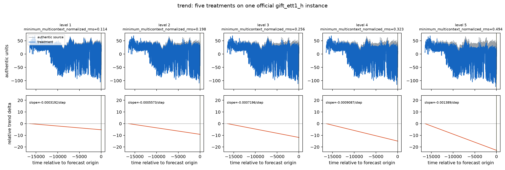
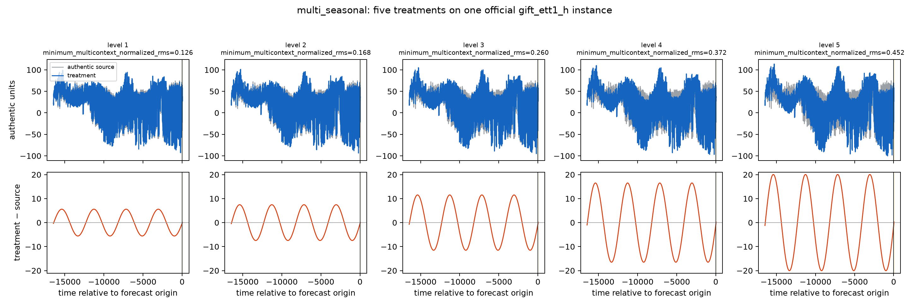
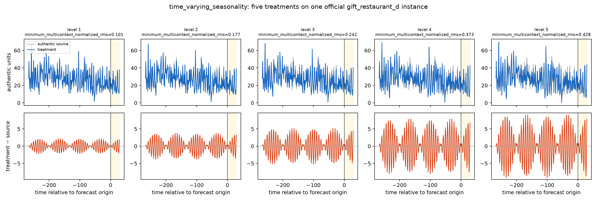
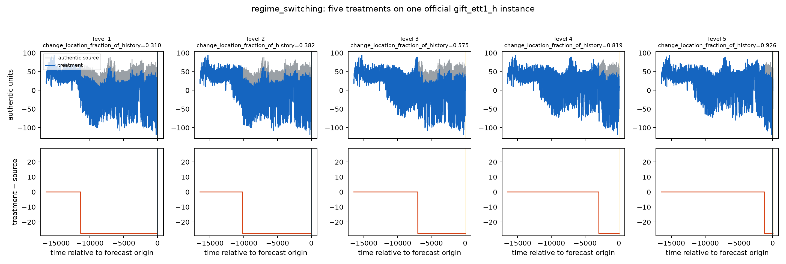
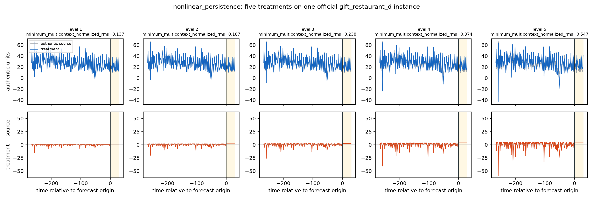
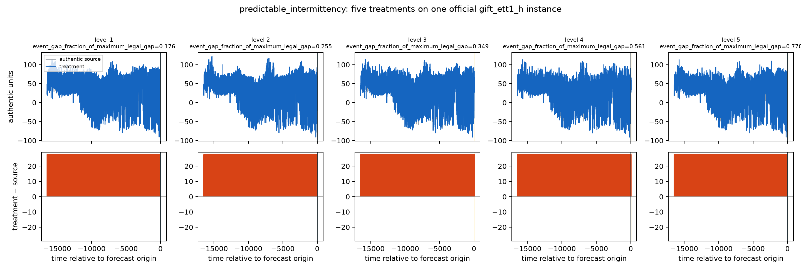
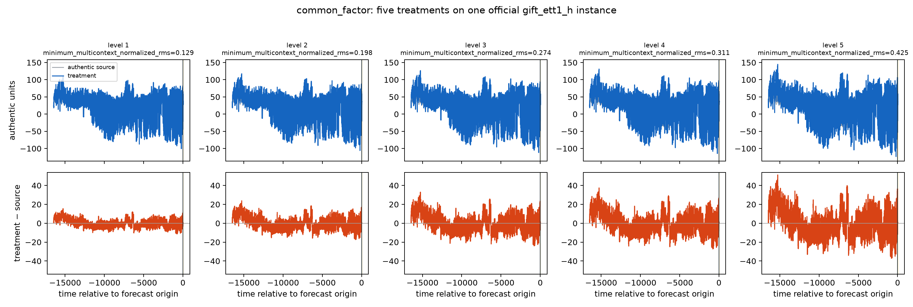
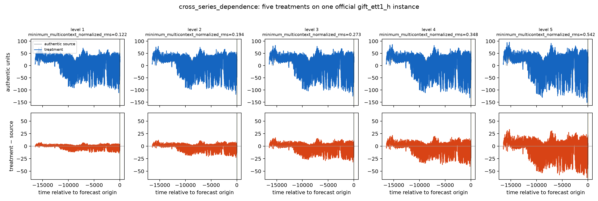
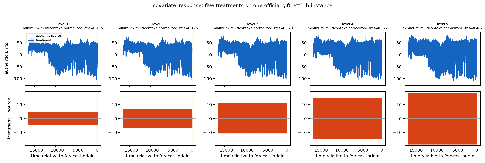

# Ten capability designs on authentic benchmark paths

This document defines the v6 GIFT-Eval implementation. In every formula,
`x_{t,d}` is an authentic official history, `y_{h,d}` its official future,
and `σ_d` a source-history scale. Fits and random draws do not use the target
future. Treatments cover the complete history.

## Common five-level rule

Levels are `k=1,…,5`. Each controlled coordinate is drawn from an ordered,
non-overlapping interval using a deterministic counter-based generator. For
amplitude-like capabilities the intervals target minimum multicontext source
distances:

```text
[0.10,0.14], [0.16,0.20], [0.22,0.28], [0.30,0.38], [0.42,0.55]
```

The physical component gain is instance-specific because component scales
differ across capabilities and source paths.

## 1. Trend

The history-only slope direction is estimated per target and accepted when
the whole-history and half-history slope signs agree. The treatment is a
linear ramp from the sample beginning:

\[
x^{(k)}_{t,d}=x_{t,d}+
\operatorname{sign}(\hat\beta_d)\,\sigma_d g_k\frac{t}{L-1},
\]

\[
y^{(k)}_{h,d}=y_{h,d}+
\operatorname{sign}(\hat\beta_d)\,\sigma_d g_k
\frac{L+h}{L-1}.
\]

Weak or direction-unstable targets are excluded. A sample with no stable
target is unavailable.

## 2. Multi-seasonal

After a linear detrend, the dominant carrier frequency and an independent
non-harmonic secondary frequency are resolved from the history. The fitted
secondary harmonic is extended analytically:

\[
x^{(k)}=x+g_k\widehat S_{secondary},\qquad
y^{(k)}=y+g_k\widehat S^{ext}_{secondary}.
\]

The carrier and all remaining authentic nuisance paths stay unchanged.

## 3. Time-varying seasonality

A carrier and a slower envelope frequency are resolved from history. The
controlled component is constrained amplitude modulation:

\[
M_t=\widehat S_{carrier,t}
\sin(2\pi f_{env}t),qquad
x^{(k)}=x+g_kM.
\]

The same phase-locked basis is analytically extended over the horizon.

## 4. Regime switching

Amplitude and direction are shared across all five levels. The controlled
coordinate is the change-location fraction `r_k`:

```text
[.20,.32], [.38,.50], [.56,.66], [.72,.82], [.87,.94]
```

With `j_k=round(r_k L)`,

\[
x^{(k)}_{t,d}=x_{t,d}+A_d\mathbf1[t\ge j_k],
\qquad y^{(k)}_{h,d}=y_{h,d}+A_d.
\]

Higher levels place the change nearer the forecast origin, reducing the
available post-change evidence. They do not increase the future effect.

## 5. Nonlinear persistence

For each target, history fits a linear lag state and an augmented quadratic
state. Eligible targets have positive incremental predictive gain. With
`q_t=z_{t-1}²-E[z²]`, the controlled component is

\[
M_{t,d}=\sigma_d\hat\gamma_d q_{t,d},qquad
x^{(k)}=x+g_kM.
\]

The future component uses a bounded zero-innovation rollout from the final
history state.

## 6. Predictable intermittency

Pulse shape and positive amplitude are shared. The controlled coordinate is
the event gap as a fraction of the largest gap supported by both history and
horizon:

```text
[.10,.18], [.22,.30], [.34,.44], [.50,.64], [.72,.92]
```

\[
x^{(k)}_t=x_t+A\sum_n p(t-\phi_k-nq_k).
\]

Higher levels have a larger `q_k` and therefore sparser events. Every level
contains at least three visible history events and one deterministically
scheduled future event.

## 7. Common factor

This mechanism uses a native panel with `D≥3`. History-only PCA gives factor
`f_t` and loading `ℓ`; an AR(1) state extends the factor:

\[
x^{(k)}_t=x_t+g_k f_t\ell,
\qquad y^{(k)}_h=y_h+g_k f^{ext}_h\ell.
\]

The top factor share and at least three nondegenerate loadings are required.

## 8. Hierarchical coherence

The current GIFT adapter does not infer a hierarchy from separate univariate
records. This capability remains qualification-only and emits no treatment or
rank. A future adapter can add it when the benchmark supplies an explicit
summing matrix and raw-support policy.

## 9. Cross-series dependence

On a native `D≥2` panel, history selects a driver, responder, and lag by the
responder's incremental predictive gain. The isolated transfer component is

\[
M_{t,j}=\hat\beta z_{t-\ell,i},\qquad
x^{(k)}_{t,j}=x_{t,j}+g_kM_{t,j}.
\]

The driver is unchanged. A history-only linear extension supplies the future
driver path. The claim is directed predictive transfer, not causality.

## 10. Covariate response

The adapter derives periodic sine/cosine calendar features from the source
frequency. They are deterministic and known through the official horizon.
For an eligible target and selected calendar feature `c_t`,

\[
x^{(k)}_{t,d}=x_{t,d}+g_k\hat\beta_dc_t,
\qquad y^{(k)}_{h,d}=y_{h,d}+g_k\hat\beta_dc_h.
\]

Baseline and treatment expose the same calendar path; only the target response
coefficient is enhanced.

## Source-distance gate

Each treatment—not adjacent levels—is compared with its authentic source on
all available suffixes in `{96,168,336,512,1024,L}`. The minimum normalized
RMS is 0.10, with no upper distance threshold. Regime and intermittency solve
one shared amplitude from the weakest level, preserving their
location/sparsity coordinate across the five-level group.

## Actual v6 curve examples

These figures come from validated v6 generation artifacts, not an
illustrative synthetic generator or model forecasts. Five columns are the
five independently drawn level parameters. Grey is the authentic official
source, blue is the treatment, and the lower row is their difference. Every
figure displays that official instance's complete input history and official
future; generation applies the same treatment before model-specific context
truncation. Each
source is the lexicographically first validated group, selected without future
targets or model results.

### Trend



Source: `gift_ett1_h`, official origin `o16460`. The ramp follows the
history-estimated trend sign. Since the complete official history is shown,
the lower row directly displays the uncentered linear difference from the
history start, with its slope increasing across levels.

### Multi-seasonal



Source: `gift_ett1_h`, `o16460`. Only the independent secondary harmonic is
enhanced.

### Time-varying seasonality



Source: `gift_restaurant_d`, `o266`. A phase-locked carrier is multiplied by a
slower history-resolved envelope.

### Regime switching



Source: `gift_ett1_h`, `o16460`. Amplitude is shared and the change point moves
toward the forecast origin.

### Nonlinear persistence



Source: `gift_restaurant_d`, `o266`. The future delta uses a zero-innovation
history-state rollout.

### Predictable intermittency



Source: `gift_ett1_h`, `o16460`. Pulse shape and amplitude are shared while the
event gap grows.

### Common factor



Source: native D=7 `gift_ett1_h`, `o16460`. The plot shows one affected panel
target; no generation-time channel task was created.

### Hierarchical coherence


No five-level treatment is emitted until an adapter supplies an explicit
summing matrix.

### Cross-series dependence



Source: native D=7 `gift_ett1_h`, `o16460`. The driver is unchanged and the
selected responder is plotted.

### Covariate response



Source: `gift_ett1_h`, `o16460`. All levels share the same known-future
calendar path and change only the target response.
